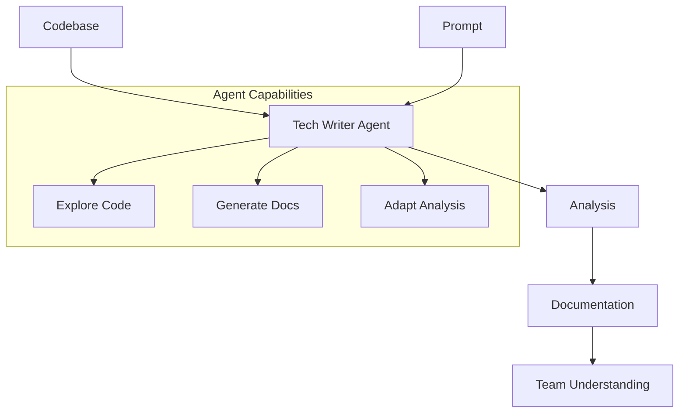
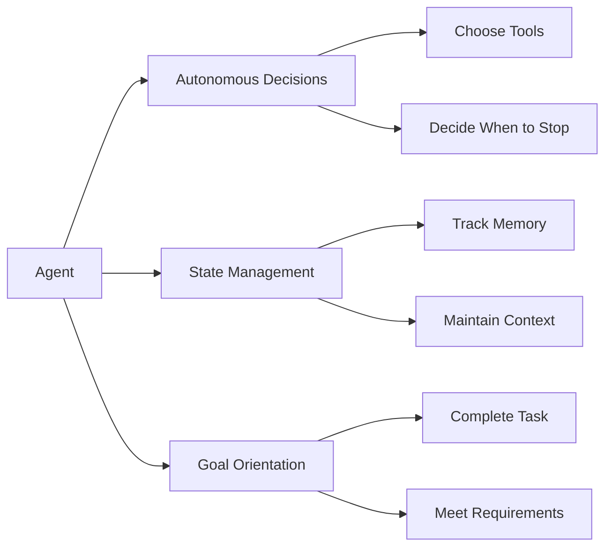
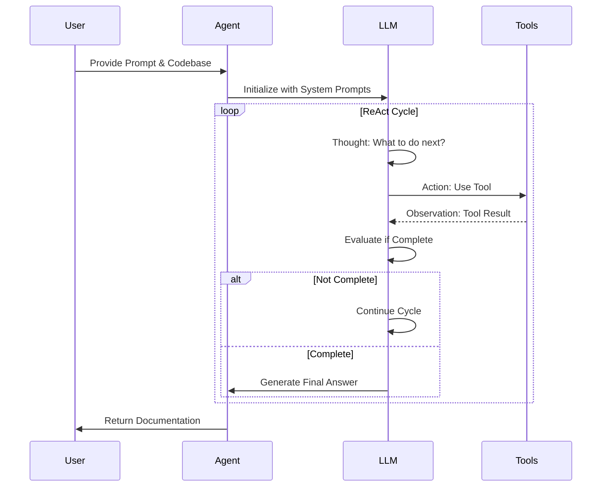
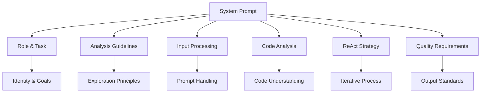
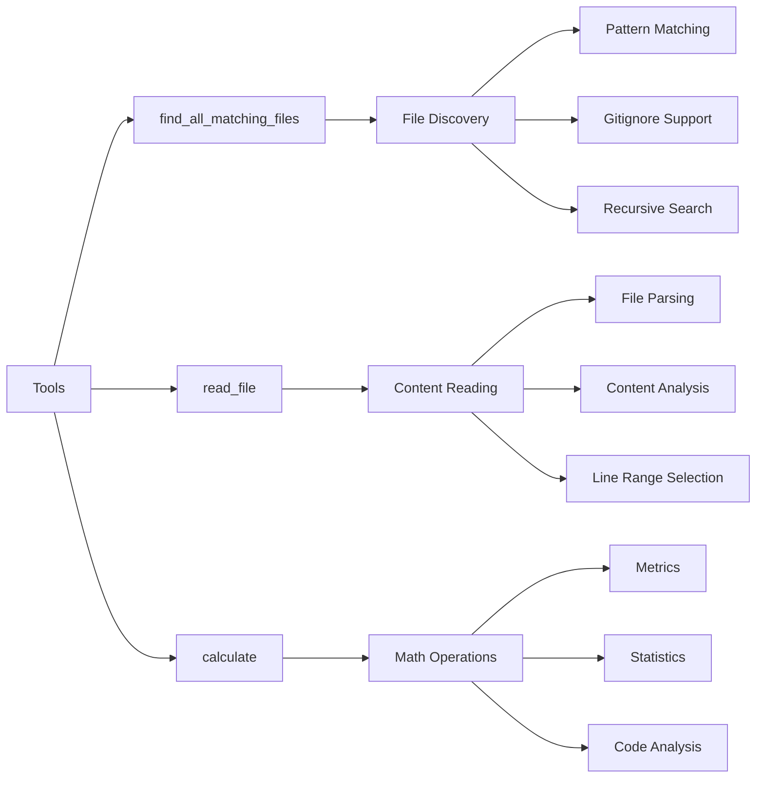
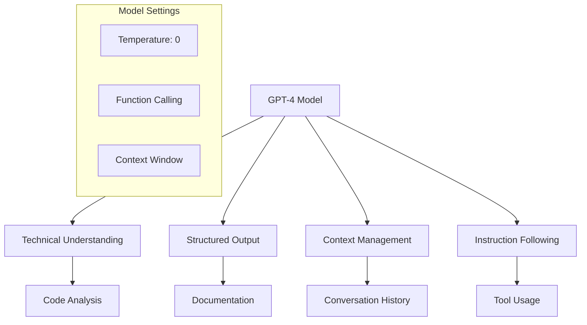
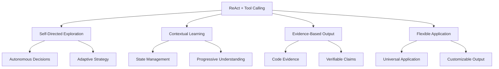
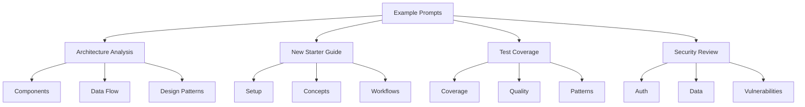

# Tech Writer Agent Overview

## The Whole Game

The Tech Writer Agent is an AI-powered tool that helps teams understand codebases by automatically generating comprehensive documentation and analysis. It solves a common problem: teams often struggle to maintain up-to-date documentation and fully understand their codebase, especially when onboarding new members or working with legacy code.



The agent:
1. Takes a codebase and a specific prompt (e.g., "Create a new starter guide")
2. Explores the codebase systematically
3. Generates detailed, evidence-based documentation
4. Adapts its analysis based on the prompt's requirements

## What Makes It Agentic?

The key to this code's agentic nature is its ability to:
1. **Make Autonomous Decisions**: The agent decides which tools to use and when to stop
2. **Maintain State**: It keeps track of what it has learned through its "memory" of interactions
3. **Goal-Oriented**: It continues until it has gathered enough information to answer the prompt



Unlike traditional static analysis tools, this agent can:
- Choose which files to examine
- Decide when it has enough information
- Generate human-readable explanations

The agent follows a linear ReAct pattern where each tool use informs the next decision, but it doesn't learn or adapt its behavior between runs. Each execution starts fresh with the same capabilities.

## Core Flow: The ReAct Pattern

The agent follows the ReAct (Reasoning and Acting) pattern:



1. **Prompt Reception**
   - Receives a prompt and codebase location
   - Initializes its memory with system prompts

2. **Iterative Analysis**
   ```
   Thought: What do I need to know next?
   Action: Choose and use appropriate tools
   Observation: Process tool results
   Repeat until complete
   ```

3. **Decision Points**
   - After each tool use, the agent decides:
     - If it needs more information (use more tools)
     - If it has enough information (generate final answer)

4. **Final Output**
   - Generates a comprehensive markdown document
   - Includes evidence from the codebase
   - Structured according to the prompt's requirements

## The Prompts

The agent uses a layered prompt system:



1. **Role and Task**
   - Defines the agent's identity as a tech writer
   - Sets the primary goal of codebase analysis

2. **General Analysis Guidelines**
   - Establishes principles for code exploration
   - Emphasizes evidence-based analysis
   - Focuses on structure and clarity

3. **Input Processing Guidelines**
   - How to handle the user's specific prompt
   - How to use the codebase as context
   - How to adapt analysis to requirements

4. **Code Analysis Strategies**
   - Systematic approach to code exploration
   - What to look for and how to organize findings
   - How to handle different types of code

5. **ReAct Planning Strategy**
   - How to structure the iterative process
   - When to use tools vs. generate answers
   - How to maintain context

6. **Quality Requirements**
   - Standards for the final output
   - Requirements for evidence and citations
   - Structure and completeness criteria

## The Tools

The agent has three core tools that enable systematic codebase exploration:



### 1. find_all_matching_files
**Purpose**: Discover relevant files in the codebase based on patterns and criteria

**Parameters**:
- `pattern`: Glob pattern to match files (e.g., "*.py", "src/**/*.ts")
- `exclude_pattern`: Optional pattern to exclude files
- `include_hidden`: Whether to include hidden files (default: false)
- `recursive`: Whether to search subdirectories (default: true)

**Features**:
- Respects .gitignore rules
- Supports recursive directory traversal
- Handles both inclusion and exclusion patterns
- Returns full file paths relative to workspace root

**Example Usage**:
```python
# Find all Python files in src directory
files = find_all_matching_files("src/**/*.py")

# Find all TypeScript files excluding tests
files = find_all_matching_files("*.ts", exclude_pattern="*test*.ts")

# Find all configuration files
files = find_all_matching_files("*.{json,yaml,yml,toml}")
```

### 2. read_file
**Purpose**: Examine and parse file contents with flexible reading options

**Parameters**:
- `relative_workspace_path`: Path to file relative to workspace root
- `should_read_entire_file`: Whether to read entire file (default: false)
- `start_line_one_indexed`: Starting line number (1-indexed)
- `end_line_one_indexed_inclusive`: Ending line number (inclusive)

**Features**:
- Line range selection for partial file reading
- Handles various file encodings
- Provides context around selected lines
- Returns both content and metadata

**Example Usage**:
```python
# Read entire file
content = read_file("package.json", should_read_entire_file=True)

# Read specific line range
content = read_file("src/main.py", start_line_one_indexed=10, end_line_one_indexed_inclusive=20)

# Read with context
content = read_file("config.yaml", start_line_one_indexed=5, end_line_one_indexed_inclusive=15)
```

### 3. calculate
**Purpose**: Perform mathematical operations and code analysis calculations

**Parameters**:
- `expression`: Mathematical expression to evaluate
- `variables`: Optional dictionary of variables for expression

**Features**:
- Basic arithmetic operations
- Statistical calculations
- Code complexity metrics
- Custom formula evaluation

**Example Usage**:
```python
# Basic arithmetic
result = calculate("2 + 2 * 4")

# Statistical analysis
result = calculate("mean([1, 2, 3, 4, 5])")

# Code metrics
result = calculate("complexity_score(lines_of_code, cyclomatic_complexity)")

# Custom formula with variables
result = calculate("(a + b) * c", variables={"a": 5, "b": 3, "c": 2})
```

### Tool Usage Patterns

The agent combines these tools in various ways:

1. **Broad to Narrow Search**
   ```
   find_all_matching_files → read_file → calculate
   ```
   - First finds relevant files
   - Then examines specific files in detail
   - Finally calculates metrics or statistics

2. **Pattern-Based Analysis**
   ```
   find_all_matching_files → read_file → find_all_matching_files
   ```
   - Finds files matching initial pattern
   - Reads them to discover related patterns
   - Searches for files matching new patterns

3. **Metric Collection**
   ```
   find_all_matching_files → read_file → calculate → read_file
   ```
   - Finds files to analyze
   - Reads their contents
   - Calculates metrics
   - Reads more files for context

Each tool is designed to be:
- **Deterministic**: Same inputs produce same outputs
- **Stateless**: No side effects between calls
- **Composable**: Can be combined in various ways
- **Focused**: Each tool has a single responsibility

## The Language Model

The agent uses OpenAI's GPT-4 model because it:
1. Understands complex technical concepts
2. Can generate coherent, structured output
3. Maintains context across multiple interactions
4. Can follow complex instructions precisely



Key model settings:
- Temperature: 0 (deterministic output)
- Tools: Function calling enabled
- Context: Maintains conversation history

## The Magic Sauce: ReAct with Tool Calling

What makes this approach powerful:



1. **Self-Directed Exploration**
   - Agent decides what to look at
   - Builds understanding iteratively
   - Adapts to what it finds

2. **Contextual Learning**
   - Each tool use informs next steps
   - Maintains state through conversation
   - Builds comprehensive understanding

3. **Evidence-Based Output**
   - Every claim backed by code
   - Real examples from the codebase
   - Accurate and verifiable

4. **Flexible Application**
   - Works with any codebase
   - Adapts to different prompts
   - Generates various types of documentation

## Example Prompts



1. **Architecture Analysis**
   ```
   Analyze the codebase architecture, focusing on:
   - System components and their relationships
   - Data flow and state management
   - Key design patterns and decisions
   - Potential areas for improvement
   ```

2. **New Starter Guide**
   ```
   Create a comprehensive guide for new team members:
   - Project overview and purpose
   - Setup instructions
   - Key concepts and patterns
   - Common tasks and workflows
   - Troubleshooting guide
   ```

3. **Test Coverage Analysis**
   ```
   Analyze test coverage and quality:
   - Test types and their distribution
   - Coverage gaps and critical areas
   - Test patterns and practices
   - Recommendations for improvement
   ```

4. **Security Review**
   ```
   Perform a security-focused analysis:
   - Authentication and authorization
   - Data handling and validation
   - API security
   - Common vulnerabilities
   - Security best practices
   ```

Each prompt guides the agent to:
1. Focus on specific aspects of the codebase
2. Use appropriate tools for the task
3. Generate relevant, structured output
4. Provide evidence-based recommendations 