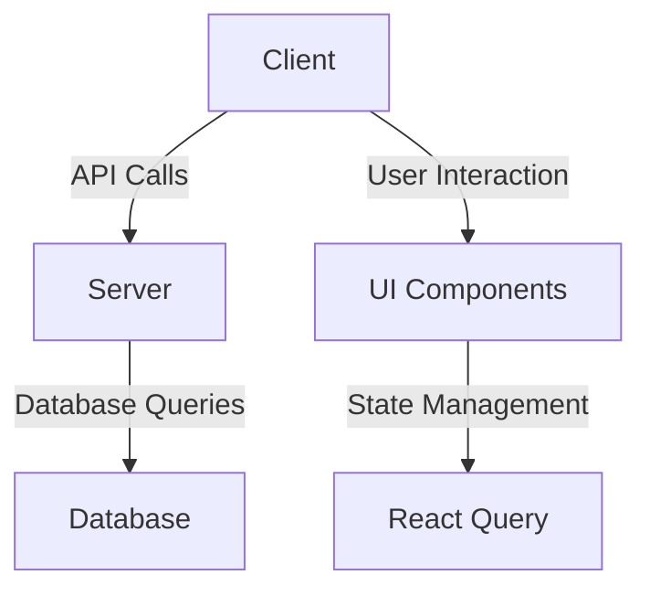
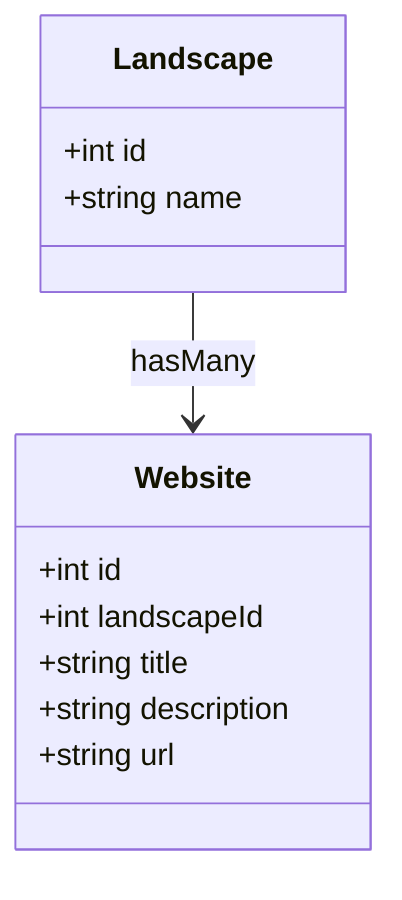
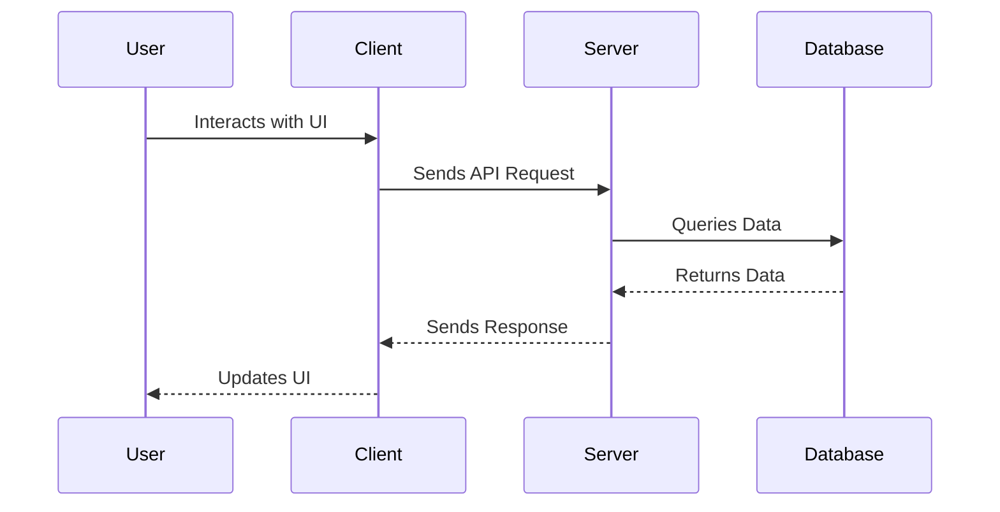
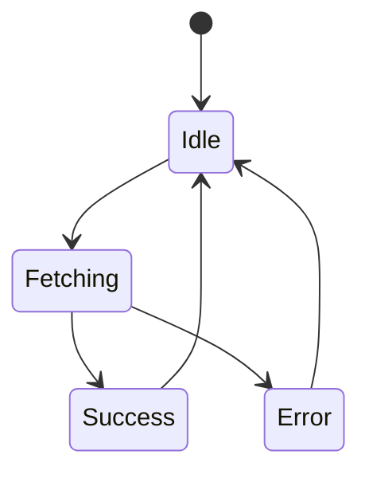
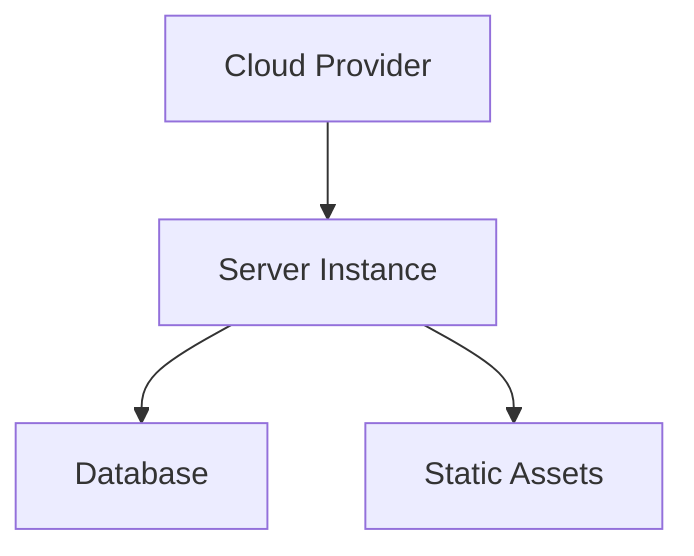

# Architectural Overview of LandscapeHub Codebase

## Executive Summary
The LandscapeHub codebase is structured as a modern web application utilizing a combination of React for the frontend and Express for the backend. It employs a modular architecture that separates concerns effectively, allowing for scalability and maintainability. The application leverages TypeScript for type safety, and it integrates various libraries and frameworks, including Vite for build tooling and Drizzle ORM for database interactions.

The architecture follows a component-based design, with a clear separation between the client and server layers. The use of React Query for data fetching and state management enhances the application's responsiveness and user experience. Additionally, the codebase incorporates best practices for error handling, security, and performance optimization, making it robust and resilient.

This document provides a comprehensive analysis of the architectural patterns, component structures, data flows, state management, error handling strategies, security models, performance considerations, testing strategies, deployment architecture, and the technology stack used in the LandscapeHub application.

## 1. High-Level Architecture
### Architectural Patterns
The LandscapeHub application follows a **Client-Server Architecture** with a clear separation between the frontend and backend components. The frontend is built using React, while the backend is powered by Express. This architecture allows for independent development and deployment of the client and server.

### Component Diagram

### Key Design Principles
- **Separation of Concerns**: The application is divided into distinct layers (client and server), each responsible for specific functionalities.
- **Modularity**: Components are designed to be reusable and maintainable, promoting code reuse and reducing duplication.
- **Type Safety**: The use of TypeScript enhances code quality and reduces runtime errors.

## 2. Component Structure
### Core Components/Modules
- **Client**: Contains UI components, pages, and hooks for managing state and side effects.
- **Server**: Handles API requests, routing, and middleware for processing requests.
- **Database**: Manages data storage and retrieval using Drizzle ORM.

### Class Diagram

### Dependencies Analysis
The application has a well-defined dependency structure, with no circular dependencies observed in the core components. Each module interacts with others through clearly defined interfaces.

## 3. Data Flow
### Sequence Diagram

### Key Data Structures
- **Landscapes**: Represents a collection of landscapes with attributes like `id` and `name`.
- **Websites**: Represents websites associated with landscapes, including attributes like `title`, `description`, and `url`.

### API Contracts
The API contracts are defined in the Express routes, with endpoints for CRUD operations on landscapes and websites.

## 4. State Management
### State Management Strategy
State is managed using **React Query**, which provides a powerful and flexible way to handle server state in the application. This approach simplifies data fetching and caching.

### State Diagram

### Global State Patterns
The application does not utilize global state management libraries like Redux but relies on React Query for managing server state.

## 5. Error Handling & Resilience
### Error Handling Strategy
The application employs middleware in Express to handle errors gracefully. Errors are logged, and appropriate HTTP status codes are returned to the client.

### Resilience Patterns
- **CORS Middleware**: Configured to allow specific origins, enhancing security.
- **Error Logging**: Captures and logs errors for monitoring and debugging.

### Exception Hierarchies
Exceptions are handled at the middleware level, ensuring that all errors are processed uniformly.

## 6. Security Model
### Authentication & Authorization
The application uses **Passport.js** for authentication, specifically the local strategy for user login. CORS is configured to restrict access to specific domains.

### Data Protection Approaches
Sensitive data is managed through environment variables, and HTTPS is recommended for production deployments.

### Security Concerns
Potential security concerns include ensuring that all user inputs are validated and sanitized to prevent SQL injection and XSS attacks.

## 7. Performance Considerations
### Caching Mechanisms
React Query provides built-in caching for API responses, reducing the need for repeated network requests.

### Concurrency Approaches
The application handles concurrent requests through Express middleware, allowing multiple users to interact with the application simultaneously.

### Performance Optimizations
- **Static File Serving**: Optimized through Express middleware for serving static assets.
- **Build Optimizations**: Vite is used for fast builds and hot module replacement during development.

## 8. Testing Strategy
### Testing Approach
The application employs **Jest** for unit testing and integration testing, with scripts defined in the `package.json` for running tests and generating coverage reports.

### Test Coverage
Test coverage is monitored using Jest's built-in coverage reporting features.

### Test Automation Patterns
Automated tests are integrated into the development workflow, ensuring that new changes do not break existing functionality.

## 9. Deployment Architecture
### Deployment Model
The application is designed to be deployed on cloud platforms, with configurations for environment variables and database connections.

### Deployment Diagram

### CI/CD Patterns
While specific CI/CD configurations are not detailed in the codebase, the use of scripts in `package.json` suggests a potential for integration with CI/CD tools.

## 10. Technology Stack
### Key Technologies
- **Frontend**: React, TypeScript, Tailwind CSS, Vite
- **Backend**: Express, TypeScript, Drizzle ORM
- **Database**: PostgreSQL

### Version Constraints
The application uses specific versions of libraries, as defined in `package.json`, ensuring compatibility and stability.

### Deprecated Dependencies
No deprecated dependencies were identified in the current analysis.

## Key Architectural Decisions
- The choice of React and Express allows for a flexible and scalable architecture.
- The use of TypeScript enhances type safety and reduces runtime errors.
- The integration of React Query simplifies data fetching and state management.

## Recommendations
- Consider implementing a more robust global state management solution if the application grows in complexity.
- Regularly review and update dependencies to mitigate security vulnerabilities.
- Enhance security measures by implementing input validation and sanitization across all user inputs.

This architectural overview provides a comprehensive understanding of the LandscapeHub codebase, highlighting its strengths and areas for potential improvement.