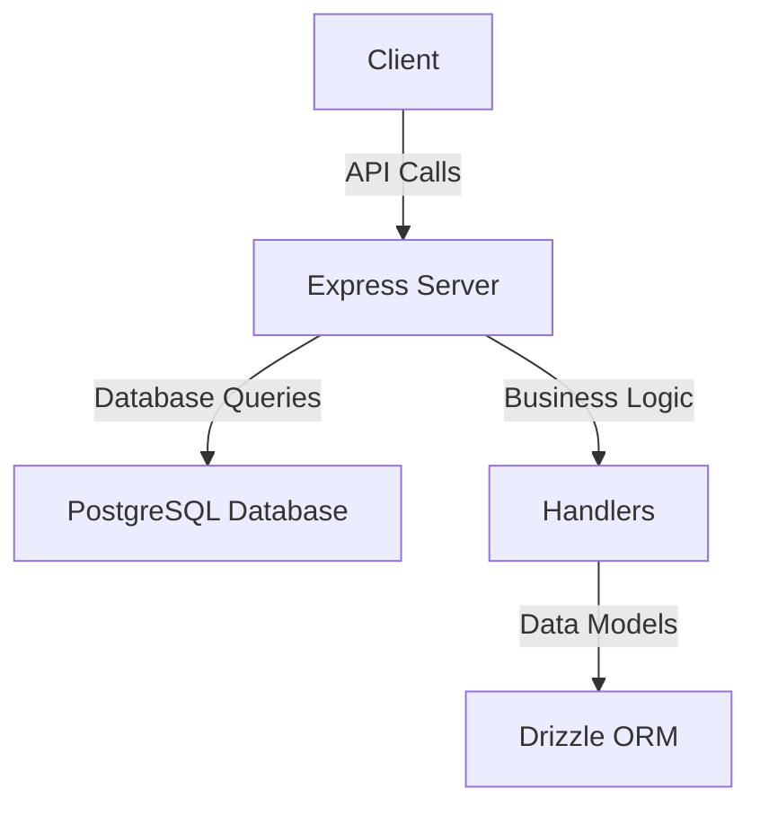
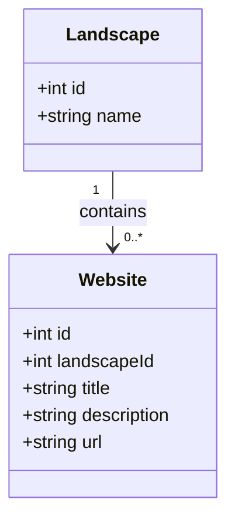
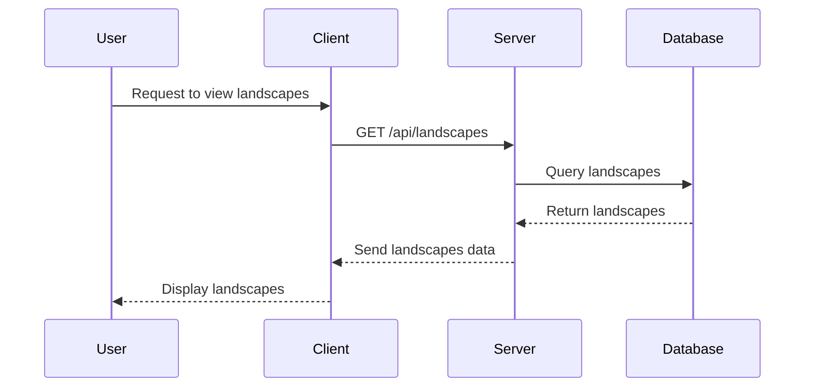
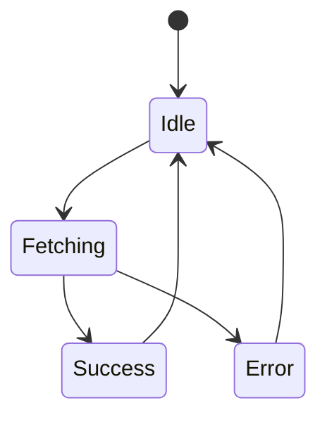
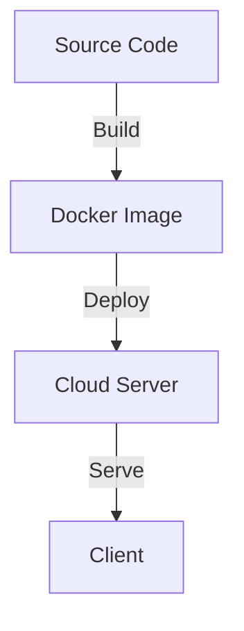

# Architectural Overview of LandscapeHub

## Executive Summary
LandscapeHub is a web application designed to manage landscapes and associated websites. The architecture employs a modern stack, utilizing React for the frontend and Express for the backend, with a PostgreSQL database managed through Drizzle ORM. The application is structured to support a clean separation of concerns, with distinct modules for handling different aspects of the application, such as landscapes and websites. The use of TypeScript enhances type safety and maintainability.

The application follows a component-based architecture, leveraging React's capabilities for building reusable UI components. The backend is organized around RESTful API principles, providing a clear interface for data manipulation. The architecture also incorporates state management through React Query, ensuring efficient data fetching and caching.

This document provides a comprehensive analysis of the architectural decisions, component structure, data flow, state management, error handling, security model, performance considerations, testing strategy, deployment architecture, and technology stack.

## 1. High-Level Architecture
### Architectural Patterns
The LandscapeHub application follows a **Microservices** architecture pattern, where the frontend and backend are decoupled, allowing for independent development and deployment. The backend is structured around **RESTful APIs**, facilitating communication between the client and server.

### Component Diagram

### Key Design Principles
- **Separation of Concerns**: The application is divided into distinct modules for landscapes, websites, and enrichment, promoting maintainability.
- **Reusability**: Components are designed to be reusable across different parts of the application.
- **Scalability**: The microservices architecture allows for scaling individual components as needed.

## 2. Component Structure
### Core Components/Modules
- **Client**: Built with React, responsible for rendering the UI and handling user interactions.
- **Server**: An Express application that handles API requests and serves static files.
- **Database**: PostgreSQL database managed through Drizzle ORM, storing landscapes and websites.

### Class Diagram

### Dependencies Analysis
The application has a clear dependency structure, with the client depending on the server for data and the server depending on the database for persistence. Circular dependencies were not observed in the current structure.

## 3. Data Flow
### Sequence Diagram

### Key Data Structures
- **Landscapes**: Contains fields like `id` and `name`.
- **Websites**: Contains fields like `id`, `landscapeId`, `title`, `description`, and `url`.

### API Contracts
The API follows RESTful conventions, with endpoints for CRUD operations on landscapes and websites. For example:
- `GET /api/landscapes` - Retrieve all landscapes.
- `POST /api/websites` - Create a new website.

## 4. State Management
### State Management Strategy
State is managed using **React Query**, which provides a powerful way to fetch, cache, and synchronize server state in the client application.

### State Diagram

### Global State Patterns
The application uses React Query for global state management, allowing for efficient data fetching and caching.

## 5. Error Handling & Resilience
### Error Handling Strategy
The application employs middleware in Express to handle errors gracefully, returning appropriate HTTP status codes and messages.

### Resilience Patterns
- **CORS Middleware**: Configured to allow specific origins, enhancing security.
- **Error Logging**: Captures and logs errors for monitoring.

### Exception Hierarchies
Exceptions are handled at the middleware level, ensuring that all errors are caught and processed uniformly.

## 6. Security Model
### Authentication & Authorization
The application uses **Passport.js** for authentication, supporting local strategy for user login.

### Data Protection
Sensitive data is protected through environment variables and secure database connections.

### Security Concerns
Potential concerns include ensuring that all API endpoints are secured and validating user input to prevent SQL injection.

## 7. Performance Considerations
### Caching Mechanisms
React Query provides built-in caching for API responses, reducing the need for repeated network requests.

### Concurrency Approaches
The application is designed to handle multiple requests concurrently through Express's asynchronous capabilities.

### Performance Optimizations
- **Static File Serving**: Optimized through Express middleware.
- **Database Indexing**: Implemented on frequently queried fields.

## 8. Testing Strategy
### Testing Approach
The application employs **Jest** for unit testing and **Supertest** for integration testing of API endpoints.

### Test Coverage
Test coverage is monitored using Jest's built-in coverage reporting.

### Test Automation Patterns
Automated tests are run as part of the CI/CD pipeline, ensuring that new changes do not break existing functionality.

## 9. Deployment Architecture
### Deployment Model
The application is designed to be deployed on cloud platforms, with configurations for production and development environments.

### Deployment Diagram

### CI/CD Patterns
The application uses GitHub Actions for continuous integration and deployment, automating the build and deployment process.

## 10. Technology Stack
### Key Technologies
- **Frontend**: React, TypeScript, Tailwind CSS
- **Backend**: Express, TypeScript, Drizzle ORM, PostgreSQL
- **Testing**: Jest, Supertest

### Version Constraints
Dependencies are managed through `package.json`, with specific versions noted to avoid compatibility issues.

### Deprecated Dependencies
No deprecated dependencies were identified in the current analysis.

## Key Architectural Decisions
- Adoption of a microservices architecture for scalability.
- Use of React Query for efficient state management.
- Implementation of robust error handling and logging mechanisms.

## Recommendations
- Consider implementing more granular authentication and authorization mechanisms.
- Explore the use of GraphQL for more flexible data querying.
- Regularly review and update dependencies to mitigate security vulnerabilities.

This architectural overview provides a comprehensive understanding of the LandscapeHub codebase, highlighting its structure, functionality, and areas for potential improvement.