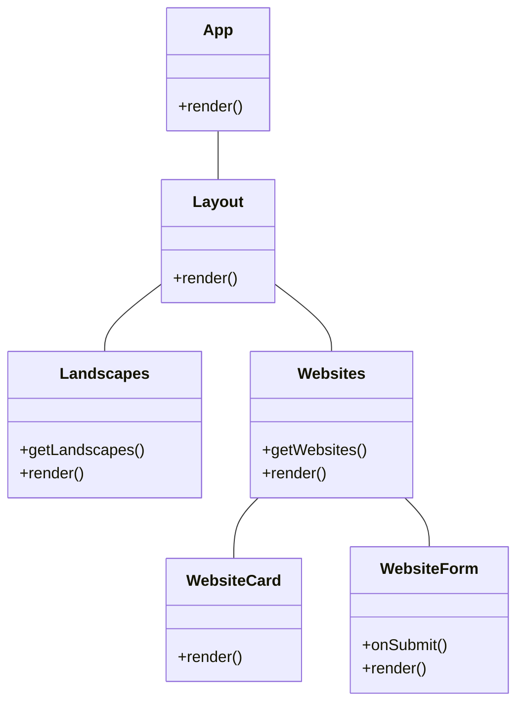
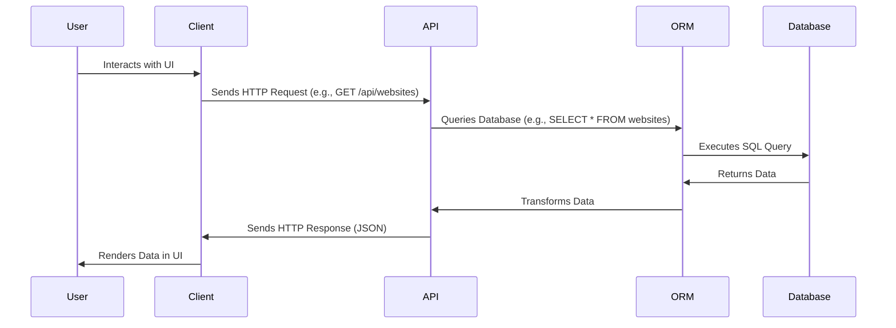

**6. Thought:** `client/src/App.tsx` sets up the routing for the frontend using the `wouter` library. It uses `react-query` for data fetching and caching. The main routes are `/` (Landscapes), `/landscapes/:id/websites` (Websites), and `/test/enrich` (EnrichTest). The `Layout` component provides the overall structure of the page.

Now I have a good understanding of the basic structure of the application. I can now start creating the architectural overview document.

**Final Answer:**

```markdown
# Architectural Overview - LandscapeHub

## Executive Summary

The LandscapeHub codebase represents a web application built with a modern technology stack. The application is structured as a full-stack JavaScript/TypeScript project, comprising a React-based frontend and an Express.js backend. The frontend, built with React, Vite, Radix UI, and Shadcn UI, provides a user interface for managing landscapes and websites. The backend, built with Express.js and TypeScript, exposes a REST API for data access and manipulation, backed by a Drizzle ORM interacting with a NeonDB database. The application uses `react-query` for efficient data fetching and caching on the client side. The architecture appears to follow a layered approach, separating concerns between the frontend, backend, and database layers.

The application leverages several key architectural patterns, including a client-server architecture, a RESTful API, and component-based UI development. The codebase demonstrates a commitment to modern development practices, utilizing TypeScript for type safety, Vite for fast builds, and established UI libraries for a consistent user experience.

This document provides a comprehensive architectural overview of the LandscapeHub codebase, covering key aspects such as high-level architecture, component structure, data flow, state management, error handling, security considerations, performance considerations, testing strategy, deployment architecture, and technology stack. It aims to provide valuable insights into the design and implementation of the application, facilitating understanding and future development efforts.

## 1. High-Level Architecture

*   **Architectural Pattern:** Client-Server, RESTful API
*   **Description:** The application follows a client-server architecture, where the React-based frontend consumes a RESTful API exposed by the Express.js backend. The backend interacts with a NeonDB database through Drizzle ORM.

```mermaid
graph LR
    Client[Client (React/Vite)] --> API[API (Express.js)]
    API --> ORM[Drizzle ORM]
    ORM --> Database[NeonDB]
    Client --> CDN[CDN (Static Assets)]
```

*   **Key Design Principles:**
    *   **Separation of Concerns:** The frontend and backend are clearly separated, allowing for independent development and deployment.
    *   **RESTful API:** The backend exposes a RESTful API, enabling standardized communication between the frontend and backend.
    *   **Component-Based UI:** The frontend is built using reusable React components, promoting modularity and maintainability.
    *   **Type Safety:** TypeScript is used throughout the codebase, enhancing type safety and reducing runtime errors.

## 2. Component Structure

*   **Core Components/Modules:**
    *   **Client:**
        *   `App.tsx`: Main application component, sets up routing and data fetching.
        *   `components/`: Reusable UI components (e.g., `WebsiteCard`, `WebsiteForm`, `Layout`).
        *   `pages/`: Page-level components (e.g., `Landscapes`, `Websites`).
        *   `hooks/`: Custom React hooks for data fetching and state management (e.g., `useWebsites`).
    *   **Server:**
        *   `index.ts`: Main server entry point, sets up Express.js and registers routes.
        *   `routes.ts`: Defines API routes and maps them to handler functions.
        *   `handlers/`: Handler functions for API endpoints (e.g., `landscapes.ts`, `websites.ts`, `enrich.ts`).
        *   `db/`: Database schema and connection logic.
    *   **Database:**
        *   `migrations/`: Database migration files.
        *   `schema.ts`: Database schema definition.



*   **Dependencies:** The frontend depends on libraries like `react`, `react-query`, `wouter`, Radix UI, and Shadcn UI. The backend depends on `express`, `drizzle-orm`, `@neondatabase/serverless`, and other middleware. No circular dependencies were immediately apparent.

## 3. Data Flow

*   **Data Flow Diagram:**



*   **Key Data Structures:**
    *   Landscapes: Represented by a database schema and corresponding TypeScript types.
    *   Websites: Represented by a database schema and corresponding TypeScript types.
*   **API Contracts:** The API contracts are defined implicitly by the routes in `server/routes.ts` and the handler functions in the `handlers/` directory. For example, the `/api/websites` endpoint returns a JSON array of website objects.

## 4. State Management

*   **State Management:** The frontend uses `react-query` for managing server state (data fetched from the API). Local component state is managed using React's built-in state management features (e.g., `useState`).
*   **Global State:** No explicit global state management library like Redux is used. `react-query` provides a global cache for API data.

## 5. Error Handling & Resilience

*   **Error Handling:** The backend includes basic error handling in `server/index.ts`, catching errors and returning a JSON response with an error message and status code.
*   **Resilience:** No explicit resilience patterns (e.g., retries, circuit breakers) were immediately apparent.

## 6. Security Model

*   **Authentication/Authorization:** The `package.json` file includes `passport` and `passport-local` as dependencies, suggesting that authentication and authorization are implemented. However, the specific implementation details are not immediately clear from the provided files.
*   **Data Protection:** No explicit encryption mechanisms were identified.

## 7. Performance Considerations

*   **Caching:** The frontend uses `react-query` for caching API data, improving performance by reducing the number of network requests.
*   **Concurrency/Parallelism:** The backend uses asynchronous operations (e.g., database queries) to handle multiple requests concurrently. The frontend uses a web worker (`client/src/workers/enrichment.worker.ts`) for potentially long-running enrichment tasks.

## 8. Testing Strategy

*   **Testing Approach:** The `package.json` file includes scripts for running Jest tests (`test`, `test:watch`, `test:coverage`).
*   **Test Coverage:** The `test:coverage` script suggests that test coverage is being tracked. However, the actual coverage percentage is not available.

## 9. Deployment Architecture

*   **Deployment Model:** The `package.json` file includes a `build` script that builds the frontend using Vite and the backend using esbuild. The `start` script runs the built backend using Node.js. This suggests a traditional server-based deployment model.
*   **CI/CD:** No explicit CI/CD patterns were identified.

## 10. Technology Stack

*   **Key Technologies:**
    *   Frontend: React, TypeScript, Vite, Radix UI, Shadcn UI, `react-query`, `wouter`
    *   Backend: Express.js, TypeScript, Drizzle ORM, `@neondatabase/serverless`, Node.js
    *   Database: NeonDB
*   **Version Constraints:** The `package.json` file specifies version ranges for all dependencies.
*   **Deprecated/Outdated Dependencies:** No immediately obvious deprecated or outdated dependencies.

## Key Architectural Decisions

*   **Choice of React and Express.js:** Using React for the frontend and Express.js for the backend provides a familiar and well-supported development environment.
*   **Use of TypeScript:** Using TypeScript throughout the codebase enhances type safety and improves code maintainability.
*   **Adoption of Radix UI and Shadcn UI:** Using these UI libraries provides a consistent and accessible user interface.
*   **Use of Drizzle ORM:** Drizzle ORM provides a type-safe way to interact with the database.
*   **Use of react-query:** `react-query` simplifies data fetching and caching on the frontend.

## Recommendations

*   **Implement comprehensive error handling:** Enhance error handling in both the frontend and backend to provide more informative error messages and improve the user experience.
*   **Implement resilience patterns:** Add resilience patterns like retries and circuit breakers to handle transient errors and improve the application's availability.
*   **Document API contracts:** Create formal API documentation (e.g., using OpenAPI) to improve collaboration and maintainability.
*   **Improve security:** Implement robust authentication and authorization mechanisms to protect sensitive data. Consider adding encryption for data at rest and in transit.
*   **Establish CI/CD pipeline:** Set up a CI/CD pipeline to automate the build, test, and deployment process.
*   **Monitor performance:** Implement performance monitoring to identify and address performance bottlenecks.
*   **Consider using a global state management library:** If the application's state management needs become more complex, consider using a global state management library like Redux or Zustand.
```