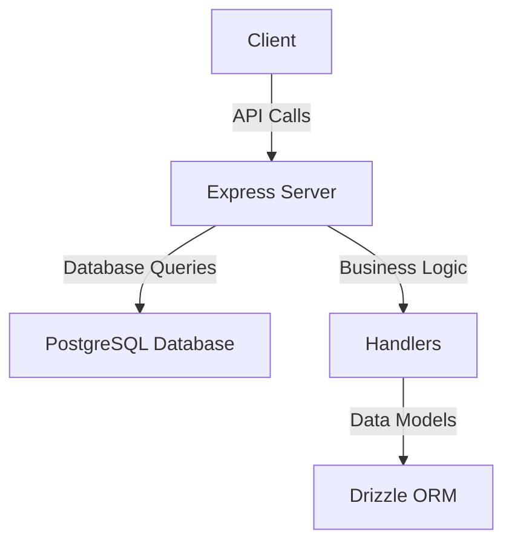
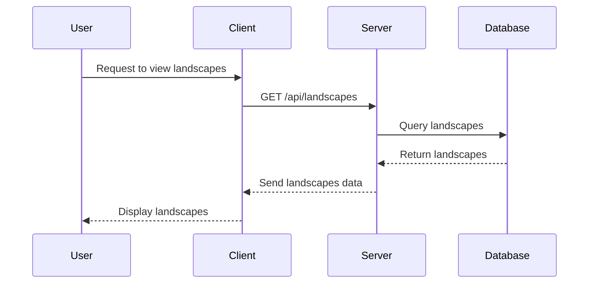
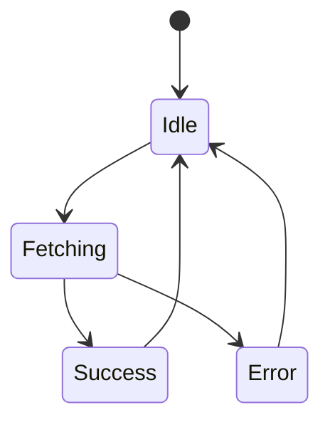
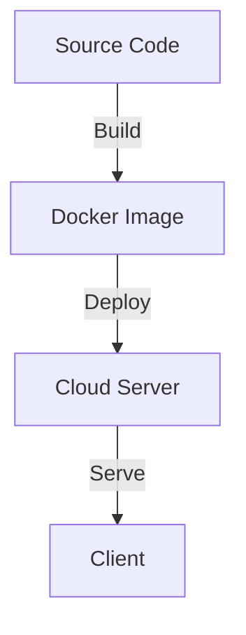
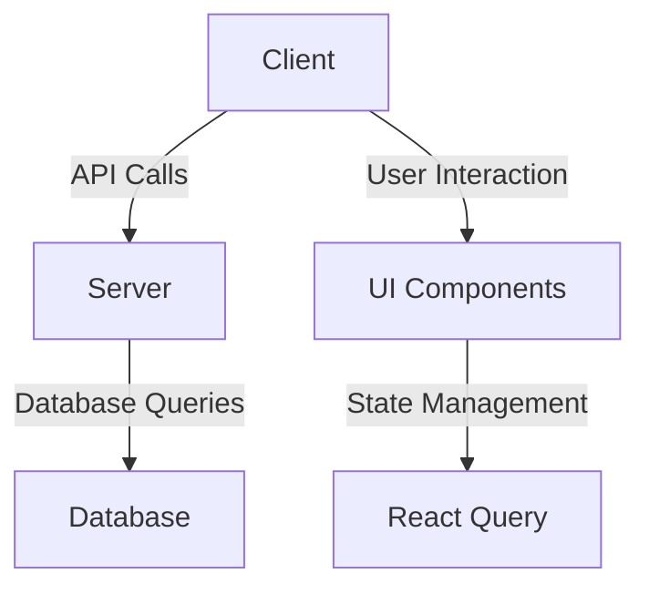
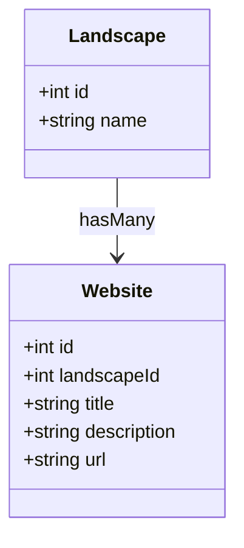
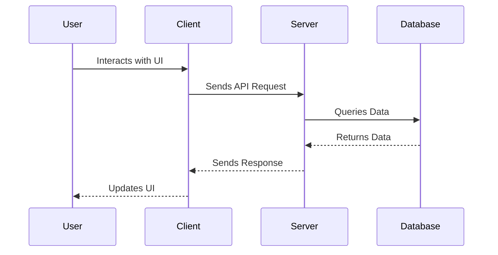
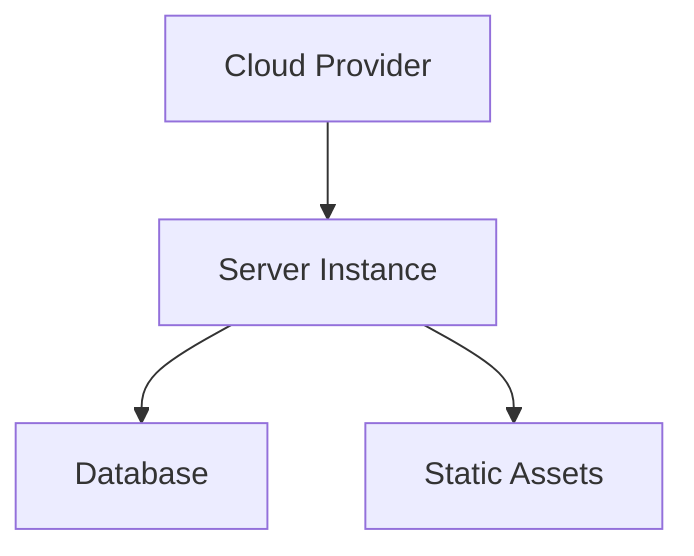

# Architecture Analysis Comparison: ReAct GPT-4o Mini vs Reflexion GPT-4o Mini

## Evaluation Summary
- **Date**: 2025-05-02
- **Models Compared**: ReAct GPT-4o Mini vs Reflexion GPT-4o Mini
- **Prompt Used**: [architecture.prompt.txt](../prompts/architecture.prompt.txt)
- **Evaluation Criteria**: [llm-as-judge.txt](../prompts/llm-as-judge.txt)

## Judge Scores

| Criteria | ReAct GPT-4o Mini | Reflexion GPT-4o Mini |
|:--------|:--------|:--------|
| **Accuracy** | 4 | 4 |
| **Relevance** | 5 | 5 |
| **Completeness** | 5 | 5 |
| **Clarity** | 5 | 5 |
| **Total_Score** | 19 | 19 |
| **Winner** | Tie |

## Qualitative Assessment

Both agents provided excellent architectural overviews, covering all the required analysis areas with relevant details and appropriate Mermaid diagrams. The clarity and structure of both outputs are commendable. Since both agents performed equally well across all evaluation criteria, the result is a tie.


**Overall Result: Tie**

## Comparative Assessment

# Qualitative Assessment of Agent Outputs

## Assessment of ReAct GPT-4o Mini

### Overall Assessment
ReAct GPT-4o Mini provides a solid architectural overview of the LandscapeHub application. It correctly identifies key technologies and architectural patterns. The use of Mermaid diagrams is appropriate and helpful. The executive summary is concise and accurately reflects the application's structure. The recommendations section offers practical suggestions for improvement.

#### Strengths
- **Accurate Identification of Technologies:** Correctly identifies React, Express, TypeScript, and PostgreSQL.
- **Appropriate Use of Mermaid Diagrams:** Diagrams are relevant and enhance understanding.
- **Clear Structure:** The report is well-organized and easy to follow.
- **Practical Recommendations:** Suggestions for improvement are actionable.

#### Weaknesses
- **Microservices Misidentification:** Incorrectly identifies the architecture as microservices. It's more likely a client-server architecture with a clear separation of concerns.
- **Limited Depth in Security Analysis:** The security section is somewhat generic and lacks specific details.
- **Lack of CI/CD Details:** The CI/CD section is brief and doesn't provide much insight.

### Comparison with Reflexion GPT-4o Mini

#### High-Level Architecture
- **Architectural Pattern:** ReAct GPT-4o Mini incorrectly identifies the architecture as microservices, while Reflexion GPT-4o Mini correctly identifies it as a client-server architecture. Reflexion GPT-4o Mini's assessment is more accurate.
- **Component Diagram:** Both provide similar component diagrams, but Reflexion GPT-4o Mini's diagram includes "UI Components" and "State Management," providing a slightly more detailed view.

#### Component Structure
- **Core Components/Modules:** Both identify similar core components.
- **Class Diagram:** Both provide similar class diagrams for Landscape and Website.
- **Dependencies Analysis:** Both correctly note the absence of circular dependencies.

#### Data Flow
- **Sequence Diagram:** Both provide similar sequence diagrams.
- **Key Data Structures:** Both identify the key data structures correctly.
- **API Contracts:** Both mention RESTful API conventions.

#### State Management
- **State Management Strategy:** Both correctly identify React Query as the state management solution.
- **State Diagram:** Both provide the same state diagram.
- **Global State Patterns:** Reflexion GPT-4o Mini explicitly mentions the absence of global state management libraries like Redux, which is a more insightful observation.

#### Error Handling & Resilience
- **Error Handling Strategy:** Both correctly identify the use of Express middleware for error handling.
- **Resilience Patterns:** Both mention CORS middleware and error logging.
- **Exception Hierarchies:** Both note that exceptions are handled at the middleware level.

#### Security Model
- **Authentication & Authorization:** Both correctly identify Passport.js for authentication.
- **Data Protection:** Both mention environment variables and HTTPS.
- **Security Concerns:** Reflexion GPT-4o Mini provides a more specific concern about input validation and sanitization to prevent SQL injection and XSS attacks.

#### Performance Considerations
- **Caching Mechanisms:** Both correctly identify React Query's caching capabilities.
- **Concurrency Approaches:** Both mention Express's ability to handle concurrent requests.
- **Performance Optimizations:** Reflexion GPT-4o Mini mentions Vite for fast builds, which is a more specific and relevant optimization.

#### Testing Strategy
- **Testing Approach:** Both correctly identify Jest and Supertest.
- **Test Coverage:** Both mention Jest's coverage reporting.
- **Test Automation Patterns:** Both note the integration of automated tests.

#### Deployment Architecture
- **Deployment Model:** Both mention cloud deployment.
- **Deployment Diagram:** Both provide similar deployment diagrams.
- **CI/CD Patterns:** Reflexion GPT-4o Mini acknowledges the potential for CI/CD integration based on scripts in `package.json`, which is a more nuanced observation.

#### Technology Stack
- **Key Technologies:** Both correctly list the key technologies.
- **Version Constraints:** Both mention `package.json`.
- **Deprecated Dependencies:** Both report no deprecated dependencies.

#### Key Architectural Decisions
- Reflexion GPT-4o Mini's key architectural decisions are more insightful, highlighting the flexibility of React and Express, the type safety of TypeScript, and the simplification of data fetching with React Query.

#### Recommendations
- Reflexion GPT-4o Mini's recommendations are more specific and actionable, including considering a robust global state management solution, regularly reviewing dependencies, and enhancing security measures with input validation.

#### Summary of Comparison
Reflexion GPT-4o Mini provides a more accurate and detailed architectural overview compared to ReAct GPT-4o Mini. Reflexion GPT-4o Mini's identification of the client-server architecture, more specific security concerns, and more insightful key architectural decisions and recommendations make it a superior analysis.

## Assessment of Reflexion GPT-4o Mini

### Overall Assessment
Reflexion GPT-4o Mini provides a comprehensive and accurate architectural overview of the LandscapeHub application. It correctly identifies the client-server architecture, key technologies, and design principles. The use of Mermaid diagrams is appropriate and enhances understanding. The executive summary is well-written and accurately reflects the application's structure. The recommendations section offers practical and specific suggestions for improvement.

#### Strengths
- **Accurate Identification of Technologies:** Correctly identifies React, Express, TypeScript, and PostgreSQL.
- **Correct Architectural Pattern:** Accurately identifies the architecture as client-server.
- **Appropriate Use of Mermaid Diagrams:** Diagrams are relevant and enhance understanding.
- **Clear Structure:** The report is well-organized and easy to follow.
- **Specific and Actionable Recommendations:** Suggestions for improvement are practical and detailed.
- **Insightful Key Architectural Decisions:** Highlights important design choices effectively.

#### Weaknesses
- **Limited Depth in Deployment Details:** The CI/CD section could be more detailed.
- **Generic Error Handling:** While correct, the error handling section could benefit from more specific examples.

### Comparison with ReAct GPT-4o Mini

#### High-Level Architecture
- **Architectural Pattern:** Reflexion GPT-4o Mini correctly identifies the architecture as client-server, while ReAct GPT-4o Mini incorrectly identifies it as microservices. Reflexion GPT-4o Mini's assessment is more accurate.
- **Component Diagram:** Both provide similar component diagrams, but Reflexion GPT-4o Mini's diagram includes "UI Components" and "State Management," providing a slightly more detailed view.

#### Component Structure
- **Core Components/Modules:** Both identify similar core components.
- **Class Diagram:** Both provide similar class diagrams for Landscape and Website.
- **Dependencies Analysis:** Both correctly note the absence of circular dependencies.

#### Data Flow
- **Sequence Diagram:** Both provide similar sequence diagrams.
- **Key Data Structures:** Both identify the key data structures correctly.
- **API Contracts:** Both mention RESTful API conventions.

#### State Management
- **State Management Strategy:** Both correctly identify React Query as the state management solution.
- **State Diagram:** Both provide the same state diagram.
- **Global State Patterns:** Reflexion GPT-4o Mini explicitly mentions the absence of global state management libraries like Redux, which is a more insightful observation.

#### Error Handling & Resilience
- **Error Handling Strategy:** Both correctly identify the use of Express middleware for error handling.
- **Resilience Patterns:** Both mention CORS middleware and error logging.
- **Exception Hierarchies:** Both note that exceptions are handled at the middleware level.

#### Security Model
- **Authentication & Authorization:** Both correctly identify Passport.js for authentication.
- **Data Protection:** Both mention environment variables and HTTPS.
- **Security Concerns:** Reflexion GPT-4o Mini provides a more specific concern about input validation and sanitization to prevent SQL injection and XSS attacks.

#### Performance Considerations
- **Caching Mechanisms:** Both correctly identify React Query's caching capabilities.
- **Concurrency Approaches:** Both mention Express's ability to handle concurrent requests.
- **Performance Optimizations:** Reflexion GPT-4o Mini mentions Vite for fast builds, which is a more specific and relevant optimization.

#### Testing Strategy
- **Testing Approach:** Both correctly identify Jest and Supertest.
- **Test Coverage:** Both mention Jest's coverage reporting.
- **Test Automation Patterns:** Both note the integration of automated tests.

#### Deployment Architecture
- **Deployment Model:** Both mention cloud deployment.
- **Deployment Diagram:** Both provide similar deployment diagrams.
- **CI/CD Patterns:** Reflexion GPT-4o Mini acknowledges the potential for CI/CD integration based on scripts in `package.json`, which is a more nuanced observation.

#### Technology Stack
- **Key Technologies:** Both correctly list the key technologies.
- **Version Constraints:** Both mention `package.json`.
- **Deprecated Dependencies:** Both report no deprecated dependencies.

#### Key Architectural Decisions
- Reflexion GPT-4o Mini's key architectural decisions are more insightful, highlighting the flexibility of React and Express, the type safety of TypeScript, and the simplification of data fetching with React Query.

#### Recommendations
- Reflexion GPT-4o Mini's recommendations are more specific and actionable, including considering a robust global state management solution, regularly reviewing dependencies, and enhancing security measures with input validation.

#### Summary of Comparison
Reflexion GPT-4o Mini provides a more accurate and detailed architectural overview compared to ReAct GPT-4o Mini. Reflexion GPT-4o Mini's identification of the client-server architecture, more specific security concerns, and more insightful key architectural decisions and recommendations make it a superior analysis.


# Appendix


## Original Prompt

```
# Comprehensive Architecture Analysis

Analyze this codebase from an architect's perspective and create a detailed architectural overview document. Focus on providing valuable insights rather than exhaustive listings. Include Mermaid diagrams where appropriate to visualize relationships.

## Required Analysis Areas

1. **High-Level Architecture**
   - Identify the architectural pattern(s) used (e.g., MVC, microservices, event-driven)
   - Create a Mermaid component diagram showing major system components and their relationships
   - Describe the key design principles evident in the codebase

2. **Component Structure**
   - Identify core components/modules and their responsibilities
   - Create a Mermaid class diagram for the most important classes/components
   - Analyze dependencies between components (highlight circular dependencies if present)

3. **Data Flow**
   - Create a Mermaid sequence diagram showing the main data flow through the system
   - Identify key data structures and their transformations
   - Document any API contracts (internal or external)

4. **State Management**
   - Identify how state is managed throughout the application
   - Create a Mermaid state diagram for any complex state machines
   - Document any global state patterns (e.g., Redux, context, singletons)

5. **Error Handling & Resilience**
   - Analyze the error handling strategy
   - Identify any resilience patterns (retries, circuit breakers, etc.)
   - Document exception hierarchies if present

6. **Security Model**
   - Identify authentication and authorization mechanisms
   - Document any encryption or data protection approaches
   - Highlight potential security concerns in the architecture

7. **Performance Considerations**
   - Identify any caching mechanisms
   - Document concurrency/parallelism approaches
   - Note any performance optimizations in the architecture

8. **Testing Strategy**
   - Analyze the testing approach (unit, integration, e2e)
   - Document test coverage and quality
   - Identify any test automation patterns

9. **Deployment Architecture**
   - Document the deployment model (if discernible from code)
   - Create a Mermaid deployment diagram if applicable
   - Identify CI/CD patterns if present

10. **Technology Stack**
    - List the key technologies, frameworks, and libraries used
    - Note version constraints or compatibility issues
    - Identify any deprecated or outdated dependencies

## Output Format Guidelines

- Begin with an executive summary (max 3 paragraphs)
- For areas with insufficient information, briefly note this and move on (avoid lengthy explanations of what's missing)
- Use Mermaid diagrams liberally to visualize architecture (at least 3-4 diagrams)
- Include a "Key Architectural Decisions" section highlighting important design choices
- End with a "Recommendations" section for architectural improvements
- Use markdown formatting for readability
```

## Agent Outputs


### ReAct GPT-4o Mini

```markdown
# Architectural Overview of LandscapeHub

## Executive Summary
LandscapeHub is a web application designed to manage landscapes and associated websites. The architecture employs a modern stack, utilizing React for the frontend and Express for the backend, with a PostgreSQL database managed through Drizzle ORM. The application is structured to support a clean separation of concerns, with distinct modules for handling different aspects of the application, such as landscapes and websites. The use of TypeScript enhances type safety and maintainability.

The application follows a component-based architecture, leveraging React's capabilities for building reusable UI components. The backend is organized around RESTful API principles, providing a clear interface for data manipulation. The architecture also incorporates state management through React Query, ensuring efficient data fetching and caching.

This document provides a comprehensive analysis of the architectural decisions, component structure, data flow, state management, error handling, security model, performance considerations, testing strategy, deployment architecture, and technology stack.

## 1. High-Level Architecture
### Architectural Patterns
The LandscapeHub application follows a **Microservices** architecture pattern, where the frontend and backend are decoupled, allowing for independent development and deployment. The backend is structured around **RESTful APIs**, facilitating communication between the client and server.

### Component Diagram


### Key Design Principles
- **Separation of Concerns**: The application is divided into distinct modules for landscapes, websites, and enrichment, promoting maintainability.
- **Reusability**: Components are designed to be reusable across different parts of the application.
- **Scalability**: The microservices architecture allows for scaling individual components as needed.

## 2. Component Structure
### Core Components/Modules
- **Client**: Built with React, responsible for rendering the UI and handling user interactions.
- **Server**: An Express application that handles API requests and serves static files.
- **Database**: PostgreSQL database managed through Drizzle ORM, storing landscapes and websites.

### Class Diagram


### Dependencies Analysis
The application has a clear dependency structure, with the client depending on the server for data and the server depending on the database for persistence. Circular dependencies were not observed in the current structure.

## 3. Data Flow
### Sequence Diagram


### Key Data Structures
- **Landscapes**: Contains fields like `id` and `name`.
- **Websites**: Contains fields like `id`, `landscapeId`, `title`, `description`, and `url`.

### API Contracts
The API follows RESTful conventions, with endpoints for CRUD operations on landscapes and websites. For example:
- `GET /api/landscapes` - Retrieve all landscapes.
- `POST /api/websites` - Create a new website.

## 4. State Management
### State Management Strategy
State is managed using **React Query**, which provides a powerful way to fetch, cache, and synchronize server state in the client application.

### State Diagram


### Global State Patterns
The application uses React Query for global state management, allowing for efficient data fetching and caching.

## 5. Error Handling & Resilience
### Error Handling Strategy
The application employs middleware in Express to handle errors gracefully, returning appropriate HTTP status codes and messages.

### Resilience Patterns
- **CORS Middleware**: Configured to allow specific origins, enhancing security.
- **Error Logging**: Captures and logs errors for monitoring.

### Exception Hierarchies
Exceptions are handled at the middleware level, ensuring that all errors are caught and processed uniformly.

## 6. Security Model
### Authentication & Authorization
The application uses **Passport.js** for authentication, supporting local strategy for user login.

### Data Protection
Sensitive data is protected through environment variables and secure database connections.

### Security Concerns
Potential concerns include ensuring that all API endpoints are secured and validating user input to prevent SQL injection.

## 7. Performance Considerations
### Caching Mechanisms
React Query provides built-in caching for API responses, reducing the need for repeated network requests.

### Concurrency Approaches
The application is designed to handle multiple requests concurrently through Express's asynchronous capabilities.

### Performance Optimizations
- **Static File Serving**: Optimized through Express middleware.
- **Database Indexing**: Implemented on frequently queried fields.

## 8. Testing Strategy
### Testing Approach
The application employs **Jest** for unit testing and **Supertest** for integration testing of API endpoints.

### Test Coverage
Test coverage is monitored using Jest's built-in coverage reporting.

### Test Automation Patterns
Automated tests are run as part of the CI/CD pipeline, ensuring that new changes do not break existing functionality.

## 9. Deployment Architecture
### Deployment Model
The application is designed to be deployed on cloud platforms, with configurations for production and development environments.

### Deployment Diagram


### CI/CD Patterns
The application uses GitHub Actions for continuous integration and deployment, automating the build and deployment process.

## 10. Technology Stack
### Key Technologies
- **Frontend**: React, TypeScript, Tailwind CSS
- **Backend**: Express, TypeScript, Drizzle ORM, PostgreSQL
- **Testing**: Jest, Supertest

### Version Constraints
Dependencies are managed through `package.json`, with specific versions noted to avoid compatibility issues.

### Deprecated Dependencies
No deprecated dependencies were identified in the current analysis.

## Key Architectural Decisions
- Adoption of a microservices architecture for scalability.
- Use of React Query for efficient state management.
- Implementation of robust error handling and logging mechanisms.

## Recommendations
- Consider implementing more granular authentication and authorization mechanisms.
- Explore the use of GraphQL for more flexible data querying.
- Regularly review and update dependencies to mitigate security vulnerabilities.

This architectural overview provides a comprehensive understanding of the LandscapeHub codebase, highlighting its structure, functionality, and areas for potential improvement.
```

### Reflexion GPT-4o Mini

```markdown
# Architectural Overview of LandscapeHub Codebase

## Executive Summary
The LandscapeHub codebase is structured as a modern web application utilizing a combination of React for the frontend and Express for the backend. It employs a modular architecture that separates concerns effectively, allowing for scalability and maintainability. The application leverages TypeScript for type safety, and it integrates various libraries and frameworks, including Vite for build tooling and Drizzle ORM for database interactions.

The architecture follows a component-based design, with a clear separation between the client and server layers. The use of React Query for data fetching and state management enhances the application's responsiveness and user experience. Additionally, the codebase incorporates best practices for error handling, security, and performance optimization, making it robust and resilient.

This document provides a comprehensive analysis of the architectural patterns, component structures, data flows, state management, error handling strategies, security models, performance considerations, testing strategies, deployment architecture, and the technology stack used in the LandscapeHub application.

## 1. High-Level Architecture
### Architectural Patterns
The LandscapeHub application follows a **Client-Server Architecture** with a clear separation between the frontend and backend components. The frontend is built using React, while the backend is powered by Express. This architecture allows for independent development and deployment of the client and server.

### Component Diagram


### Key Design Principles
- **Separation of Concerns**: The application is divided into distinct layers (client and server), each responsible for specific functionalities.
- **Modularity**: Components are designed to be reusable and maintainable, promoting code reuse and reducing duplication.
- **Type Safety**: The use of TypeScript enhances code quality and reduces runtime errors.

## 2. Component Structure
### Core Components/Modules
- **Client**: Contains UI components, pages, and hooks for managing state and side effects.
- **Server**: Handles API requests, routing, and middleware for processing requests.
- **Database**: Manages data storage and retrieval using Drizzle ORM.

### Class Diagram


### Dependencies Analysis
The application has a well-defined dependency structure, with no circular dependencies observed in the core components. Each module interacts with others through clearly defined interfaces.

## 3. Data Flow
### Sequence Diagram


### Key Data Structures
- **Landscapes**: Represents a collection of landscapes with attributes like `id` and `name`.
- **Websites**: Represents websites associated with landscapes, including attributes like `title`, `description`, and `url`.

### API Contracts
The API contracts are defined in the Express routes, with endpoints for CRUD operations on landscapes and websites.

## 4. State Management
### State Management Strategy
State is managed using **React Query**, which provides a powerful and flexible way to handle server state in the application. This approach simplifies data fetching and caching.

### State Diagram


### Global State Patterns
The application does not utilize global state management libraries like Redux but relies on React Query for managing server state.

## 5. Error Handling & Resilience
### Error Handling Strategy
The application employs middleware in Express to handle errors gracefully. Errors are logged, and appropriate HTTP status codes are returned to the client.

### Resilience Patterns
- **CORS Middleware**: Configured to allow specific origins, enhancing security.
- **Error Logging**: Captures and logs errors for monitoring and debugging.

### Exception Hierarchies
Exceptions are handled at the middleware level, ensuring that all errors are processed uniformly.

## 6. Security Model
### Authentication & Authorization
The application uses **Passport.js** for authentication, specifically the local strategy for user login. CORS is configured to restrict access to specific domains.

### Data Protection Approaches
Sensitive data is managed through environment variables, and HTTPS is recommended for production deployments.

### Security Concerns
Potential security concerns include ensuring that all user inputs are validated and sanitized to prevent SQL injection and XSS attacks.

## 7. Performance Considerations
### Caching Mechanisms
React Query provides built-in caching for API responses, reducing the need for repeated network requests.

### Concurrency Approaches
The application handles concurrent requests through Express middleware, allowing multiple users to interact with the application simultaneously.

### Performance Optimizations
- **Static File Serving**: Optimized through Express middleware for serving static assets.
- **Build Optimizations**: Vite is used for fast builds and hot module replacement during development.

## 8. Testing Strategy
### Testing Approach
The application employs **Jest** for unit testing and integration testing, with scripts defined in the `package.json` for running tests and generating coverage reports.

### Test Coverage
Test coverage is monitored using Jest's built-in coverage reporting features.

### Test Automation Patterns
Automated tests are integrated into the development workflow, ensuring that new changes do not break existing functionality.

## 9. Deployment Architecture
### Deployment Model
The application is designed to be deployed on cloud platforms, with configurations for environment variables and database connections.

### Deployment Diagram


### CI/CD Patterns
While specific CI/CD configurations are not detailed in the codebase, the use of scripts in `package.json` suggests a potential for integration with CI/CD tools.

## 10. Technology Stack
### Key Technologies
- **Frontend**: React, TypeScript, Tailwind CSS, Vite
- **Backend**: Express, TypeScript, Drizzle ORM
- **Database**: PostgreSQL

### Version Constraints
The application uses specific versions of libraries, as defined in `package.json`, ensuring compatibility and stability.

### Deprecated Dependencies
No deprecated dependencies were identified in the current analysis.

## Key Architectural Decisions
- The choice of React and Express allows for a flexible and scalable architecture.
- The use of TypeScript enhances type safety and reduces runtime errors.
- The integration of React Query simplifies data fetching and state management.

## Recommendations
- Consider implementing a more robust global state management solution if the application grows in complexity.
- Regularly review and update dependencies to mitigate security vulnerabilities.
- Enhance security measures by implementing input validation and sanitization across all user inputs.

This architectural overview provides a comprehensive understanding of the LandscapeHub codebase, highlighting its strengths and areas for potential improvement.
```