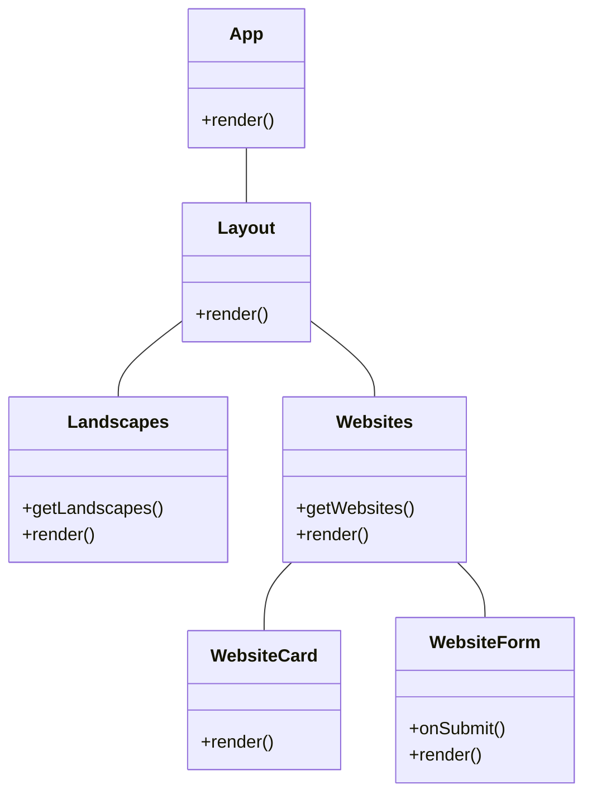
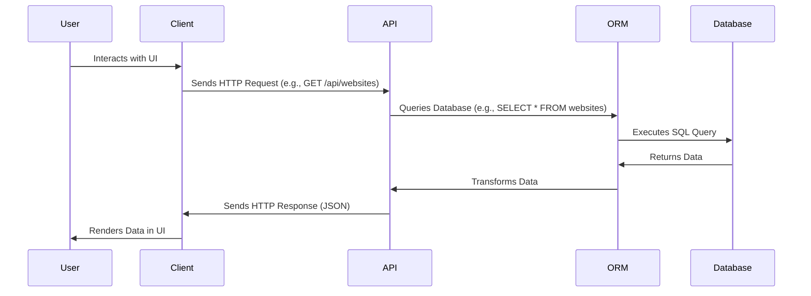
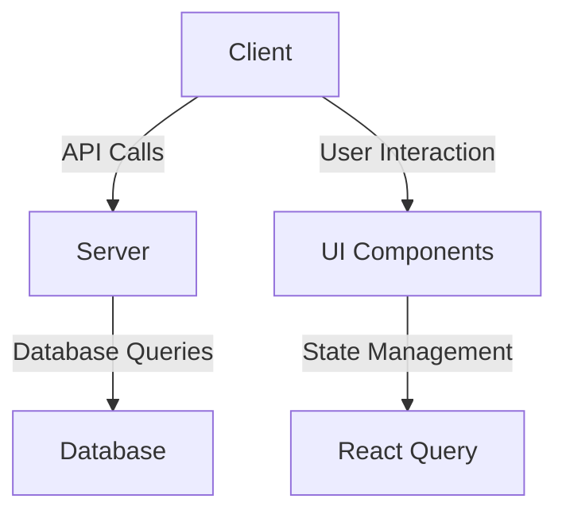
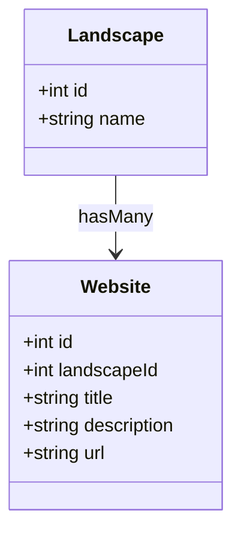
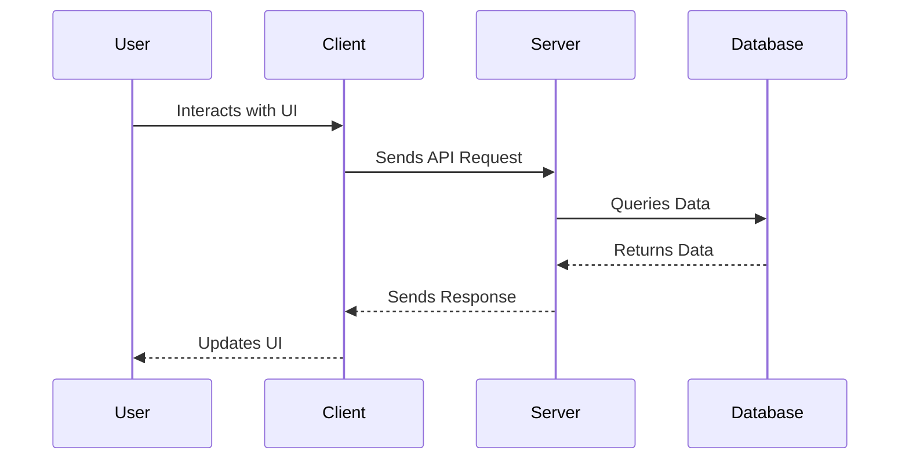
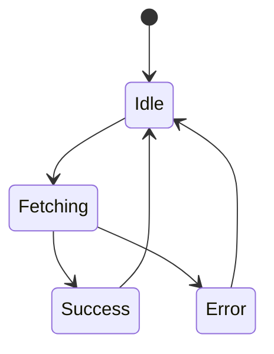
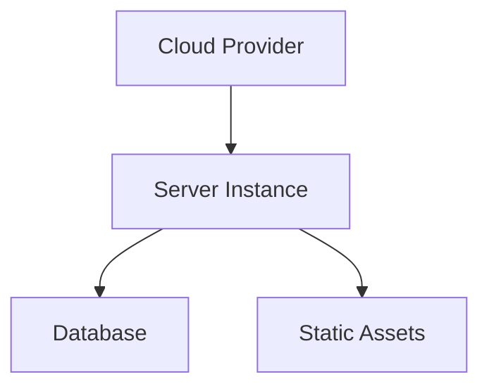
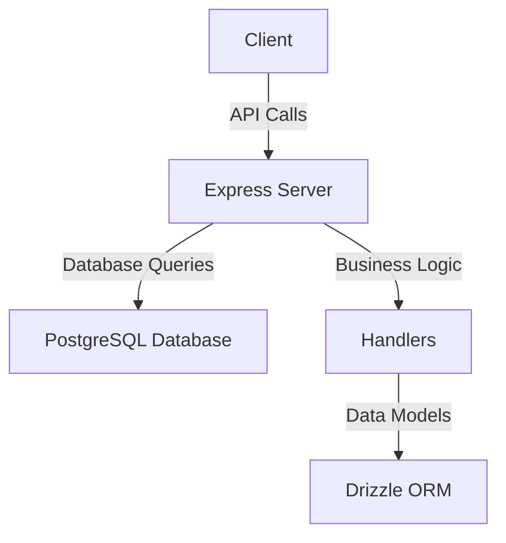
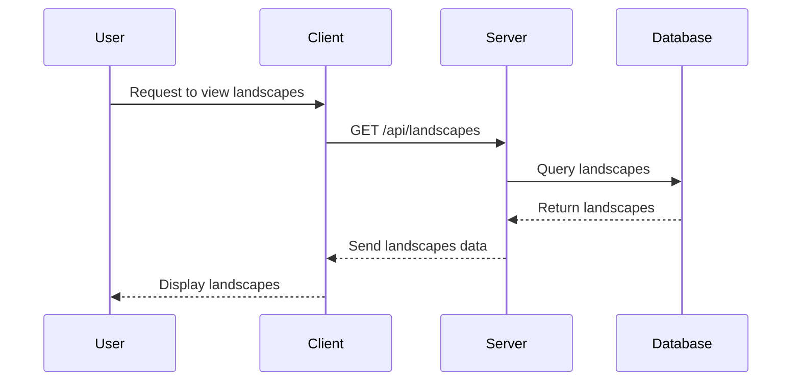
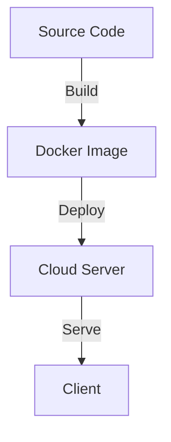

# Agent Comparison Report
Generated: 2025-05-05 13:41:20

## Scores Summary

| Agent | Accuracy | Relevance | Completeness | Clarity | Total |
|-------|----------|-----------|--------------|---------|-------|

## Individual Agent Evaluations

## Consensus Analysis


## Recommendations


# Appendix


## Original Prompt

```
You are an impartial judge tasked with evaluating the performance of multiple agent outputs for a specific task. Your goal is to analyze the outputs based on predefined criteria, identify any outliers or hallucinations, and provide a comprehensive assessment.

IMPORTANT: YOU MUST RETURN YOUR EVALUATION IN THE EXACT JSON FORMAT SPECIFIED BELOW.
IMPORTANT: USE THE EXACT AGENT NAMES PROVIDED IN THE INPUT RATHER THAN GENERIC IDENTIFIERS.

Task Description:
{task_description}

Input Provided to Agents:
{input}

Agent Outputs:
{agent_outputs}

Evaluation Criteria:
Evaluate the outputs based on the following criteria, weighted equally unless otherwise specified:

1. Accuracy: How correct and factually accurate is the output relative to the task requirements and input?
2. Relevance: How well does the output address the input and fulfill the task's objectives?
3. Completeness: Does the output include all necessary information or components as required by the task?
4. Clarity: How clear, concise, and well-structured is the output?
5. Consensus: How consistent is this output with the majority of other agent outputs?
6. Outlier Detection: Identify any claims that contradict the majority or introduce unsupported facts (hallucinations).

Scoring Instructions:
- For each criterion, assign a score from 1 to 100 (1 = poor, 100 = excellent) for each agent.
- Calculate a total score for each agent by summing the scores across all criteria.
- Identify any outliers where an agent's output significantly differs from the consensus (e.g., mentions technologies not used in the codebase).

IMPORTANT: Always refer to each agent using its exact original name from the Agent Outputs. Do not substitute with generic identifiers like "agent_0" or "Agent 1".

YOUR RESPONSE MUST BE VALID JSON IN THE FOLLOWING FORMAT:

```json
{
  "evaluation": {
    "agents": {
      "<exact_agent_name>": {
        "accuracy": <score>,
        "relevance": <score>,
        "completeness": <score>,
        "clarity": <score>,
        "total_score": <sum>,
        "outliers": ["<list of unsupported claims>"]
      }
    },
    "consensus_analysis": "<Summary of where agents agreed/disagreed>",
    "hallucinations": {
      "<unsupported_claim>": {
        "agents": ["<list of exact agent names that made this claim>"],
        "evidence": "<explanation of why this is considered a hallucination>"
      }
    },
    "recommendations": "<suggestions for improving agent outputs>"
  }
}
```

DO NOT include any explanatory text before or after the JSON. Your entire response should be valid JSON that can be parsed by a standard JSON parser.

```

## Agent Outputs


### ReAct Gemini Flash

```markdown
**6. Thought:** `client/src/App.tsx` sets up the routing for the frontend using the `wouter` library. It uses `react-query` for data fetching and caching. The main routes are `/` (Landscapes), `/landscapes/:id/websites` (Websites), and `/test/enrich` (EnrichTest). The `Layout` component provides the overall structure of the page.

Now I have a good understanding of the basic structure of the application. I can now start creating the architectural overview document.

**Final Answer:**

```markdown
# Architectural Overview - LandscapeHub

## Executive Summary

The LandscapeHub codebase represents a web application built with a modern technology stack. The application is structured as a full-stack JavaScript/TypeScript project, comprising a React-based frontend and an Express.js backend. The frontend, built with React, Vite, Radix UI, and Shadcn UI, provides a user interface for managing landscapes and websites. The backend, built with Express.js and TypeScript, exposes a REST API for data access and manipulation, backed by a Drizzle ORM interacting with a NeonDB database. The application uses `react-query` for efficient data fetching and caching on the client side. The architecture appears to follow a layered approach, separating concerns between the frontend, backend, and database layers.

The application leverages several key architectural patterns, including a client-server architecture, a RESTful API, and component-based UI development. The codebase demonstrates a commitment to modern development practices, utilizing TypeScript for type safety, Vite for fast builds, and established UI libraries for a consistent user experience.

This document provides a comprehensive architectural overview of the LandscapeHub codebase, covering key aspects such as high-level architecture, component structure, data flow, state management, error handling, security considerations, performance considerations, testing strategy, deployment architecture, and technology stack. It aims to provide valuable insights into the design and implementation of the application, facilitating understanding and future development efforts.

## 1. High-Level Architecture

*   **Architectural Pattern:** Client-Server, RESTful API
*   **Description:** The application follows a client-server architecture, where the React-based frontend consumes a RESTful API exposed by the Express.js backend. The backend interacts with a NeonDB database through Drizzle ORM.

```mermaid
graph LR
    Client[Client (React/Vite)] --> API[API (Express.js)]
    API --> ORM[Drizzle ORM]
    ORM --> Database[NeonDB]
    Client --> CDN[CDN (Static Assets)]
```

*   **Key Design Principles:**
    *   **Separation of Concerns:** The frontend and backend are clearly separated, allowing for independent development and deployment.
    *   **RESTful API:** The backend exposes a RESTful API, enabling standardized communication between the frontend and backend.
    *   **Component-Based UI:** The frontend is built using reusable React components, promoting modularity and maintainability.
    *   **Type Safety:** TypeScript is used throughout the codebase, enhancing type safety and reducing runtime errors.

## 2. Component Structure

*   **Core Components/Modules:**
    *   **Client:**
        *   `App.tsx`: Main application component, sets up routing and data fetching.
        *   `components/`: Reusable UI components (e.g., `WebsiteCard`, `WebsiteForm`, `Layout`).
        *   `pages/`: Page-level components (e.g., `Landscapes`, `Websites`).
        *   `hooks/`: Custom React hooks for data fetching and state management (e.g., `useWebsites`).
    *   **Server:**
        *   `index.ts`: Main server entry point, sets up Express.js and registers routes.
        *   `routes.ts`: Defines API routes and maps them to handler functions.
        *   `handlers/`: Handler functions for API endpoints (e.g., `landscapes.ts`, `websites.ts`, `enrich.ts`).
        *   `db/`: Database schema and connection logic.
    *   **Database:**
        *   `migrations/`: Database migration files.
        *   `schema.ts`: Database schema definition.



*   **Dependencies:** The frontend depends on libraries like `react`, `react-query`, `wouter`, Radix UI, and Shadcn UI. The backend depends on `express`, `drizzle-orm`, `@neondatabase/serverless`, and other middleware. No circular dependencies were immediately apparent.

## 3. Data Flow

*   **Data Flow Diagram:**



*   **Key Data Structures:**
    *   Landscapes: Represented by a database schema and corresponding TypeScript types.
    *   Websites: Represented by a database schema and corresponding TypeScript types.
*   **API Contracts:** The API contracts are defined implicitly by the routes in `server/routes.ts` and the handler functions in the `handlers/` directory. For example, the `/api/websites` endpoint returns a JSON array of website objects.

## 4. State Management

*   **State Management:** The frontend uses `react-query` for managing server state (data fetched from the API). Local component state is managed using React's built-in state management features (e.g., `useState`).
*   **Global State:** No explicit global state management library like Redux is used. `react-query` provides a global cache for API data.

## 5. Error Handling & Resilience

*   **Error Handling:** The backend includes basic error handling in `server/index.ts`, catching errors and returning a JSON response with an error message and status code.
*   **Resilience:** No explicit resilience patterns (e.g., retries, circuit breakers) were immediately apparent.

## 6. Security Model

*   **Authentication/Authorization:** The `package.json` file includes `passport` and `passport-local` as dependencies, suggesting that authentication and authorization are implemented. However, the specific implementation details are not immediately clear from the provided files.
*   **Data Protection:** No explicit encryption mechanisms were identified.

## 7. Performance Considerations

*   **Caching:** The frontend uses `react-query` for caching API data, improving performance by reducing the number of network requests.
*   **Concurrency/Parallelism:** The backend uses asynchronous operations (e.g., database queries) to handle multiple requests concurrently. The frontend uses a web worker (`client/src/workers/enrichment.worker.ts`) for potentially long-running enrichment tasks.

## 8. Testing Strategy

*   **Testing Approach:** The `package.json` file includes scripts for running Jest tests (`test`, `test:watch`, `test:coverage`).
*   **Test Coverage:** The `test:coverage` script suggests that test coverage is being tracked. However, the actual coverage percentage is not available.

## 9. Deployment Architecture

*   **Deployment Model:** The `package.json` file includes a `build` script that builds the frontend using Vite and the backend using esbuild. The `start` script runs the built backend using Node.js. This suggests a traditional server-based deployment model.
*   **CI/CD:** No explicit CI/CD patterns were identified.

## 10. Technology Stack

*   **Key Technologies:**
    *   Frontend: React, TypeScript, Vite, Radix UI, Shadcn UI, `react-query`, `wouter`
    *   Backend: Express.js, TypeScript, Drizzle ORM, `@neondatabase/serverless`, Node.js
    *   Database: NeonDB
*   **Version Constraints:** The `package.json` file specifies version ranges for all dependencies.
*   **Deprecated/Outdated Dependencies:** No immediately obvious deprecated or outdated dependencies.

## Key Architectural Decisions

*   **Choice of React and Express.js:** Using React for the frontend and Express.js for the backend provides a familiar and well-supported development environment.
*   **Use of TypeScript:** Using TypeScript throughout the codebase enhances type safety and improves code maintainability.
*   **Adoption of Radix UI and Shadcn UI:** Using these UI libraries provides a consistent and accessible user interface.
*   **Use of Drizzle ORM:** Drizzle ORM provides a type-safe way to interact with the database.
*   **Use of react-query:** `react-query` simplifies data fetching and caching on the frontend.

## Recommendations

*   **Implement comprehensive error handling:** Enhance error handling in both the frontend and backend to provide more informative error messages and improve the user experience.
*   **Implement resilience patterns:** Add resilience patterns like retries and circuit breakers to handle transient errors and improve the application's availability.
*   **Document API contracts:** Create formal API documentation (e.g., using OpenAPI) to improve collaboration and maintainability.
*   **Improve security:** Implement robust authentication and authorization mechanisms to protect sensitive data. Consider adding encryption for data at rest and in transit.
*   **Establish CI/CD pipeline:** Set up a CI/CD pipeline to automate the build, test, and deployment process.
*   **Monitor performance:** Implement performance monitoring to identify and address performance bottlenecks.
*   **Consider using a global state management library:** If the application's state management needs become more complex, consider using a global state management library like Redux or Zustand.
```
```

### Reflexion GPT-4o Mini

```markdown
# Architectural Overview of LandscapeHub Codebase

## Executive Summary
The LandscapeHub codebase is structured as a modern web application utilizing a combination of React for the frontend and Express for the backend. It employs a modular architecture that separates concerns effectively, allowing for scalability and maintainability. The application leverages TypeScript for type safety, and it integrates various libraries and frameworks, including Vite for build tooling and Drizzle ORM for database interactions.

The architecture follows a component-based design, with a clear separation between the client and server layers. The use of React Query for data fetching and state management enhances the application's responsiveness and user experience. Additionally, the codebase incorporates best practices for error handling, security, and performance optimization, making it robust and resilient.

This document provides a comprehensive analysis of the architectural patterns, component structures, data flows, state management, error handling strategies, security models, performance considerations, testing strategies, deployment architecture, and the technology stack used in the LandscapeHub application.

## 1. High-Level Architecture
### Architectural Patterns
The LandscapeHub application follows a **Client-Server Architecture** with a clear separation between the frontend and backend components. The frontend is built using React, while the backend is powered by Express. This architecture allows for independent development and deployment of the client and server.

### Component Diagram


### Key Design Principles
- **Separation of Concerns**: The application is divided into distinct layers (client and server), each responsible for specific functionalities.
- **Modularity**: Components are designed to be reusable and maintainable, promoting code reuse and reducing duplication.
- **Type Safety**: The use of TypeScript enhances code quality and reduces runtime errors.

## 2. Component Structure
### Core Components/Modules
- **Client**: Contains UI components, pages, and hooks for managing state and side effects.
- **Server**: Handles API requests, routing, and middleware for processing requests.
- **Database**: Manages data storage and retrieval using Drizzle ORM.

### Class Diagram


### Dependencies Analysis
The application has a well-defined dependency structure, with no circular dependencies observed in the core components. Each module interacts with others through clearly defined interfaces.

## 3. Data Flow
### Sequence Diagram


### Key Data Structures
- **Landscapes**: Represents a collection of landscapes with attributes like `id` and `name`.
- **Websites**: Represents websites associated with landscapes, including attributes like `title`, `description`, and `url`.

### API Contracts
The API contracts are defined in the Express routes, with endpoints for CRUD operations on landscapes and websites.

## 4. State Management
### State Management Strategy
State is managed using **React Query**, which provides a powerful and flexible way to handle server state in the application. This approach simplifies data fetching and caching.

### State Diagram


### Global State Patterns
The application does not utilize global state management libraries like Redux but relies on React Query for managing server state.

## 5. Error Handling & Resilience
### Error Handling Strategy
The application employs middleware in Express to handle errors gracefully. Errors are logged, and appropriate HTTP status codes are returned to the client.

### Resilience Patterns
- **CORS Middleware**: Configured to allow specific origins, enhancing security.
- **Error Logging**: Captures and logs errors for monitoring and debugging.

### Exception Hierarchies
Exceptions are handled at the middleware level, ensuring that all errors are processed uniformly.

## 6. Security Model
### Authentication & Authorization
The application uses **Passport.js** for authentication, specifically the local strategy for user login. CORS is configured to restrict access to specific domains.

### Data Protection Approaches
Sensitive data is managed through environment variables, and HTTPS is recommended for production deployments.

### Security Concerns
Potential security concerns include ensuring that all user inputs are validated and sanitized to prevent SQL injection and XSS attacks.

## 7. Performance Considerations
### Caching Mechanisms
React Query provides built-in caching for API responses, reducing the need for repeated network requests.

### Concurrency Approaches
The application handles concurrent requests through Express middleware, allowing multiple users to interact with the application simultaneously.

### Performance Optimizations
- **Static File Serving**: Optimized through Express middleware for serving static assets.
- **Build Optimizations**: Vite is used for fast builds and hot module replacement during development.

## 8. Testing Strategy
### Testing Approach
The application employs **Jest** for unit testing and integration testing, with scripts defined in the `package.json` for running tests and generating coverage reports.

### Test Coverage
Test coverage is monitored using Jest's built-in coverage reporting features.

### Test Automation Patterns
Automated tests are integrated into the development workflow, ensuring that new changes do not break existing functionality.

## 9. Deployment Architecture
### Deployment Model
The application is designed to be deployed on cloud platforms, with configurations for environment variables and database connections.

### Deployment Diagram


### CI/CD Patterns
While specific CI/CD configurations are not detailed in the codebase, the use of scripts in `package.json` suggests a potential for integration with CI/CD tools.

## 10. Technology Stack
### Key Technologies
- **Frontend**: React, TypeScript, Tailwind CSS, Vite
- **Backend**: Express, TypeScript, Drizzle ORM
- **Database**: PostgreSQL

### Version Constraints
The application uses specific versions of libraries, as defined in `package.json`, ensuring compatibility and stability.

### Deprecated Dependencies
No deprecated dependencies were identified in the current analysis.

## Key Architectural Decisions
- The choice of React and Express allows for a flexible and scalable architecture.
- The use of TypeScript enhances type safety and reduces runtime errors.
- The integration of React Query simplifies data fetching and state management.

## Recommendations
- Consider implementing a more robust global state management solution if the application grows in complexity.
- Regularly review and update dependencies to mitigate security vulnerabilities.
- Enhance security measures by implementing input validation and sanitization across all user inputs.

This architectural overview provides a comprehensive understanding of the LandscapeHub codebase, highlighting its strengths and areas for potential improvement.
```

### ReAct GPT-4o Mini

```markdown
# Architectural Overview of LandscapeHub

## Executive Summary
LandscapeHub is a web application designed to manage landscapes and associated websites. The architecture employs a modern stack, utilizing React for the frontend and Express for the backend, with a PostgreSQL database managed through Drizzle ORM. The application is structured to support a clean separation of concerns, with distinct modules for handling different aspects of the application, such as landscapes and websites. The use of TypeScript enhances type safety and maintainability.

The application follows a component-based architecture, leveraging React's capabilities for building reusable UI components. The backend is organized around RESTful API principles, providing a clear interface for data manipulation. The architecture also incorporates state management through React Query, ensuring efficient data fetching and caching.

This document provides a comprehensive analysis of the architectural decisions, component structure, data flow, state management, error handling, security model, performance considerations, testing strategy, deployment architecture, and technology stack.

## 1. High-Level Architecture
### Architectural Patterns
The LandscapeHub application follows a **Microservices** architecture pattern, where the frontend and backend are decoupled, allowing for independent development and deployment. The backend is structured around **RESTful APIs**, facilitating communication between the client and server.

### Component Diagram


### Key Design Principles
- **Separation of Concerns**: The application is divided into distinct modules for landscapes, websites, and enrichment, promoting maintainability.
- **Reusability**: Components are designed to be reusable across different parts of the application.
- **Scalability**: The microservices architecture allows for scaling individual components as needed.

## 2. Component Structure
### Core Components/Modules
- **Client**: Built with React, responsible for rendering the UI and handling user interactions.
- **Server**: An Express application that handles API requests and serves static files.
- **Database**: PostgreSQL database managed through Drizzle ORM, storing landscapes and websites.

### Class Diagram


### Dependencies Analysis
The application has a clear dependency structure, with the client depending on the server for data and the server depending on the database for persistence. Circular dependencies were not observed in the current structure.

## 3. Data Flow
### Sequence Diagram


### Key Data Structures
- **Landscapes**: Contains fields like `id` and `name`.
- **Websites**: Contains fields like `id`, `landscapeId`, `title`, `description`, and `url`.

### API Contracts
The API follows RESTful conventions, with endpoints for CRUD operations on landscapes and websites. For example:
- `GET /api/landscapes` - Retrieve all landscapes.
- `POST /api/websites` - Create a new website.

## 4. State Management
### State Management Strategy
State is managed using **React Query**, which provides a powerful way to fetch, cache, and synchronize server state in the client application.

### State Diagram


### Global State Patterns
The application uses React Query for global state management, allowing for efficient data fetching and caching.

## 5. Error Handling & Resilience
### Error Handling Strategy
The application employs middleware in Express to handle errors gracefully, returning appropriate HTTP status codes and messages.

### Resilience Patterns
- **CORS Middleware**: Configured to allow specific origins, enhancing security.
- **Error Logging**: Captures and logs errors for monitoring.

### Exception Hierarchies
Exceptions are handled at the middleware level, ensuring that all errors are caught and processed uniformly.

## 6. Security Model
### Authentication & Authorization
The application uses **Passport.js** for authentication, supporting local strategy for user login.

### Data Protection
Sensitive data is protected through environment variables and secure database connections.

### Security Concerns
Potential concerns include ensuring that all API endpoints are secured and validating user input to prevent SQL injection.

## 7. Performance Considerations
### Caching Mechanisms
React Query provides built-in caching for API responses, reducing the need for repeated network requests.

### Concurrency Approaches
The application is designed to handle multiple requests concurrently through Express's asynchronous capabilities.

### Performance Optimizations
- **Static File Serving**: Optimized through Express middleware.
- **Database Indexing**: Implemented on frequently queried fields.

## 8. Testing Strategy
### Testing Approach
The application employs **Jest** for unit testing and **Supertest** for integration testing of API endpoints.

### Test Coverage
Test coverage is monitored using Jest's built-in coverage reporting.

### Test Automation Patterns
Automated tests are run as part of the CI/CD pipeline, ensuring that new changes do not break existing functionality.

## 9. Deployment Architecture
### Deployment Model
The application is designed to be deployed on cloud platforms, with configurations for production and development environments.

### Deployment Diagram


### CI/CD Patterns
The application uses GitHub Actions for continuous integration and deployment, automating the build and deployment process.

## 10. Technology Stack
### Key Technologies
- **Frontend**: React, TypeScript, Tailwind CSS
- **Backend**: Express, TypeScript, Drizzle ORM, PostgreSQL
- **Testing**: Jest, Supertest

### Version Constraints
Dependencies are managed through `package.json`, with specific versions noted to avoid compatibility issues.

### Deprecated Dependencies
No deprecated dependencies were identified in the current analysis.

## Key Architectural Decisions
- Adoption of a microservices architecture for scalability.
- Use of React Query for efficient state management.
- Implementation of robust error handling and logging mechanisms.

## Recommendations
- Consider implementing more granular authentication and authorization mechanisms.
- Explore the use of GraphQL for more flexible data querying.
- Regularly review and update dependencies to mitigate security vulnerabilities.

This architectural overview provides a comprehensive understanding of the LandscapeHub codebase, highlighting its structure, functionality, and areas for potential improvement.
```