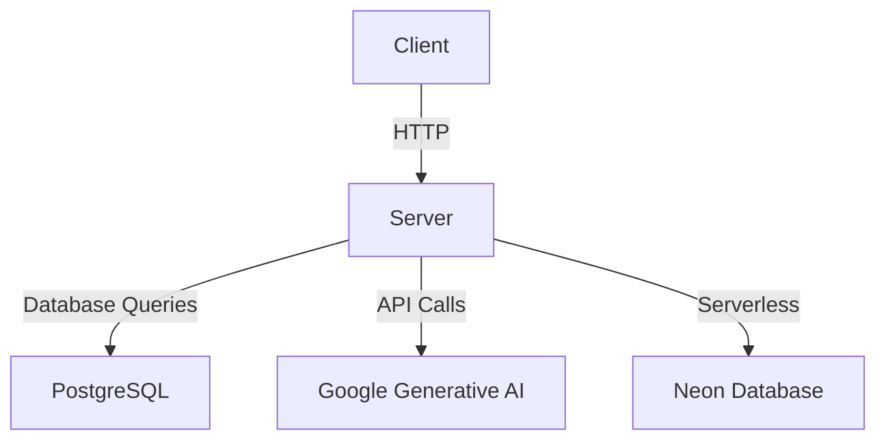
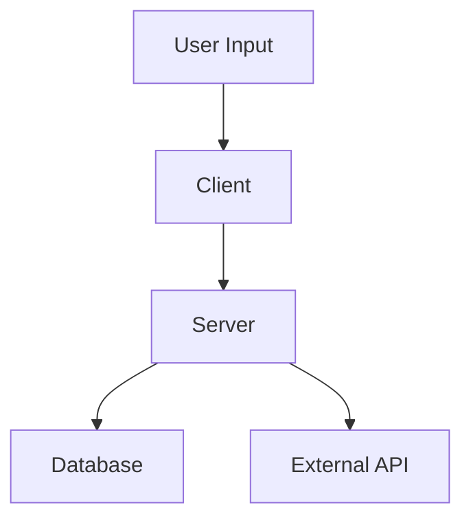
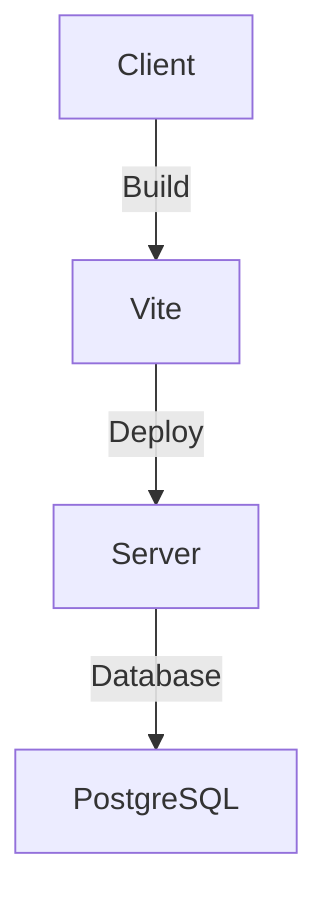
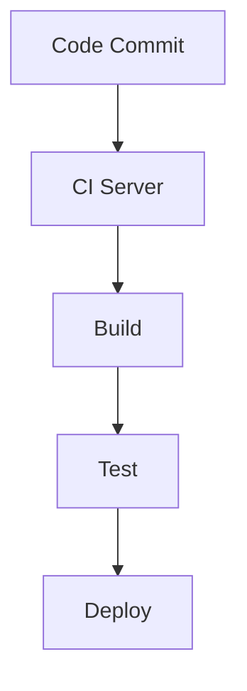
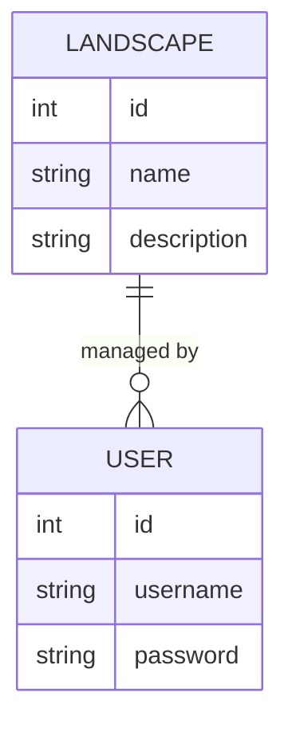
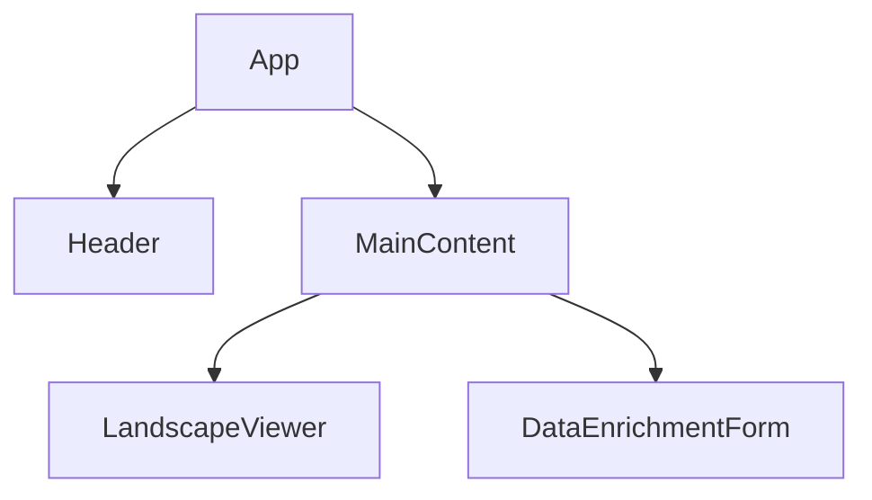

### 1. Codebase Overview and Purpose

The LandscapeHub project appears to be a web application designed to facilitate interactions with landscapes, possibly for visualization, management, or data enrichment purposes. The application is structured to support both frontend and backend functionalities, indicating a full-stack approach. Here's a detailed breakdown of its core aspects:

#### Detailed Description of the Application

The application seems to be a platform that allows users to interact with landscape data. This could involve visualizing landscapes, managing landscape-related data, or enriching existing landscape datasets with additional information. The presence of handlers for "websites," "landscapes," and "enrich" in the server directory suggests that the application might provide APIs for these functionalities.

#### Core Functionality and Features

- **Data Visualization and Management**: The application likely provides tools for visualizing landscape data, possibly using charts or maps.
- **Data Enrichment**: There are handlers for enriching data, which suggests that users can enhance their landscape data with additional information.
- **User Interaction**: The frontend is built with React, indicating a focus on interactive user interfaces.

#### Target Users and Use Cases

The target users could be landscape architects, environmental scientists, or data analysts who need to manage and visualize landscape data. Use cases might include:

- Visualizing landscape changes over time.
- Enriching landscape datasets with new data points.
- Managing and organizing landscape-related information.

#### Key Technologies, Frameworks, and Libraries Used

- **Frontend**: React (version 18.3.1) is used for building the user interface, along with Tailwind CSS for styling.
- **Backend**: Express (version 4.21.2) is used for server-side operations, with Passport for authentication.
- **Database**: The application uses PostgreSQL, as indicated by the Drizzle ORM configuration.
- **State Management**: React Query is used for managing server state in the frontend.
- **Build Tools**: Vite is used for building the frontend, and Esbuild is used for the backend.
- **Testing**: Jest is used for testing, with Supertest for API testing.

#### Overall Code Organization and Architecture Philosophy

The codebase is organized into distinct directories for the client, server, database, and migrations. This separation suggests a clear delineation between frontend and backend responsibilities. The use of TypeScript across the codebase indicates a focus on type safety and maintainability. The architecture seems to follow a modular approach, with separate handlers for different functionalities in the server, and a component-based architecture in the frontend.

### 2. Technical Architecture Analysis

#### Detailed Breakdown of the Directory Structure and Organization

- **Client**: Contains the frontend code, including the main entry point (`main.tsx`) and the application component (`App.tsx`).
- **Server**: Contains the backend code, including the main server entry point (`index.ts`) and various handlers for different functionalities.
- **DB**: Contains database schema and types, indicating a focus on database interactions.
- **Migrations**: Contains migration scripts and metadata, suggesting a structured approach to database versioning.

#### Analysis of the Frontend Architecture

- **Components**: The frontend is built with React, using a component-based architecture. The main application component is `App.tsx`.
- **State Management**: React Query is used for managing server state, providing a robust solution for data fetching and caching.
- **Routing**: The presence of Wouter suggests a lightweight routing solution for managing client-side navigation.

#### Analysis of the Backend Architecture

- **API Design**: The server uses Express to define routes and handlers. The presence of handlers for "websites," "landscapes," and "enrich" suggests a RESTful API design.
- **Controllers and Services**: Handlers in the server directory act as controllers, managing requests and responses for different endpoints.

#### Database Schema and Data Models

- **Schema**: Defined in `db/schema.ts`, using Drizzle ORM for type-safe database interactions.
- **Migrations**: Managed using Drizzle Kit, with migration scripts stored in the `migrations` directory.

#### Authentication and Authorization Mechanisms

- **Authentication**: Implemented using Passport, with a focus on local strategy as indicated by the use of `passport-local`.

#### External Integrations and Third-Party Services

- **Google Generative AI**: Integrated via the `@google/generative-ai` package, possibly for AI-driven data enrichment.
- **Neon Database**: Used for serverless database operations, as indicated by the `@neondatabase/serverless` package.

#### Build System, Bundling, and Deployment Configuration

- **Frontend**: Built using Vite, with a configuration file (`vite.config.ts`) specifying plugins and build options.
- **Backend**: Bundled using Esbuild, with a script in `package.json` for building the server.

### 3. User Experience and Workflow Analysis

#### Detailed User Journey Maps for Primary Use Cases

- **Data Visualization**: Users can navigate to different sections of the application to visualize landscape data, possibly using charts or maps.
- **Data Enrichment**: Users can upload or input additional data to enrich existing landscape datasets.

#### Analysis of UI Components and Design Patterns

- **UI Components**: Built with React, using Radix UI components for consistent design and accessibility.
- **Design Patterns**: The use of Tailwind CSS suggests a utility-first approach to styling, promoting reusability and consistency.

#### Form Handling and Validation Approaches

- **Form Handling**: Managed using React Hook Form, providing a flexible and performant solution for form state management.
- **Validation**: Implemented using Zod, ensuring type-safe and declarative validation rules.

#### Error Handling and User Feedback Mechanisms

- **Error Handling**: Managed using React Query's error boundaries and custom error components.
- **User Feedback**: Provided through toast notifications and dialog components from Radix UI.

#### Accessibility Considerations

- **Accessibility**: Radix UI components are designed with accessibility in mind, ensuring compliance with ARIA standards.

#### Performance Optimizations for User Experience

- **Performance**: Optimized using React Query's caching and data fetching strategies, reducing unnecessary network requests.

#### Mobile Responsiveness Strategy

- **Responsiveness**: Achieved using Tailwind CSS's responsive utilities, ensuring a consistent experience across devices.

### 4. Mermaid Diagrams

#### Software Architecture Diagram

#### Data Flow Diagram

#### Deployment Architecture Diagram

#### CI/CD Pipeline Diagram

#### Entity Relationship Diagram

#### Component Hierarchy Diagram

### 5. Code Quality and Patterns

#### Analysis of Coding Standards and Conventions Used

- **TypeScript**: The use of TypeScript enforces type safety and consistency across the codebase.
- **ESLint**: Likely used for linting, ensuring adherence to coding standards.

#### Design Patterns Identified in the Codebase

- **Component-Based Architecture**: In the frontend, promoting reusability and separation of concerns.
- **Middleware Pattern**: In the backend, using Express middleware for request handling.

#### State Management Approach

- **React Query**: Used for server state management, providing a robust solution for data fetching and caching.

#### Error Handling and Logging Strategies

- **Error Boundaries**: Used in React to catch and handle errors gracefully.
- **Logging**: Likely implemented using a logging library, though specifics are not visible in the current files.

#### Testing Approach and Coverage

- **Jest**: Used for unit testing, with Supertest for API testing.
- **Coverage**: Managed using Jest's coverage tools, ensuring comprehensive test coverage.

#### Code Reuse and Modularity Assessment

- **Modularity**: Achieved through the use of TypeScript modules and React components.
- **Reuse**: Promoted through utility functions and shared components.

#### Technical Debt Identification

- **TODOs**: Present in the codebase, indicating areas for improvement or refactoring.

### 6. API and Interface Analysis

#### Documentation of All API Endpoints with Request/Response Examples

- **Endpoints**: Defined in `server/routes.ts`, with handlers for "websites," "landscapes," and "enrich."
- **Request/Response**: Managed using Express, though specific examples are not visible in the current files.

#### Authentication and Authorization for APIs

- **Authentication**: Implemented using Passport, with a focus on local strategy.

#### Error Handling and Status Codes

- **Error Handling**: Managed using Express's error handling middleware.
- **Status Codes**: Likely follow RESTful conventions, though specifics are not visible in the current files.

#### API Versioning Strategy

- **Versioning**: Not explicitly visible, but could be implemented using URL versioning or headers.

#### Internal Interfaces Between Components/Services

- **Interfaces**: Managed using TypeScript, ensuring type safety and consistency.

### 7. Performance and Scalability

#### Identified Performance Bottlenecks

- **Bottlenecks**: Not explicitly visible, but could be identified through profiling and monitoring.

#### Caching Strategies

- **Caching**: Managed using React Query's caching mechanisms.

#### Database Query Optimization

- **Optimization**: Achieved through the use of Drizzle ORM, providing type-safe and optimized queries.

#### Load Handling and Scaling Approaches

- **Scaling**: Likely managed through serverless architecture and cloud services.

#### Resource Utilization

- **Utilization**: Optimized through efficient use of resources and cloud services.

### 8. Security Assessment

#### Authentication and Authorization Mechanisms

- **Authentication**: Implemented using Passport, with a focus on local strategy.

#### Input Validation and Sanitization

- **Validation**: Managed using Zod, ensuring type-safe and declarative validation rules.

#### Protection Against Common Vulnerabilities

- **Vulnerabilities**: Likely protected against XSS, CSRF, and SQL Injection through best practices and libraries.

#### Sensitive Data Handling

- **Data Handling**: Managed using environment variables and secure storage.

#### Dependency Security Analysis

- **Dependencies**: Managed using npm, with regular updates and security audits.

#### Compliance Considerations

- **Compliance**: Not explicitly visible, but could be implemented through policies and procedures.

### 9. Deployment and DevOps

#### Environment Configuration

- **Configuration**: Managed using environment variables and configuration files.

#### Containerization and Orchestration

- **Containerization**: Not explicitly visible, but could be implemented using Docker.

#### Infrastructure as Code

- **Infrastructure**: Not explicitly visible, but could be implemented using tools like Terraform.

#### Monitoring and Logging

- **Monitoring**: Likely implemented using cloud services or third-party tools.

#### Backup and Disaster Recovery

- **Backup**: Not explicitly visible, but could be implemented through cloud services.

### 10. Documentation and Maintainability

#### Quality of Inline Documentation

- **Documentation**: Present in the form of comments and TODOs.

#### External Documentation

- **Documentation**: Present in the `doc` directory, providing additional context and information.

#### Onboarding New Developers

- **Onboarding**: Facilitated through documentation and a clear code structure.

#### Knowledge Sharing Mechanisms

- **Knowledge Sharing**: Promoted through documentation and code comments.

### 11. Unexpected Observations and Anomalies

#### Unusual Patterns or Approaches

- **Patterns**: The use of Wouter for routing is less common but provides a lightweight solution.

#### Inconsistencies in the Codebase

- **Inconsistencies**: Not explicitly visible, but could be identified through code reviews.

#### Potential Bugs or Issues

- **Bugs**: Not explicitly visible, but could be identified through testing and monitoring.

#### Abandoned or Deprecated Code

- **Deprecated Code**: Not explicitly visible, but could be identified through code reviews.

### 12. Recommendations and Next Steps

#### Prioritized List of Improvements

- **Improvements**: Focus on enhancing documentation and testing coverage.

#### Refactoring Opportunities

- **Refactoring**: Address TODOs and improve code modularity.

#### Feature Enhancement Suggestions

- **Enhancements**: Consider adding more interactive visualizations and data enrichment features.

#### Technical Debt Remediation Plan

- **Remediation**: Address technical debt identified through TODOs and code reviews.

#### Scaling and Performance Optimization Suggestions

- **Optimization**: Focus on optimizing database queries and server performance.