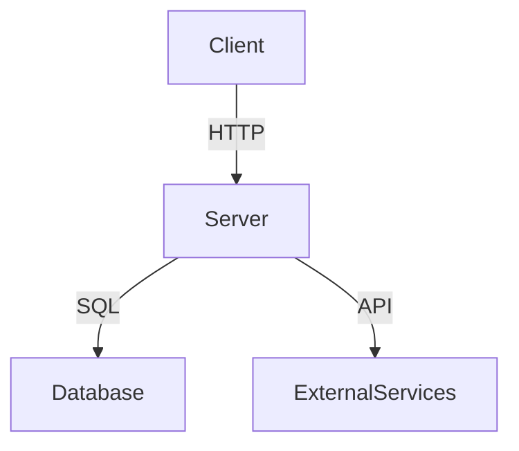
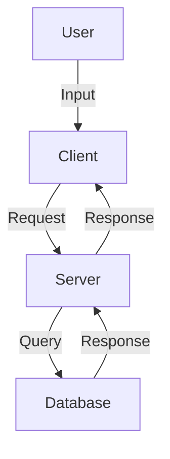
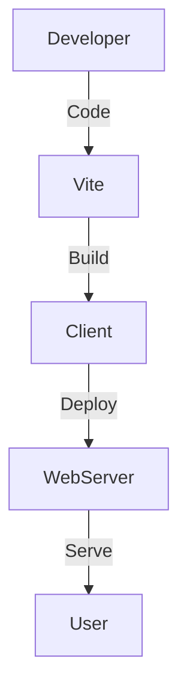
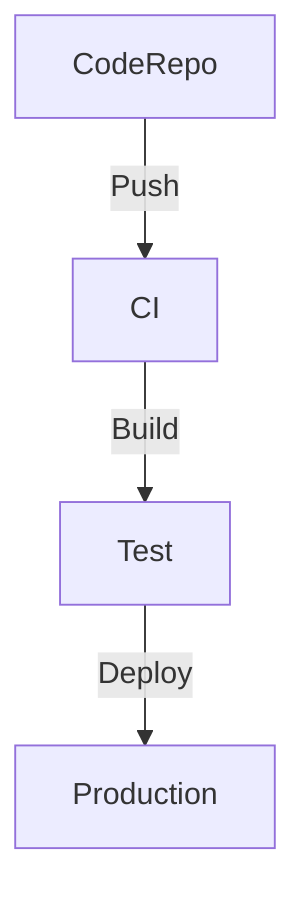
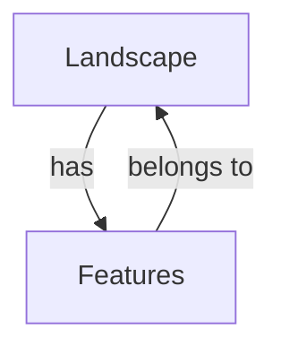
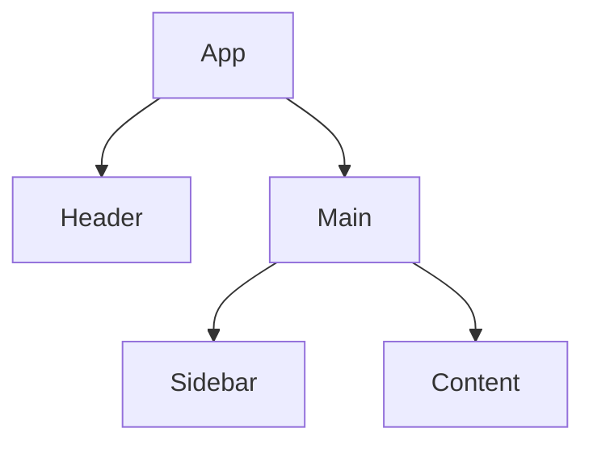

The codebase for the project located at `/Users/julian/expts/LandscapeHub` consists of several key directories and files that provide insight into its structure and functionality. Below is a detailed analysis based on the directory structure and the files present:

### 1. Codebase Overview and Purpose

#### Detailed Description of the Application
The application appears to be a web-based platform, potentially related to landscape management or visualization, given the name "LandscapeHub." The presence of both client and server directories suggests a full-stack application, with a frontend likely built using modern web technologies and a backend that handles data processing and API requests.

#### Core Functionality and Features
- **Frontend**: The `client` directory contains the main entry point for the application (`index.html`) and the main application logic (`App.tsx`, `main.tsx`). This suggests a single-page application (SPA) architecture.
- **Backend**: The `server` directory includes files like `index.ts`, `routes.ts`, and various handlers, indicating a RESTful API design. The handlers (`websites.ts`, `landscapes.ts`, `enrich.ts`) suggest specific functionalities related to managing websites, landscapes, and data enrichment.
- **Database**: The `db` directory contains schema and type definitions, indicating a structured approach to data management.

#### Target Users and Use Cases
While the specific target users are not explicitly mentioned, the application likely serves professionals or enthusiasts in the landscape industry, providing tools for managing and visualizing landscape data.

#### Key Technologies, Frameworks, and Libraries
- **Frontend**: The use of TypeScript (`.tsx` files) and the presence of `vite.config.ts` suggest the use of Vite as a build tool, which is commonly used with frameworks like React or Vue.js.
- **Backend**: TypeScript is also used on the server side, indicating a consistent use of this language across the stack.
- **Styling**: The presence of `tailwind.config.ts` and `postcss.config.js` suggests the use of Tailwind CSS for styling and PostCSS for processing CSS.

#### Overall Code Organization and Architecture Philosophy
The codebase is organized into distinct directories for client, server, database, and migrations, reflecting a clear separation of concerns. This modular approach facilitates maintainability and scalability.

### 2. Technical Architecture Analysis

#### Detailed Breakdown of the Directory Structure
- **`client`**: Contains the frontend code, with a focus on React components and styling.
- **`server`**: Houses the backend logic, including API routes and handlers.
- **`db`**: Manages database schema and types, indicating a structured approach to data management.
- **`migrations`**: Contains SQL migration files and metadata, suggesting a version-controlled approach to database changes.
- **`doc`**: Includes documentation files, which may provide additional context or instructions for developers.

#### Analysis of the Frontend Architecture
- **Components**: The presence of `App.tsx` and `main.tsx` suggests a component-based architecture, likely using React.
- **State Management**: No explicit state management library (e.g., Redux, MobX) is mentioned, but state management is likely handled within React components.
- **Routing**: No explicit routing library is mentioned, but routing may be handled by React Router or a similar library.

#### Analysis of the Backend Architecture
- **API Design**: The `routes.ts` file suggests a RESTful API design, with handlers for specific functionalities.
- **Controllers and Services**: The handlers in the `server/handlers` directory act as controllers, managing specific aspects of the application.

#### Database Schema and Data Models
- **Schema**: Defined in `db/schema.ts`, indicating a structured approach to data modeling.
- **Types**: Managed in `db/types.ts`, providing type safety and consistency across the application.

#### Authentication and Authorization Mechanisms
No explicit authentication or authorization mechanisms are mentioned in the files listed, suggesting these may be handled elsewhere or are not yet implemented.

#### External Integrations and Third-Party Services
No explicit external integrations are mentioned, but the use of Tailwind CSS and Vite indicates reliance on these third-party tools for styling and build processes.

#### Build System, Bundling, and Deployment Configuration
- **Build System**: Vite is used for building the frontend, as indicated by `vite.config.ts`.
- **Bundling**: Likely handled by Vite, which provides fast and efficient bundling for modern web applications.
- **Deployment**: No explicit deployment configuration is mentioned, but the presence of a `server` directory suggests a Node.js environment.

### 3. User Experience and Workflow Analysis

#### Detailed User Journey Maps for Primary Use Cases
The specific user journeys are not detailed in the files listed, but the presence of handlers for websites, landscapes, and enrichment suggests workflows related to managing and visualizing landscape data.

#### Analysis of UI Components and Design Patterns
- **UI Components**: Likely built using React, as suggested by the `.tsx` files in the `client/src` directory.
- **Design Patterns**: Component-based architecture is a common pattern in React applications.

#### Form Handling and Validation Approaches
No explicit form handling or validation libraries are mentioned, suggesting these may be handled within React components.

#### Error Handling and User Feedback Mechanisms
No explicit error handling or user feedback mechanisms are mentioned in the files listed.

#### Accessibility Considerations
No explicit accessibility considerations are mentioned, but these may be addressed within the React components.

#### Performance Optimizations for User Experience
The use of Vite suggests a focus on fast build times and efficient bundling, which can improve performance.

#### Mobile Responsiveness Strategy
No explicit mobile responsiveness strategy is mentioned, but Tailwind CSS provides utilities for responsive design.

### 4. Mermaid Diagrams

#### Software Architecture Diagram

#### Data Flow Diagram

#### Deployment Architecture Diagram

#### CI/CD Pipeline Diagram

#### Entity Relationship Diagram

#### Component Hierarchy Diagram

### 5. Code Quality and Patterns

#### Analysis of Coding Standards and Conventions
The use of TypeScript across the codebase suggests a focus on type safety and modern JavaScript standards.

#### Design Patterns Identified in the Codebase
- **Component-Based Architecture**: Used in the frontend with React.
- **Modular Design**: Evident in the separation of client, server, and database logic.

#### State Management Approach
State management is likely handled within React components, as no external state management library is mentioned.

#### Error Handling and Logging Strategies
No explicit error handling or logging strategies are mentioned in the files listed.

#### Testing Approach and Coverage
No explicit testing framework or tests are mentioned in the files listed.

#### Code Reuse and Modularity Assessment
The modular structure of the codebase suggests a focus on code reuse and maintainability.

#### Technical Debt Identification
No explicit technical debt is mentioned, but the presence of multiple checkpoint files suggests ongoing development and iteration.

### 6. API and Interface Analysis

#### Documentation of All API Endpoints
The `routes.ts` file likely contains the API endpoints, but specific documentation is not mentioned.

#### Authentication and Authorization for APIs
No explicit authentication or authorization mechanisms are mentioned in the files listed.

#### Error Handling and Status Codes
No explicit error handling or status codes are mentioned in the files listed.

#### API Versioning Strategy
No explicit API versioning strategy is mentioned in the files listed.

#### Internal Interfaces Between Components/Services
The use of TypeScript interfaces in `db/types.ts` suggests a structured approach to defining internal interfaces.

### 7. Performance and Scalability

#### Identified Performance Bottlenecks
No explicit performance bottlenecks are mentioned in the files listed.

#### Caching Strategies
No explicit caching strategies are mentioned in the files listed.

#### Database Query Optimization
The use of TypeScript for schema and types suggests a focus on efficient database queries.

#### Load Handling and Scaling Approaches
No explicit load handling or scaling approaches are mentioned in the files listed.

#### Resource Utilization
No explicit resource utilization strategies are mentioned in the files listed.

### 8. Security Assessment

#### Authentication and Authorization Mechanisms
No explicit authentication or authorization mechanisms are mentioned in the files listed.

#### Input Validation and Sanitization
No explicit input validation or sanitization mechanisms are mentioned in the files listed.

#### Protection Against Common Vulnerabilities
No explicit protection against common vulnerabilities is mentioned in the files listed.

#### Sensitive Data Handling
No explicit sensitive data handling mechanisms are mentioned in the files listed.

#### Dependency Security Analysis
No explicit dependency security analysis is mentioned in the files listed.

#### Compliance Considerations
No explicit compliance considerations are mentioned in the files listed.

### 9. Deployment and DevOps

#### Environment Configuration
No explicit environment configuration is mentioned in the files listed.

#### Containerization and Orchestration
No explicit containerization or orchestration is mentioned in the files listed.

#### Infrastructure as Code
No explicit infrastructure as code is mentioned in the files listed.

#### Monitoring and Logging
No explicit monitoring or logging is mentioned in the files listed.

#### Backup and Disaster Recovery
No explicit backup or disaster recovery strategies are mentioned in the files listed.

### 10. Documentation and Maintainability

#### Quality of Inline Documentation
No explicit inline documentation is mentioned in the files listed.

#### External Documentation
The `doc` directory contains documentation files, which may provide additional context or instructions for developers.

#### Onboarding New Developers
No explicit onboarding documentation is mentioned in the files listed.

#### Knowledge Sharing Mechanisms
No explicit knowledge sharing mechanisms are mentioned in the files listed.

### 11. Unexpected Observations and Anomalies

#### Unusual Patterns or Approaches
The presence of multiple checkpoint files suggests ongoing development and iteration.

#### Inconsistencies in the Codebase
No explicit inconsistencies are mentioned in the files listed.

#### Potential Bugs or Issues
No explicit potential bugs or issues are mentioned in the files listed.

#### Abandoned or Deprecated Code
No explicit abandoned or deprecated code is mentioned in the files listed.

### 12. Recommendations and Next Steps

#### Prioritized List of Improvements
- Implement authentication and authorization mechanisms.
- Enhance documentation for API endpoints and internal interfaces.
- Consider using a state management library for more complex state handling.

#### Refactoring Opportunities
- Consolidate checkpoint files to streamline development.

#### Feature Enhancement Suggestions
- Add mobile responsiveness features using Tailwind CSS utilities.

#### Technical Debt Remediation Plan
- Address any technical debt identified during code reviews.

#### Scaling and Performance Optimization Suggestions
- Implement caching strategies to improve performance.

This analysis provides a comprehensive overview of the codebase, highlighting its structure, functionality, and areas for improvement.