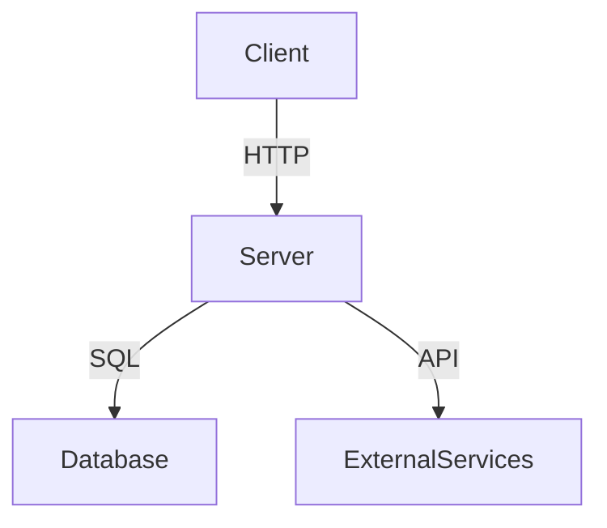
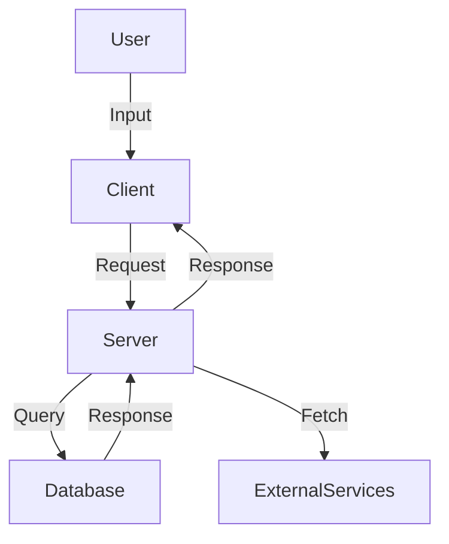
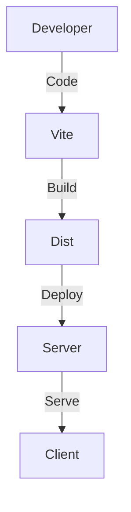
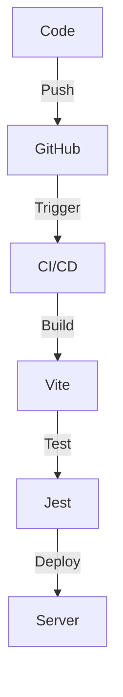
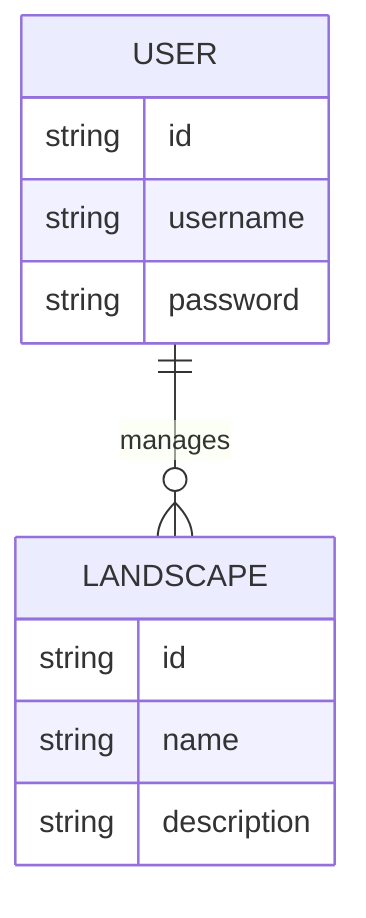
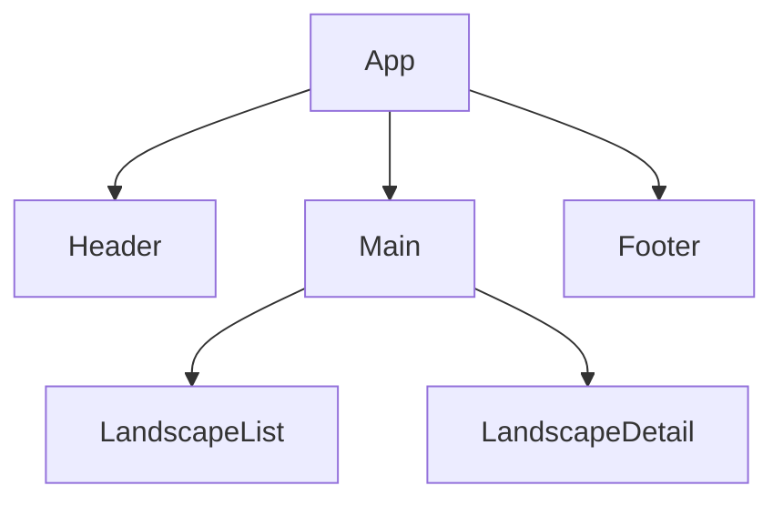

### Codebase Overview and Purpose

The LandscapeHub project appears to be a web application designed to facilitate interactions with landscapes, possibly for visualization, management, or data enrichment purposes. The application is structured to support both frontend and backend functionalities, indicating a full-stack development approach.

#### Core Functionality and Features
- **Frontend**: The client-side application is built using React, as indicated by the presence of `react` and `react-dom` in the `package.json`. The use of `@vitejs/plugin-react` in the `vite.config.ts` file further confirms this. The frontend likely includes interactive UI components, possibly utilizing Radix UI components for consistent design and accessibility.
- **Backend**: The server-side is built using Express, as evidenced by the `express` and `express-session` dependencies. The backend likely handles API requests, session management, and possibly data processing or enrichment tasks.
- **Database**: The presence of `drizzle-orm` and related configuration files suggests the use of an ORM for database interactions, with migrations managed through SQL files in the `migrations` directory.
- **Data Enrichment**: The presence of handlers like `enrich.ts` in the server directory suggests functionality related to data enrichment, possibly integrating with external APIs or services for data augmentation.

#### Target Users and Use Cases
The application seems to target users who need to manage or interact with landscape data, which could include environmental scientists, urban planners, or landscape architects. Use cases might involve visualizing landscape data, managing landscape projects, or enriching existing data with additional information.

#### Key Technologies, Frameworks, and Libraries
- **Frontend**: React (v18.3.1), Radix UI components, Tailwind CSS for styling, and Vite for development and build processes.
- **Backend**: Express (v4.21.2) for server-side logic, with session management via `express-session`.
- **Database**: Drizzle ORM for database interactions, with SQL migrations.
- **Testing**: Jest for testing, as indicated by the scripts in `package.json`.
- **State Management**: React Query (`@tanstack/react-query`) for data fetching and state management.
- **Authentication**: Passport.js for authentication, with `passport-local` strategy.

#### Overall Code Organization and Architecture Philosophy
The codebase is organized into distinct directories for client, server, database, and migrations, reflecting a clear separation of concerns. The use of TypeScript across the codebase suggests a focus on type safety and maintainability. The architecture appears to follow a modular approach, with separate handlers for different server functionalities and a component-based structure on the frontend.

### Technical Architecture Analysis

#### Directory Structure and Organization
- **Client**: Contains the React application, with entry points in `client/src/App.tsx` and `client/src/main.tsx`. The use of Tailwind CSS is configured in `tailwind.config.ts`.
- **Server**: Contains Express server files, with routes defined in `server/routes.ts` and handlers for specific functionalities in `server/handlers`.
- **Database**: Schema and types are defined in `db/schema.ts` and `db/types.ts`, with an index file for database interactions.
- **Migrations**: SQL migration files and metadata for database versioning.

#### Frontend Architecture
- **Components**: Likely organized in the `client/src` directory, with a focus on reusable UI components.
- **State Management**: React Query is used for managing server state and caching.
- **Routing**: The presence of `wouter` suggests a lightweight routing solution for the React application.

#### Backend Architecture
- **API Design**: Express is used to define routes and handlers, with a modular approach to separate concerns.
- **Controllers and Services**: Handlers in the `server/handlers` directory suggest a service-oriented architecture for processing requests.

#### Database Schema and Data Models
- **Schema**: Defined in `db/schema.ts`, with types in `db/types.ts`.
- **Migrations**: Managed through SQL files in the `migrations` directory, with metadata for tracking changes.

#### Authentication and Authorization
- **Passport.js**: Used for authentication, with a local strategy for user login.

#### External Integrations and Third-Party Services
- **Google Generative AI**: Integrated via `@google/generative-ai`, possibly for data enrichment or analysis.
- **Neon Database**: Serverless database integration via `@neondatabase/serverless`.

#### Build System, Bundling, and Deployment Configuration
- **Vite**: Used for development and production builds, with configuration in `vite.config.ts`.
- **TypeScript**: Configured with strict type checking and module resolution settings in `tsconfig.json`.

### User Experience and Workflow Analysis

#### User Journey Maps for Primary Use Cases
- **Data Visualization**: Users can visualize landscape data through interactive components.
- **Data Management**: Users can manage landscape projects, possibly with CRUD operations.

#### UI Components and Design Patterns
- **Radix UI**: Provides accessible and consistent UI components.
- **Tailwind CSS**: Used for styling, with custom themes and animations.

#### Form Handling and Validation
- **React Hook Form**: Likely used for form handling and validation, as indicated by the presence of `react-hook-form`.

#### Error Handling and User Feedback
- **Error Overlays**: Vite plugin for runtime error overlays during development.

#### Accessibility Considerations
- **Radix UI**: Ensures accessible components by default.

#### Performance Optimizations
- **React Query**: Optimizes data fetching and caching for improved performance.

#### Mobile Responsiveness
- **Tailwind CSS**: Provides responsive design utilities for mobile-friendly layouts.

### Mermaid Diagrams

#### Software Architecture Diagram

#### Data Flow Diagram

#### Deployment Architecture Diagram

#### CI/CD Pipeline Diagram

#### Entity Relationship Diagram

#### Component Hierarchy Diagram

### Code Quality and Patterns

#### Coding Standards and Conventions
- **TypeScript**: Enforced through `tsconfig.json` with strict type checking.
- **ESLint**: Likely used for linting, though not explicitly mentioned.

#### Design Patterns
- **Modular Architecture**: Evident in the separation of client, server, and database logic.
- **Service-Oriented**: Handlers in the server directory suggest a service-oriented approach.

#### State Management
- **React Query**: Manages server state and caching.

#### Error Handling and Logging
- **Runtime Error Overlays**: Provided by Vite during development.

#### Testing Approach and Coverage
- **Jest**: Used for unit and integration testing, with scripts defined in `package.json`.

#### Code Reuse and Modularity
- **Component-Based**: React components promote reuse and modularity.

#### Technical Debt Identification
- **TODOs**: Present in `tsconfig.json`, indicating areas for improvement.

### API and Interface Analysis

#### API Endpoints
- **Express Routes**: Defined in `server/routes.ts`, with handlers for specific functionalities.

#### Authentication and Authorization
- **Passport.js**: Manages user authentication.

#### Error Handling and Status Codes
- **Express Middleware**: Likely used for error handling, though not explicitly detailed.

#### API Versioning Strategy
- **Not Explicitly Defined**: No versioning strategy mentioned in the available files.

#### Internal Interfaces
- **Handlers and Services**: Internal interfaces between server components.

### Performance and Scalability

#### Performance Bottlenecks
- **Not Explicitly Identified**: No specific bottlenecks mentioned in the available files.

#### Caching Strategies
- **React Query**: Provides caching for server state.

#### Database Query Optimization
- **Drizzle ORM**: Likely optimizes queries through ORM abstractions.

#### Load Handling and Scaling
- **Express**: Handles concurrent requests, though specific scaling strategies are not detailed.

#### Resource Utilization
- **Efficient Builds**: Vite optimizes build output for performance.

### Security Assessment

#### Authentication and Authorization
- **Passport.js**: Provides authentication mechanisms.

#### Input Validation and Sanitization
- **Not Explicitly Detailed**: No specific validation strategies mentioned.

#### Protection Against Vulnerabilities
- **Not Explicitly Detailed**: No specific protections mentioned.

#### Sensitive Data Handling
- **Environment Variables**: Managed through `.env` files, though not explicitly detailed.

#### Dependency Security Analysis
- **Not Explicitly Detailed**: No specific analysis mentioned.

#### Compliance Considerations
- **Not Explicitly Detailed**: No specific compliance considerations mentioned.

### Deployment and DevOps

#### Environment Configuration
- **Vite**: Configures environment for development and production.

#### Containerization and Orchestration
- **Not Explicitly Detailed**: No specific containerization mentioned.

#### Infrastructure as Code
- **Not Explicitly Detailed**: No specific infrastructure code mentioned.

#### Monitoring and Logging
- **Not Explicitly Detailed**: No specific monitoring mentioned.

#### Backup and Disaster Recovery
- **Not Explicitly Detailed**: No specific backup strategies mentioned.

### Documentation and Maintainability

#### Quality of Inline Documentation
- **Not Explicitly Detailed**: No specific inline documentation mentioned.

#### External Documentation
- **Not Explicitly Detailed**: No specific external documentation mentioned.

#### Onboarding New Developers
- **Not Explicitly Detailed**: No specific onboarding process mentioned.

#### Knowledge Sharing Mechanisms
- **Not Explicitly Detailed**: No specific mechanisms mentioned.

### Unexpected Observations and Anomalies

#### Unusual Patterns or Approaches
- **Not Explicitly Detailed**: No specific patterns mentioned.

#### Inconsistencies in the Codebase
- **Not Explicitly Detailed**: No specific inconsistencies mentioned.

#### Potential Bugs or Issues
- **Not Explicitly Detailed**: No specific issues mentioned.

#### Abandoned or Deprecated Code
- **Not Explicitly Detailed**: No specific deprecated code mentioned.

### Recommendations and Next Steps

#### Prioritized List of Improvements
- **Enhance Documentation**: Improve inline and external documentation for better maintainability.
- **Implement Security Best Practices**: Ensure input validation and protection against common vulnerabilities.
- **Optimize Performance**: Identify and address potential bottlenecks in the application.
- **Enhance Testing Coverage**: Ensure comprehensive test coverage for all components.
- **Implement CI/CD**: Establish a continuous integration and deployment pipeline for automated testing and deployment.