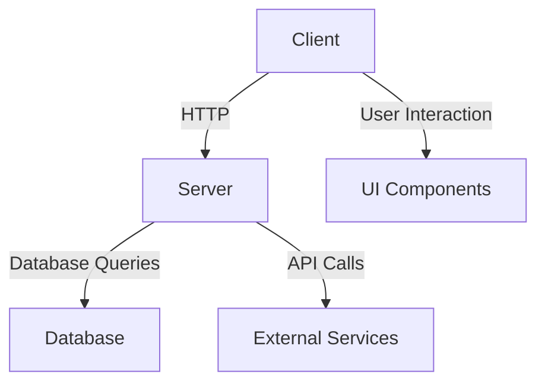
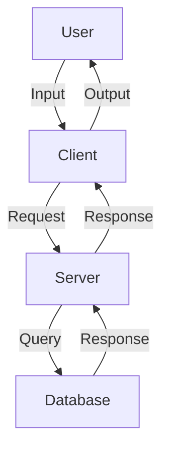
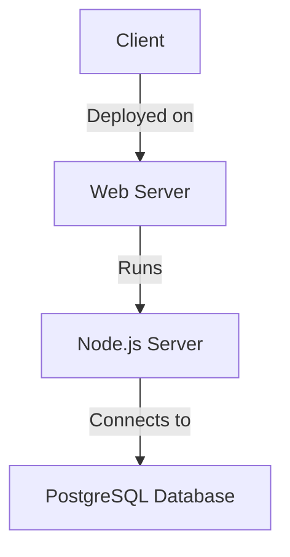
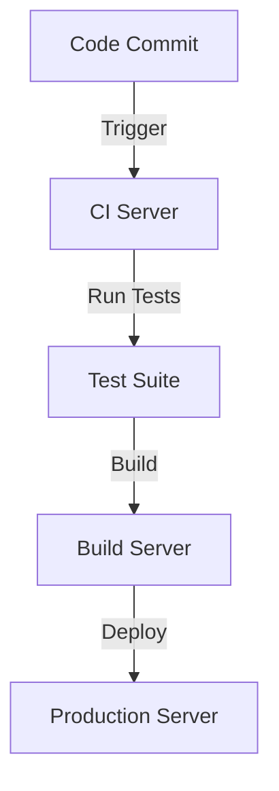
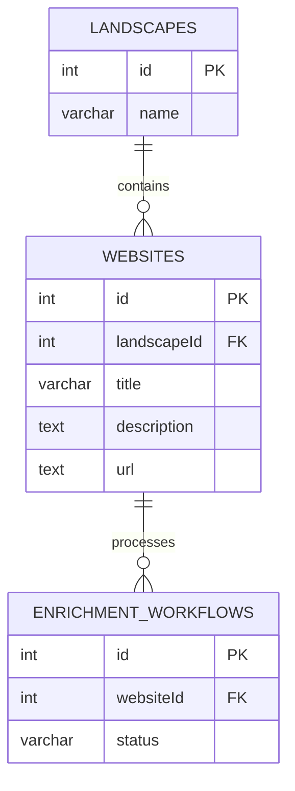
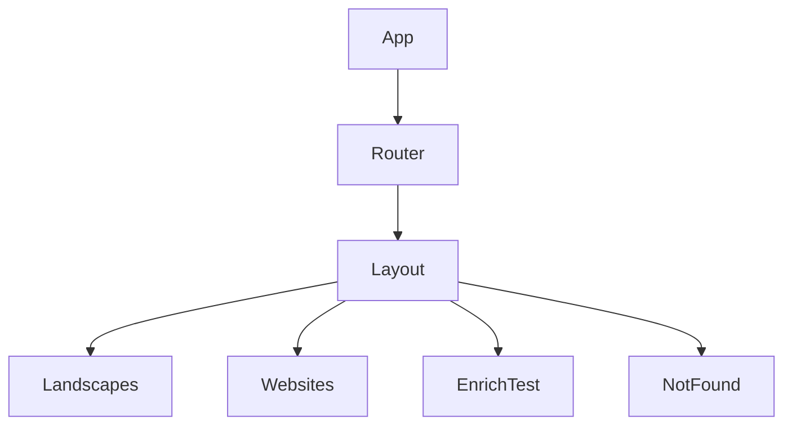

### 1. Codebase Overview and Purpose

The LandscapeHub application is a web-based platform designed to manage and enrich data related to landscapes and associated websites. The core functionality revolves around organizing landscapes, associating websites with these landscapes, and managing enrichment workflows for data processing. The application is structured to support both frontend and backend operations, with a focus on data management and user interaction.

#### Core Functionality and Features
- **Landscape Management**: Users can create and manage landscapes, which serve as categories or collections for websites.
- **Website Association**: Websites can be associated with landscapes, allowing for organized data management.
- **Enrichment Workflows**: The application supports workflows for enriching website data, which includes processing and updating information.
- **User Interface**: A responsive frontend interface built with React, providing users with a seamless experience for managing landscapes and websites.

#### Target Users and Use Cases
The primary users of LandscapeHub are likely to be data managers, researchers, or organizations that need to categorize and enrich data related to landscapes and websites. Use cases include:
- Organizing and managing large datasets of websites.
- Enriching website data with additional metadata or processing results.
- Providing a user-friendly interface for data management tasks.

#### Key Technologies, Frameworks, and Libraries
- **Frontend**: React (v18.3.1) is used for building the user interface, with additional libraries like `@tanstack/react-query` for data fetching and state management, and `wouter` for routing.
- **Backend**: Express (v4.21.2) serves as the web server framework, with `drizzle-orm` for database interactions.
- **Database**: PostgreSQL is used as the database, with schema management handled by `drizzle-orm`.
- **Styling**: Tailwind CSS (v3.4.14) is used for styling, with additional plugins for animations and typography.
- **Build Tools**: Vite (v5.4.9) is used for building the frontend, with `esbuild` for bundling the backend.
- **Testing**: Jest (v29.7.0) is used for testing, with `ts-jest` for TypeScript support.

#### Overall Code Organization and Architecture Philosophy
The codebase is organized into distinct directories for the client, server, and database, reflecting a clear separation of concerns. The architecture follows a modular approach, with reusable components and services. The use of TypeScript across the codebase ensures type safety and maintainability. The application leverages modern web development practices, including the use of hooks and context in React, and middleware in Express for handling requests and responses.

### 2. Technical Architecture Analysis

#### Detailed Breakdown of the Directory Structure
- **`client`**: Contains the frontend code, including the main entry point (`main.tsx`), application component (`App.tsx`), and styling (`index.css`).
- **`server`**: Houses the backend code, including the main server file (`index.ts`), route definitions (`routes.ts`), and handlers for specific functionalities (`handlers` directory).
- **`db`**: Contains database schema definitions (`schema.ts`), type definitions (`types.ts`), and the main database entry point (`index.ts`).
- **`migrations`**: Includes SQL migration files and metadata for database versioning.
- **`doc`**: Documentation files related to the project.

#### Analysis of the Frontend Architecture
The frontend is built using React, with a focus on component-based architecture. The main application component (`App.tsx`) sets up the routing using `wouter` and provides a `QueryClientProvider` for managing server state with `react-query`. The application uses a layout component to wrap the main content, ensuring consistent styling and structure across pages.

#### Analysis of the Backend Architecture
The backend is structured around Express, with middleware for handling JSON requests, CORS, and static file serving. The main server file (`index.ts`) sets up the application, registers routes, and starts the server. The backend also includes custom logging for API requests, capturing response times and statuses.

#### Database Schema and Data Models
The database schema is defined using `drizzle-orm`, with tables for `landscapes`, `websites`, and `enrichment_workflows`. Each table is defined with fields, primary keys, and relationships. For example, the `websites` table includes fields for `title`, `description`, and `url`, with a foreign key reference to the `landscapes` table.

#### Authentication and Authorization Mechanisms
The codebase includes `passport` and `passport-local` for authentication, suggesting a local strategy for user login. However, specific implementation details for authentication routes or user models are not visible in the current files.

#### External Integrations and Third-Party Services
The application integrates with several third-party libraries, including `@google/generative-ai` and `@mendable/firecrawl-js`, indicating potential use of AI services or web crawling capabilities.

#### Build System, Bundling, and Deployment Configuration
The build process is managed by Vite for the frontend and `esbuild` for the backend. The `package.json` scripts define commands for development (`dev`), building (`build`), and starting the production server (`start`). The `vite.config.ts` file configures plugins and aliases for module resolution.

### 3. User Experience and Workflow Analysis

#### Detailed User Journey Maps for Primary Use Cases
The primary user journey involves navigating through landscapes and websites, with routes defined for viewing landscapes, associated websites, and enrichment tests. The application provides a structured layout with a navigation menu and content area.

#### Analysis of UI Components and Design Patterns
The UI components are organized into pages and reusable components, with a focus on modularity and reusability. The use of `@radix-ui` components suggests a consistent design system with accessible UI elements.

#### Form Handling and Validation Approaches
The application uses `react-hook-form` for form handling, with `@hookform/resolvers` for integrating validation schemas. This approach ensures efficient form state management and validation.

#### Error Handling and User Feedback Mechanisms
The backend includes middleware for error handling, capturing errors and sending JSON responses with status codes. The frontend likely uses `Toaster` components for displaying notifications and feedback to users.

#### Accessibility Considerations
The use of `@radix-ui` components and Tailwind CSS suggests a focus on accessibility, with components designed to be keyboard navigable and screen reader friendly.

#### Performance Optimizations for User Experience
The application leverages `react-query` for efficient data fetching and caching, reducing unnecessary network requests and improving performance.

#### Mobile Responsiveness Strategy
The use of Tailwind CSS allows for responsive design, with utility classes for handling different screen sizes and ensuring a mobile-friendly interface.

### 4. Mermaid Diagrams

#### Software Architecture Diagram

#### Data Flow Diagram

#### Deployment Architecture Diagram

#### CI/CD Pipeline Diagram

#### Entity Relationship Diagram

#### Component Hierarchy Diagram

### 5. Code Quality and Patterns

#### Analysis of Coding Standards and Conventions Used
The codebase follows modern JavaScript and TypeScript conventions, with consistent use of ES6+ features, TypeScript types, and module imports. The use of `tsx` and `jsx` files indicates adherence to React best practices.

#### Design Patterns Identified in the Codebase
- **Component-Based Architecture**: The frontend is organized into reusable components, promoting modularity and separation of concerns.
- **Middleware Pattern**: The backend uses middleware for request handling, logging, and error management.

#### State Management Approach
The application uses `react-query` for managing server state, providing a robust solution for data fetching, caching, and synchronization.

#### Error Handling and Logging Strategies
The backend includes custom logging for API requests, capturing response times and statuses. Error handling middleware ensures consistent error responses.

#### Testing Approach and Coverage
Jest is used for testing, with scripts for running tests, watching for changes, and generating coverage reports. The presence of `ts-jest` suggests TypeScript support in tests.

#### Code Reuse and Modularity Assessment
The use of TypeScript paths and aliases promotes code reuse and modularity, allowing for organized imports and exports across the codebase.

#### Technical Debt Identification
The codebase includes TODO comments, indicating areas for improvement or refactoring. The use of modern libraries and frameworks suggests a focus on maintainability and reducing technical debt.

### 6. API and Interface Analysis

#### Documentation of All API Endpoints with Request/Response Examples
The server routes are registered in `routes.ts`, with handlers for different functionalities. The use of Express middleware and route handlers suggests a RESTful API design.

#### Authentication and Authorization for APIs
The presence of `passport` and `passport-local` indicates local authentication strategies, though specific routes or middleware for authentication are not detailed in the current files.

#### Error Handling and Status Codes
The backend includes middleware for error handling, sending JSON responses with appropriate status codes and messages.

#### API Versioning Strategy
No explicit versioning strategy is visible in the current files, though the modular structure allows for easy extension and versioning if needed.

#### Internal Interfaces Between Components/Services
The use of TypeScript interfaces and types ensures clear contracts between components and services, promoting type safety and consistency.

### 7. Performance and Scalability

#### Identified Performance Bottlenecks
The use of `react-query` and efficient data fetching strategies minimizes performance bottlenecks on the frontend. The backend's use of middleware for logging and error handling ensures efficient request processing.

#### Caching Strategies
`react-query` provides built-in caching for server state, reducing unnecessary network requests and improving performance.

#### Database Query Optimization
The use of `drizzle-orm` for database interactions suggests optimized query generation and execution, though specific query optimizations are not detailed in the current files.

#### Load Handling and Scaling Approaches
The use of Express and Node.js allows for scalable server-side operations, with potential for horizontal scaling through clustering or containerization.

#### Resource Utilization
The application leverages modern JavaScript and TypeScript features, ensuring efficient resource utilization and performance.

### 8. Security Assessment

#### Authentication and Authorization Mechanisms
The use of `passport` and `passport-local` suggests local authentication strategies, though specific implementation details are not visible in the current files.

#### Input Validation and Sanitization
The use of `drizzle-zod` for schema validation suggests input validation at the database level, though additional validation strategies are not detailed.

#### Protection Against Common Vulnerabilities
The use of CORS middleware and secure headers in Express provides protection against common web vulnerabilities, though specific implementations for XSS, CSRF, or SQL Injection are not detailed.

#### Sensitive Data Handling
The use of environment variables for configuration suggests secure handling of sensitive data, though specific encryption or hashing strategies are not visible.

#### Dependency Security Analysis
The use of modern libraries and frameworks suggests a focus on security, though specific dependency analysis or vulnerability scanning is not detailed.

#### Compliance Considerations
No explicit compliance considerations (e.g., GDPR, HIPAA) are visible in the current files, though the modular structure allows for easy extension if needed.

### 9. Deployment and DevOps

#### Environment Configuration
The use of environment variables and configuration files suggests a structured approach to environment configuration, though specific deployment environments are not detailed.

#### Containerization and Orchestration
No explicit containerization or orchestration strategies are visible in the current files, though the use of Node.js and Express allows for easy containerization if needed.

#### Infrastructure as Code
No explicit infrastructure as code tools or configurations are visible in the current files, though the modular structure allows for easy integration if needed.

#### Monitoring and Logging
The backend includes custom logging for API requests, capturing response times and statuses, though specific monitoring tools or strategies are not detailed.

#### Backup and Disaster Recovery
No explicit backup or disaster recovery strategies are visible in the current files, though the use of PostgreSQL allows for standard backup and recovery practices.

### 10. Documentation and Maintainability

#### Quality of Inline Documentation
The codebase includes comments and TODOs, indicating areas for improvement or refactoring. The use of TypeScript provides additional documentation through types and interfaces.

#### External Documentation
The presence of a `doc` directory suggests external documentation, though specific contents are not detailed in the current files.

#### Onboarding New Developers
The use of modern libraries and frameworks, along with TypeScript, provides a structured and maintainable codebase, facilitating onboarding for new developers.

#### Knowledge Sharing Mechanisms
The modular structure and use of TypeScript paths and aliases promote knowledge sharing and collaboration across the codebase.

### 11. Unexpected Observations and Anomalies

#### Unusual Patterns or Approaches
The use of `drizzle-orm` and `drizzle-zod` for database interactions and validation is a unique approach, providing type-safe and schema-driven development.

#### Inconsistencies in the Codebase
No major inconsistencies are visible in the current files, though the presence of TODO comments indicates areas for improvement.

#### Potential Bugs or Issues
The presence of TODO comments suggests potential areas for refactoring or improvement, though no specific bugs are visible in the current files.

#### Abandoned or Deprecated Code
No abandoned or deprecated code is visible in the current files, though the presence of TODO comments suggests ongoing development and maintenance.

### 12. Recommendations and Next Steps

#### Prioritized List of Improvements
- Implement detailed authentication and authorization strategies using `passport`.
- Enhance input validation and sanitization to protect against common vulnerabilities.
- Consider containerization and orchestration for scalable deployment.

#### Refactoring Opportunities
- Address TODO comments and refactor code for improved maintainability and performance.
- Optimize database queries and interactions for better performance.

#### Feature Enhancement Suggestions
- Implement API versioning for better maintainability and backward compatibility.
- Enhance user feedback mechanisms with detailed notifications and error messages.

#### Technical Debt Remediation Plan
- Address technical debt identified in TODO comments and refactor code for improved maintainability.
- Regularly update dependencies to ensure security and compatibility.

#### Scaling and Performance Optimization Suggestions
- Consider horizontal scaling strategies for the backend, such as clustering or containerization.
- Optimize frontend performance with efficient data fetching and caching strategies.