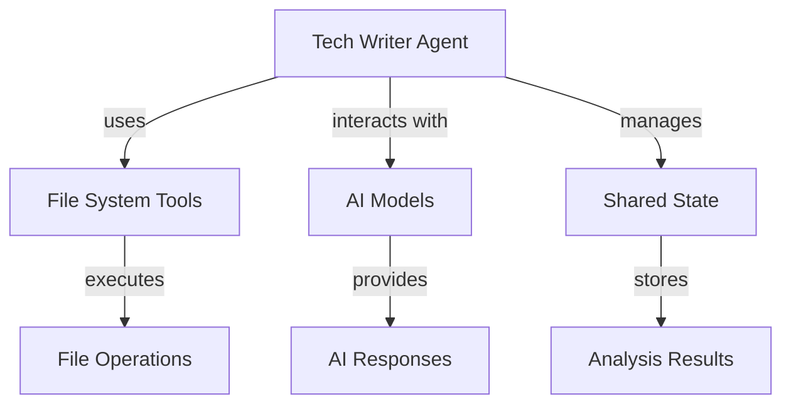
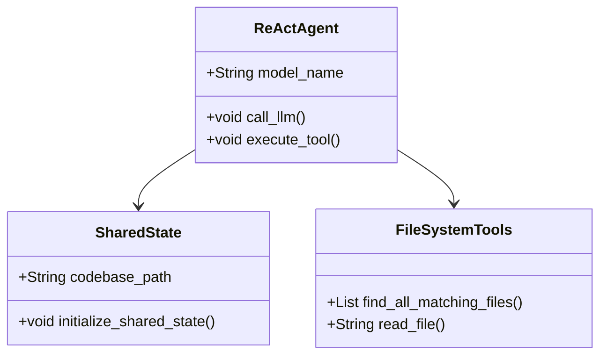
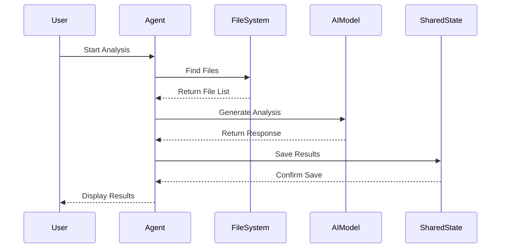
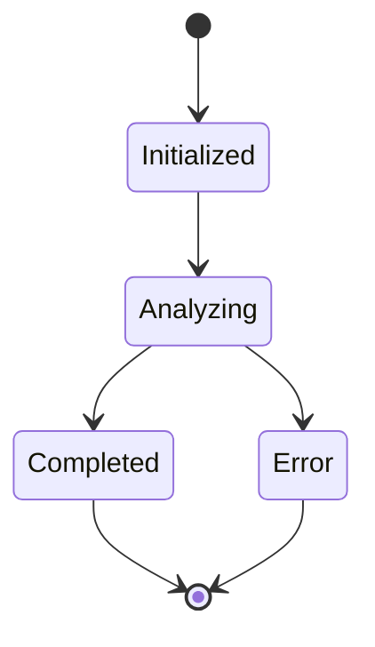
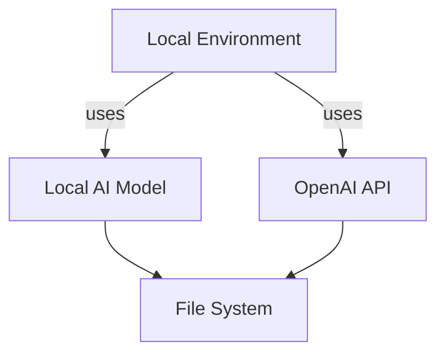

# Architectural Overview Document for Tech Writer Agent Codebase

## Executive Summary
The Tech Writer Agent is a Python-based application designed to facilitate file browsing and codebase analysis using AI models, specifically leveraging LangGraph and OpenAI's API. The architecture is modular, allowing for easy integration of various AI models and file system tools. The system is structured to support both local and cloud-based AI models, providing flexibility in deployment and usage.

The codebase employs a combination of object-oriented programming and functional programming paradigms, with a focus on clear separation of concerns among components. Key design principles include modularity, reusability, and adherence to the DRY (Don't Repeat Yourself) principle, which is evident in the shared state management and tool execution patterns.

## 1. High-Level Architecture

### Architectural Patterns
The Tech Writer Agent follows a **Microservices** architecture pattern, where different functionalities are encapsulated in distinct modules. This allows for independent development and deployment of components such as file handling, AI model interaction, and state management.

### Component Diagram

### Key Design Principles
- **Modularity**: Each component (file handling, AI interaction, state management) is encapsulated in its own module.
- **Reusability**: Common functionalities are abstracted into utility functions and classes.
- **Separation of Concerns**: Each module has a distinct responsibility, reducing interdependencies.

## 2. Component Structure

### Core Components
1. **File System Tools**: Handles file operations such as reading files and listing directories.
   - **Key Functions**: `find_all_matching_files`, `read_file`
   
2. **AI Models**: Interfaces with local and OpenAI models for generating responses.
   - **Key Classes**: `ReActAgent`
   
3. **Shared State**: Manages the state shared between different agents (Researcher, Writer, Coordinator).
   - **Key Functions**: `initialize_shared_state`, `save_state`, `load_state`

### Class Diagram

### Dependencies
- **Circular Dependencies**: No circular dependencies were identified in the core components.

## 3. Data Flow

### Sequence Diagram

### Key Data Structures
- **SharedState**: Holds information about the codebase, model name, findings, and output paths.
- **File Operations**: Utilizes lists and dictionaries to manage file data and results.

### API Contracts
- **Internal API**: Functions like `find_all_matching_files` and `read_file` are used internally by the `ReActAgent` class to interact with the file system.

## 4. State Management

### State Management Strategy
State is managed through a shared state object that is initialized at the start of the analysis. This object is updated as the analysis progresses, allowing different components to access and modify the state as needed.

### State Diagram

### Global State Patterns
- **Singleton Pattern**: The shared state is instantiated once and accessed globally by different components.

## 5. Error Handling & Resilience

### Error Handling Strategy
The application employs try-except blocks to handle exceptions gracefully, particularly in file operations and API calls. Errors are logged and returned to the user in a structured format.

### Resilience Patterns
- **Retries**: Not explicitly implemented, but can be added in API calls.
- **Circuit Breakers**: Not present; consider implementing for external API calls.

### Exception Hierarchies
Custom exceptions could be defined for specific error types, enhancing clarity in error handling.

## 6. Security Model

### Authentication & Authorization
- **API Keys**: The application requires API keys for both Gemini and OpenAI models, which are managed through environment variables.

### Data Protection
- **Environment Variables**: Sensitive information is stored in environment variables, reducing exposure in the codebase.

### Security Concerns
- Ensure that API keys are not hardcoded and are managed securely.

## 7. Performance Considerations

### Caching Mechanisms
- No explicit caching mechanisms are identified; consider implementing caching for frequently accessed data.

### Concurrency/Parallelism
- The application does not currently support concurrent processing; consider using threading or async patterns for file operations.

### Performance Optimizations
- Optimize file reading operations by implementing lazy loading or buffering.

## 8. Testing Strategy

### Testing Approach
The codebase employs unit tests using `pytest`, focusing on individual functions and components.

### Test Coverage
- Tests cover core functionalities such as file finding and reading, but may need expansion for edge cases.

### Test Automation Patterns
- Continuous integration practices should be established to automate testing on code changes.

## 9. Deployment Architecture

### Deployment Model
The application is designed to run locally or on cloud environments, depending on the AI model used.

### Deployment Diagram

### CI/CD Patterns
- No CI/CD patterns are currently documented; consider implementing GitHub Actions or similar for automated deployments.

## 10. Technology Stack

### Key Technologies
- **Python**: Core programming language.
- **LangGraph**: For state machine management.
- **OpenAI API**: For AI model interactions.
- **pytest**: For testing.

### Version Constraints
- Python version >= 3.12 is required, with specific dependencies listed in `pyproject.toml`.

### Deprecated Dependencies
- No deprecated dependencies were identified; ensure regular updates to maintain compatibility.

## Key Architectural Decisions
- The choice of a microservices architecture allows for flexibility and scalability.
- The use of environment variables for sensitive data enhances security.
- Modular design promotes reusability and maintainability.

## Recommendations
- Implement caching mechanisms for performance improvements.
- Consider adding concurrency support for file operations.
- Establish CI/CD practices for automated testing and deployment.
- Expand test coverage to include edge cases and integration tests.

This architectural overview provides a comprehensive understanding of the Tech Writer Agent codebase, highlighting its structure, functionality, and areas for improvement.