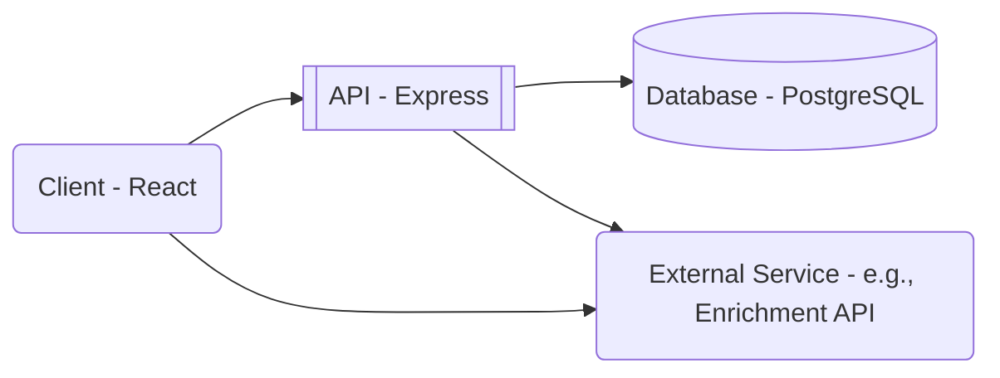
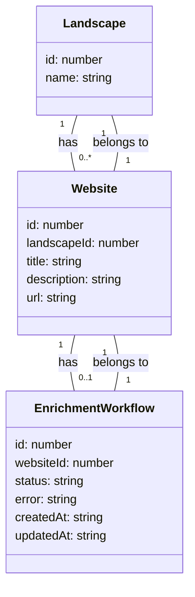
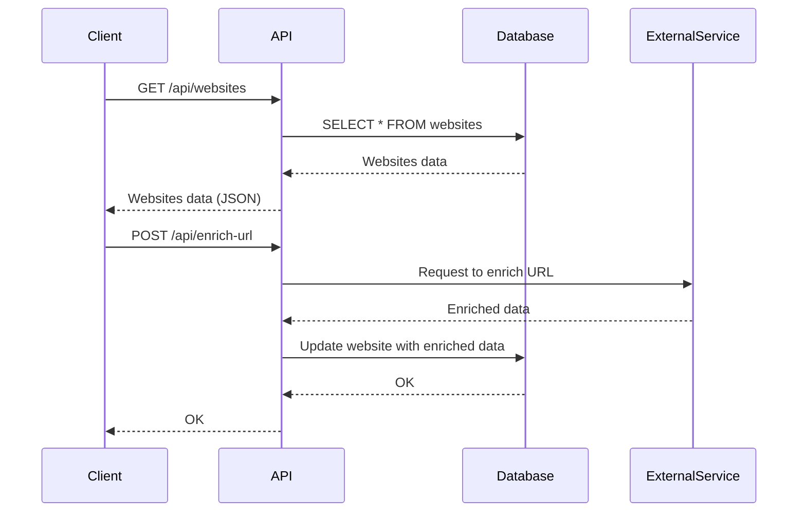

**6. Thought:** The `db/schema.ts` file defines the database schema using Drizzle ORM. It includes tables for `landscapes`, `websites`, and `enrichmentWorkflows`. There are foreign key relationships between these tables. Zod schemas are also created for data validation. This confirms the use of a relational database (likely PostgreSQL, given the `pgTable` import).

Now I have enough information to start creating the architectural overview document.

## Architectural Overview Document

### Executive Summary

The LandscapeHub codebase is a full-stack web application built with React, Express, and TypeScript. It follows a layered architecture with a clear separation of concerns between the client (React), server (Express), and database (PostgreSQL with Drizzle ORM). The application provides CRUD operations for landscapes and websites, along with a feature to enrich website data. The client-side uses Radix UI for components and leverages React Query for data fetching and caching. The server-side exposes a REST API and uses middleware for CORS, logging, and error handling. The application uses Vite for building and development.

The architecture emphasizes modularity, with separate handlers for different API endpoints and a well-defined database schema. The use of TypeScript throughout the codebase promotes type safety and maintainability.

### 1. High-Level Architecture

**Architectural Pattern:** Layered Architecture / REST API

The application follows a layered architecture, with distinct layers for the client, server, and database. The client interacts with the server through a REST API.

**Key Design Principles:**

*   **Separation of Concerns:** Clear separation between client, server, and database layers.
*   **Modularity:** API endpoints are handled by separate modules.
*   **Type Safety:** TypeScript is used throughout the codebase.
*   **RESTful API:** The server exposes a REST API for client-server communication.

### 2. Component Structure

**Core Components:**

*   **Client (React):** Responsible for rendering the user interface and interacting with the API.
*   **Server (Express):** Handles API requests, interacts with the database, and serves static files.
*   **Database (PostgreSQL):** Stores the application data.
*   **Handlers:** Modules that handle specific API endpoints (e.g., landscapes, websites, enrich).
*   **Components (Radix UI):** Reusable UI components.
*   **Hooks:** Custom React hooks for data fetching and state management.

**Dependencies:**

The client depends on the server API. The server depends on the database and potentially external services for data enrichment. There are no apparent circular dependencies.

### 3. Data Flow

**Key Data Structures:**

*   **Landscape:** Represents a collection of websites.
*   **Website:** Represents a single website with metadata.
*   **EnrichmentWorkflow:** Represents the status of a website enrichment process.

**API Contracts:**

The server exposes a REST API with endpoints for managing landscapes and websites. The API uses JSON for request and response bodies.

### 4. State Management

**State Management:**

The client-side uses React's built-in state management capabilities along with React Query for managing server-side state (data fetching and caching). There's no explicit global state management library like Redux.

### 5. Error Handling & Resilience

**Error Handling:**

The server uses middleware to catch errors and return appropriate HTTP status codes and error messages. The client likely uses try-catch blocks and error boundaries to handle errors.

**Exception Hierarchies:**

There is no explicit exception hierarchy defined in the provided code snippets.

### 6. Security Model

**Authentication and Authorization:**

The provided code snippets do not reveal any specific authentication or authorization mechanisms. The CORS configuration in `server/index.ts` suggests that the application may be configured to allow requests from specific origins.

**Potential Security Concerns:**

*   Lack of explicit authentication and authorization mechanisms.
*   Potential for CORS misconfiguration.

### 7. Performance Considerations

**Caching:**

The client-side uses React Query for caching API responses. The server-side may use caching mechanisms for frequently accessed data, but this is not evident in the provided code snippets.

**Concurrency/Parallelism:**

The server uses Node.js, which is single-threaded but can handle concurrency through asynchronous operations. The client-side may use web workers for computationally intensive tasks (e.g., `client/src/workers/enrichment.worker.ts`).

### 8. Testing Strategy

**Testing Approach:**

The `package.json` file includes scripts for running Jest tests, suggesting that the application uses unit and integration tests.

**Test Coverage and Quality:**

The test coverage and quality are unknown based on the provided code snippets.

### 9. Deployment Architecture

**Deployment Model:**

The `package.json` file includes a `build` script that suggests the application is deployed as a static website with a Node.js backend. The server is likely deployed to a platform that supports Node.js (e.g., Heroku, AWS, Google Cloud).

### 10. Technology Stack

*   **Client:** React, TypeScript, Radix UI, React Query, Vite
*   **Server:** Express, TypeScript, Node.js
*   **Database:** PostgreSQL, Drizzle ORM
*   **Other:** Zod, Tailwind CSS

**Version Constraints:**

The `package.json` file specifies version ranges for the dependencies.

## Key Architectural Decisions

*   **Use of React, Express, and TypeScript:** This provides a modern, type-safe, and scalable platform for building web applications.
*   **Use of Drizzle ORM:** This simplifies database interactions and provides type safety.
*   **Use of Radix UI:** This provides a set of accessible and customizable UI components.
*   **Use of React Query:** This simplifies data fetching and caching on the client-side.

## Recommendations

*   **Implement Authentication and Authorization:** Add authentication and authorization mechanisms to protect the API endpoints and sensitive data.
*   **Improve Error Handling:** Implement a more robust error handling strategy with centralized logging and monitoring.
*   **Add Monitoring and Alerting:** Implement monitoring and alerting to detect and respond to performance issues and errors.
*   **Improve Test Coverage:** Increase test coverage to ensure the quality and reliability of the application.
*   **Consider a Global State Management Library:** If the application grows in complexity, consider using a global state management library like Redux or Zustand.
*   **Implement a CI/CD Pipeline:** Automate the build, test, and deployment process with a CI/CD pipeline.
*   **Centralize Configuration:** Externalize configuration settings using environment variables or a configuration file.
