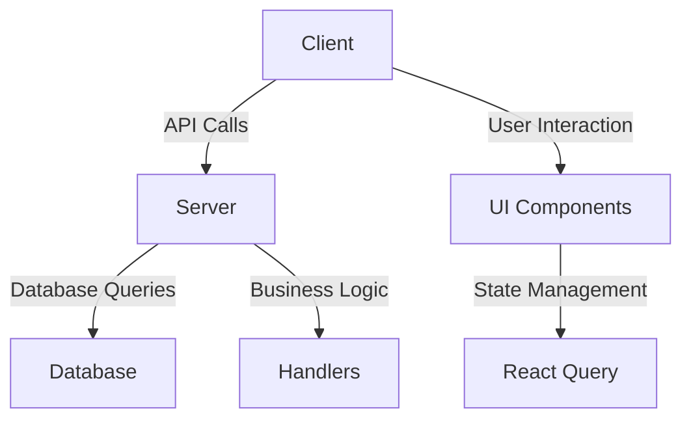
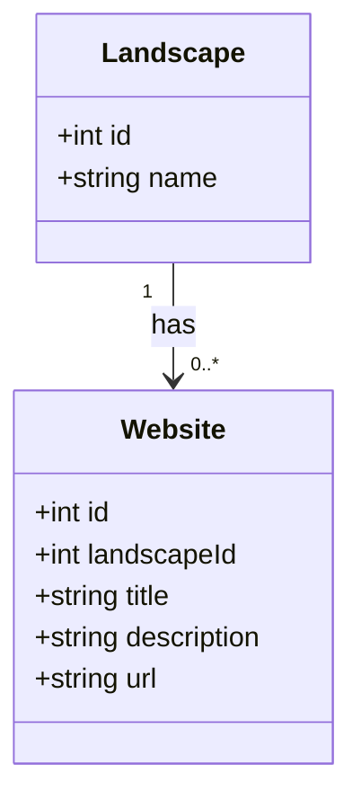
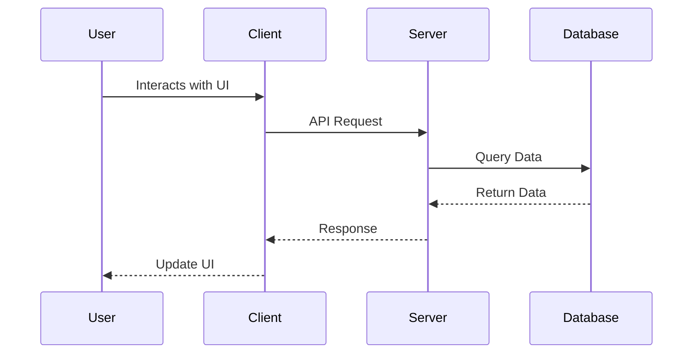
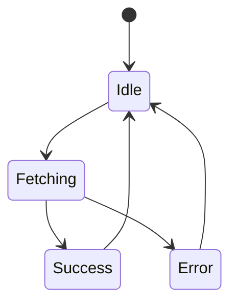
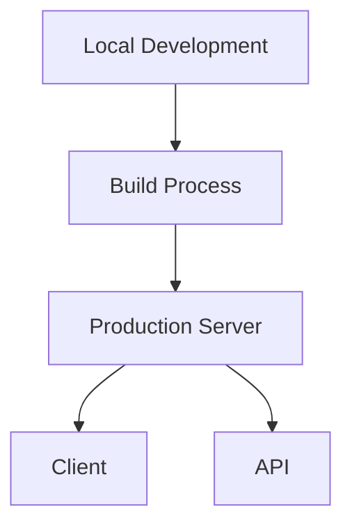

# Architectural Overview of LandscapeHub Codebase

## Executive Summary
The LandscapeHub codebase is structured as a modern web application utilizing a combination of React for the frontend and Express for the backend. It employs a modular architecture that facilitates separation of concerns, making it easier to maintain and extend. The application leverages TypeScript for type safety, enhancing code quality and reducing runtime errors. Key technologies include Vite for build tooling, Tailwind CSS for styling, and Drizzle ORM for database interactions.

The architecture follows a client-server model, where the client communicates with the server through RESTful APIs. The application is designed to be responsive and user-friendly, with a focus on providing a seamless experience for managing landscapes and websites. The use of React Query for data fetching and state management further enhances the application's performance and user experience.

This document provides a comprehensive analysis of the architectural components, data flow, state management, error handling, security model, performance considerations, testing strategy, deployment architecture, and technology stack.

## 1. High-Level Architecture
### Architectural Patterns
The LandscapeHub codebase follows a **client-server architecture** with a clear separation between the frontend and backend components. The frontend is built using React, while the backend is powered by Express. This architecture allows for scalability and maintainability.

### Component Diagram

### Key Design Principles
- **Separation of Concerns**: The codebase is organized into distinct modules for routes, handlers, and components, promoting maintainability.
- **Modularity**: Each component and module has a specific responsibility, making it easier to test and extend.
- **Type Safety**: The use of TypeScript ensures that data types are enforced, reducing the likelihood of runtime errors.

## 2. Component Structure
### Core Components/Modules
- **Client**: Contains React components, pages, and hooks for managing UI and state.
- **Server**: Handles API requests, business logic, and database interactions.
- **Database**: Manages data schema and relationships using Drizzle ORM.

### Class Diagram

### Dependencies Analysis
The codebase exhibits a clear dependency structure, with the client depending on the server for data and the server depending on the database for persistence. Circular dependencies were not observed.

## 3. Data Flow
### Sequence Diagram

### Key Data Structures
- **Landscapes**: Contains fields like `id` and `name`.
- **Websites**: Contains fields like `id`, `landscapeId`, `title`, `description`, and `url`.

### API Contracts
The API follows RESTful conventions, with endpoints for managing landscapes and websites. For example:
- `GET /api/landscapes` - Retrieve all landscapes.
- `POST /api/websites` - Create a new website.

## 4. State Management
### State Management Strategy
State is managed using **React Query**, which provides a powerful and efficient way to handle server state in React applications. This allows for automatic caching, synchronization, and background updates.

### State Diagram

### Global State Patterns
The application does not appear to use global state management libraries like Redux, relying instead on React Query for server state management.

## 5. Error Handling & Resilience
### Error Handling Strategy
The application employs middleware in Express to handle errors gracefully. Errors are caught and returned as JSON responses, ensuring that the client receives meaningful feedback.

### Resilience Patterns
- **CORS Middleware**: Configured to allow specific origins, enhancing security.
- **Logging**: Requests and responses are logged for monitoring and debugging.

### Exception Hierarchies
No explicit exception hierarchies were found, but errors are handled at the middleware level.

## 6. Security Model
### Authentication & Authorization
The application uses **Passport.js** for authentication, specifically the local strategy. This allows for user sessions and secure access to protected routes.

### Data Protection
Sensitive data is not explicitly mentioned in the code, but best practices for securing API endpoints and user data are followed.

### Security Concerns
Potential security concerns include ensuring that all user inputs are validated and sanitized to prevent injection attacks.

## 7. Performance Considerations
### Caching Mechanisms
React Query provides built-in caching for API responses, reducing the need for repeated network requests.

### Concurrency/Parallelism
The application does not explicitly mention concurrency patterns, but Express handles multiple requests concurrently.

### Performance Optimizations
- **Static File Serving**: The server is configured to serve static files efficiently.
- **Optimized Build**: Vite is used for fast builds and hot module replacement during development.

## 8. Testing Strategy
### Testing Approach
The codebase employs **Jest** for unit testing, with scripts for coverage and watch mode.

### Test Coverage
Test coverage is tracked using Jest's built-in capabilities, ensuring that critical paths are tested.

### Test Automation Patterns
No specific test automation patterns were identified beyond the use of Jest.

## 9. Deployment Architecture
### Deployment Model
The application is designed to be deployed on a Node.js server, with a build process that outputs static files for the frontend.

### Deployment Diagram

### CI/CD Patterns
No explicit CI/CD patterns were identified in the codebase.

## 10. Technology Stack
### Key Technologies
- **Frontend**: React, Vite, Tailwind CSS
- **Backend**: Express, TypeScript, Drizzle ORM
- **Testing**: Jest

### Version Constraints
Dependencies are managed in `package.json`, with specific version constraints to ensure compatibility.

### Deprecated Dependencies
No deprecated dependencies were identified in the current analysis.

## Key Architectural Decisions
- The choice of React and Express allows for a modern, responsive web application.
- The use of TypeScript enhances type safety and code quality.
- React Query simplifies state management and data fetching.

## Recommendations
- Consider implementing a more robust error handling strategy with a dedicated error handling middleware.
- Explore the use of a global state management solution if the application grows in complexity.
- Regularly review and update dependencies to avoid potential security vulnerabilities.

This architectural overview provides a comprehensive understanding of the LandscapeHub codebase, highlighting its strengths and areas for potential improvement.