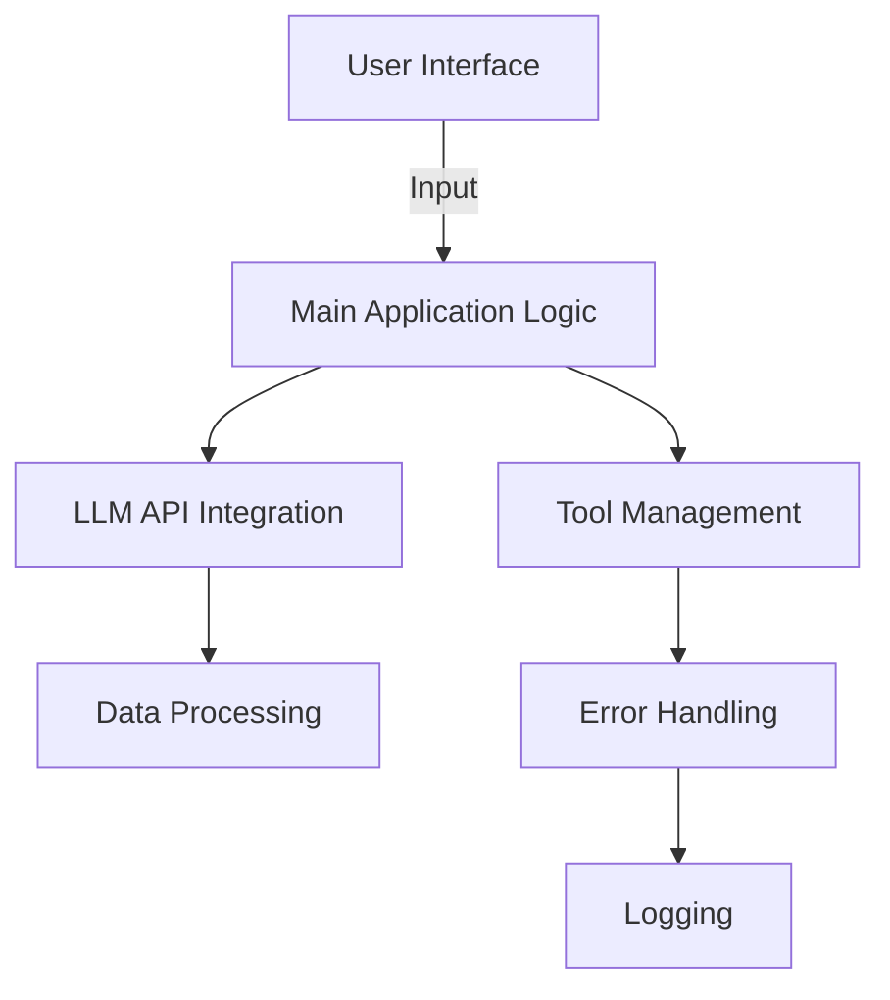
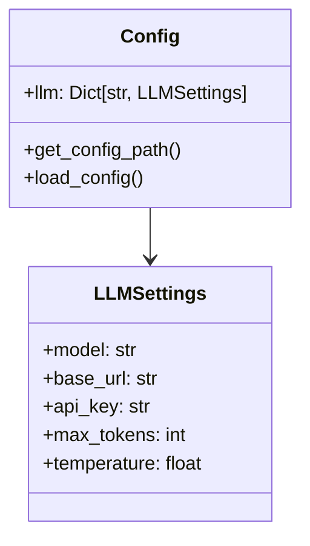
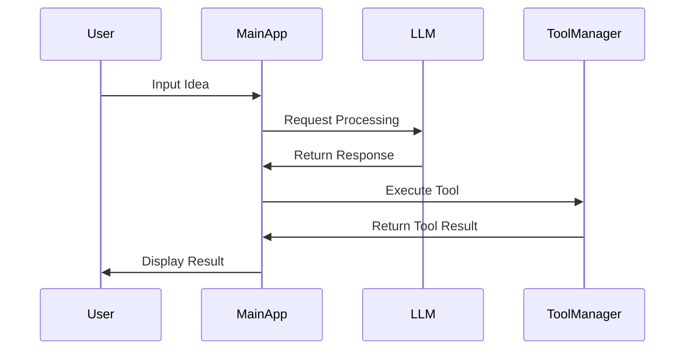
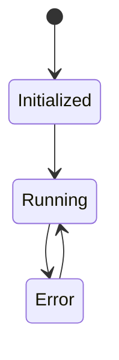
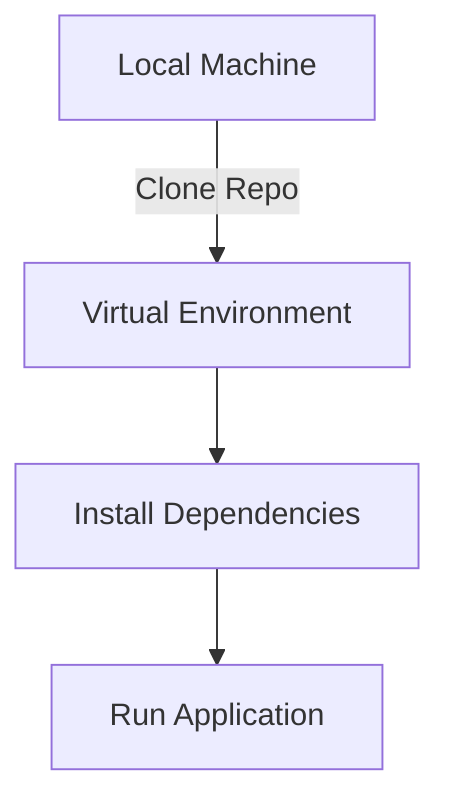

# OpenManus Architectural Overview

## Executive Summary
OpenManus is an open-source framework designed for building versatile AI agents capable of solving various tasks using multiple tools. The project is developed by a collaborative team from MetaGPT and aims to provide a user-friendly interface for interacting with large language models (LLMs) without the need for an invite code. The architecture is modular, allowing for easy integration of different components and tools, and is built with a focus on extensibility and maintainability.

The codebase employs a combination of design patterns, including Singleton for configuration management and a layered architecture for separating concerns. The use of Pydantic for data validation and configuration management enhances the robustness of the application. The project also emphasizes logging and error handling, ensuring that issues can be tracked and resolved efficiently.

This document provides a comprehensive analysis of the architectural structure, component responsibilities, data flow, state management, error handling, security model, performance considerations, testing strategy, deployment architecture, and technology stack.

## 1. High-Level Architecture
### Architectural Patterns
The OpenManus codebase follows a layered architecture pattern, which separates the application into distinct layers, each with its own responsibilities. Key components include:
- **Presentation Layer**: Handles user interactions and input.
- **Business Logic Layer**: Contains the core functionality and processing logic.
- **Data Access Layer**: Manages interactions with external APIs and data sources.

### Component Diagram

### Key Design Principles
- **Modularity**: Components are designed to be independent, allowing for easier testing and maintenance.
- **Single Responsibility**: Each module has a specific responsibility, reducing complexity.
- **Configuration Management**: Utilizes Pydantic for managing application settings and API configurations.

## 2. Component Structure
### Core Components
- **Main Application Logic (`main.py`)**: Entry point for the application, orchestrating the flow of data and interactions.
- **Configuration Management (`config.py`)**: Manages application settings and API keys using Pydantic models.
- **Logging (`logger.py`)**: Centralized logging mechanism for tracking application behavior and errors.
- **Error Handling (`exceptions.py`)**: Custom exceptions for managing tool-related errors.

### Class Diagram

### Dependencies Analysis
The components are loosely coupled, with no circular dependencies observed. Each module interacts with others through well-defined interfaces, promoting maintainability.

## 3. Data Flow
### Sequence Diagram

### Key Data Structures
- **LLMSettings**: Holds configuration for LLMs, including model name, API key, and other parameters.
- **AppConfig**: Encapsulates the overall application configuration.

### API Contracts
The application interacts with external LLM APIs, requiring specific configurations defined in `config.toml`.

## 4. State Management
### State Management Overview
State is managed through configuration files and Pydantic models, ensuring that application settings are validated and consistent throughout the application lifecycle.

### State Diagram

### Global State Patterns
The Singleton pattern is used in the `Config` class to ensure a single instance of the configuration is used throughout the application.

## 5. Error Handling & Resilience
### Error Handling Strategy
The application employs custom exceptions (e.g., `ToolError`) to manage errors related to tool execution. Logging is integrated to capture error details.

### Resilience Patterns
- **Retries**: Implemented using the `tenacity` library for retrying failed operations.
- **Logging**: Comprehensive logging for tracking application state and errors.

### Exception Hierarchy
- `ToolError`: Base class for tool-related exceptions.

## 6. Security Model
### Authentication & Authorization
The application requires API keys for accessing external LLM services, which are managed through configuration files.

### Data Protection
Sensitive information, such as API keys, should be stored securely and not hard-coded in the application.

### Security Concerns
Potential risks include exposure of API keys and unauthorized access to external services.

## 7. Performance Considerations
### Caching Mechanisms
No explicit caching mechanisms are observed in the current architecture, which may be an area for improvement.

### Concurrency Approaches
The application uses threading for configuration management, allowing for concurrent access to configuration settings.

### Performance Optimizations
The use of Pydantic for data validation enhances performance by ensuring that data structures are validated efficiently.

## 8. Testing Strategy
### Testing Approach
The codebase does not provide explicit testing files, indicating a potential area for improvement in test coverage.

### Test Automation Patterns
No specific test automation patterns are identified in the current architecture.

## 9. Deployment Architecture
### Deployment Model
The application can be deployed using standard Python packaging practices, as indicated by the `setup.py` file.

### Deployment Diagram

### CI/CD Patterns
No CI/CD patterns are explicitly defined in the codebase.

## 10. Technology Stack
### Key Technologies
- **Python**: Primary programming language.
- **Pydantic**: For data validation and settings management.
- **Loguru**: For logging.
- **OpenAI API**: For LLM interactions.

### Version Constraints
The application requires Python 3.12 and specific versions of libraries as defined in `requirements.txt`.

### Deprecated Dependencies
No deprecated dependencies are identified at this time.

## Key Architectural Decisions
- Adoption of a modular architecture to enhance maintainability.
- Use of Pydantic for configuration management to ensure data integrity.
- Centralized logging for better error tracking and debugging.

## Recommendations
- Implement caching mechanisms to improve performance.
- Enhance test coverage with unit and integration tests.
- Consider implementing CI/CD practices for streamlined deployment.
- Review security practices to ensure sensitive data is adequately protected.

This architectural overview provides a comprehensive understanding of the OpenManus codebase, highlighting its strengths and areas for potential improvement.