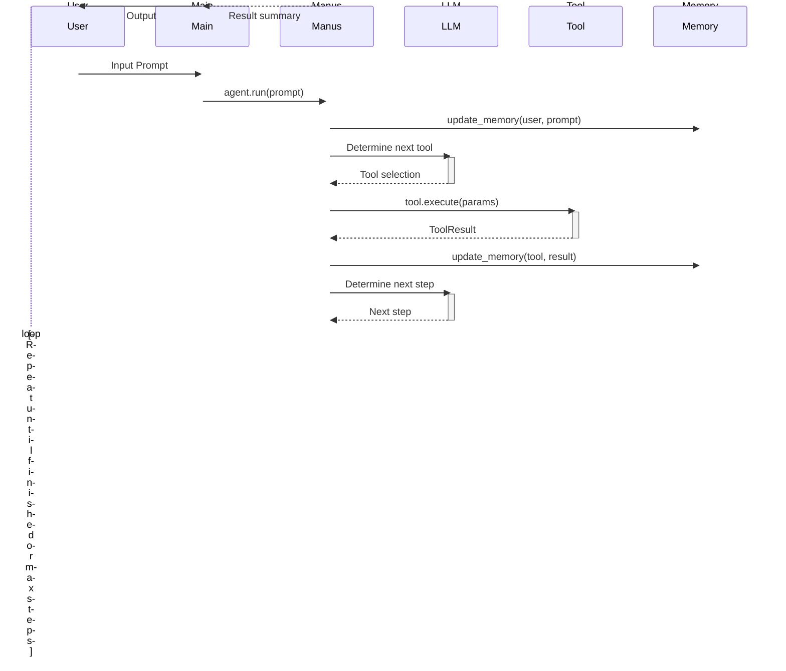
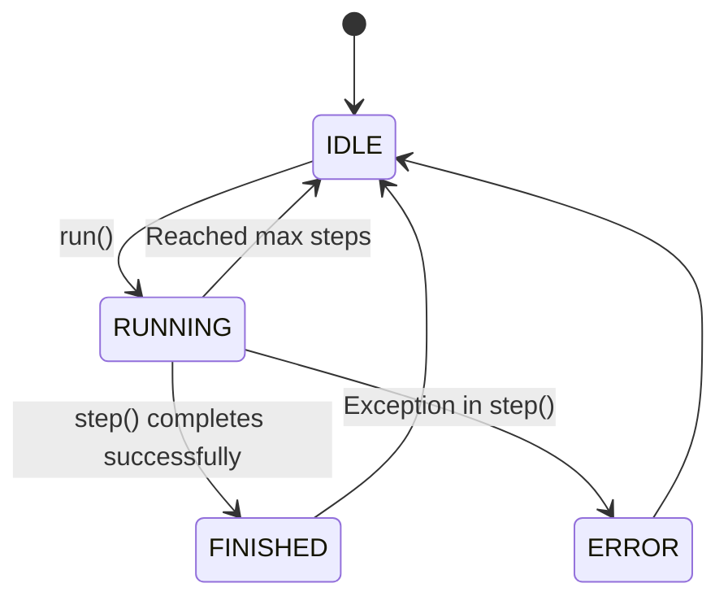
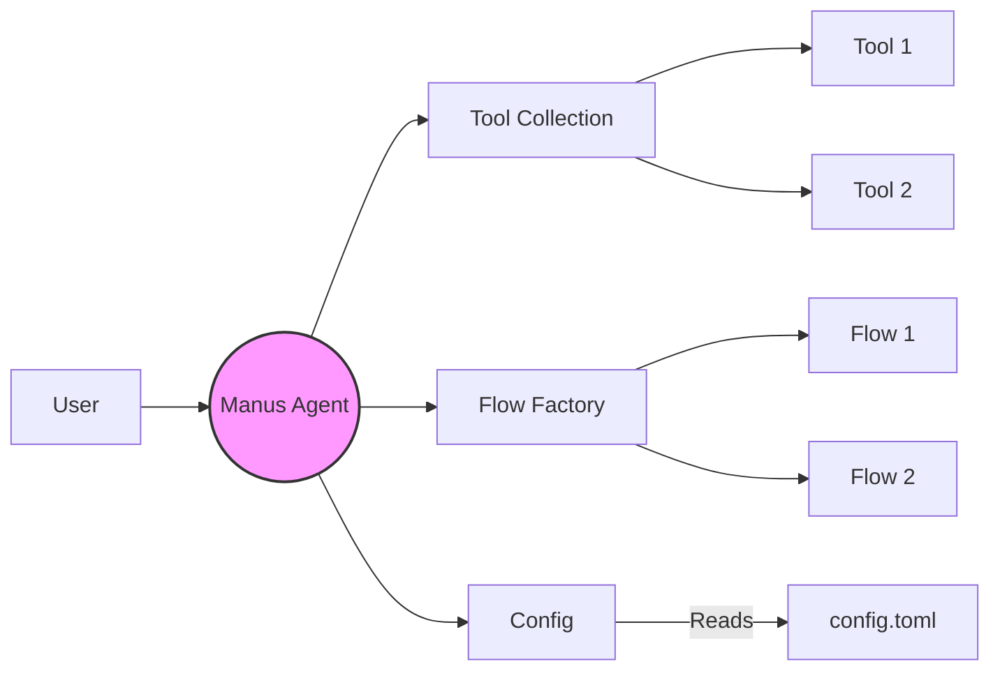
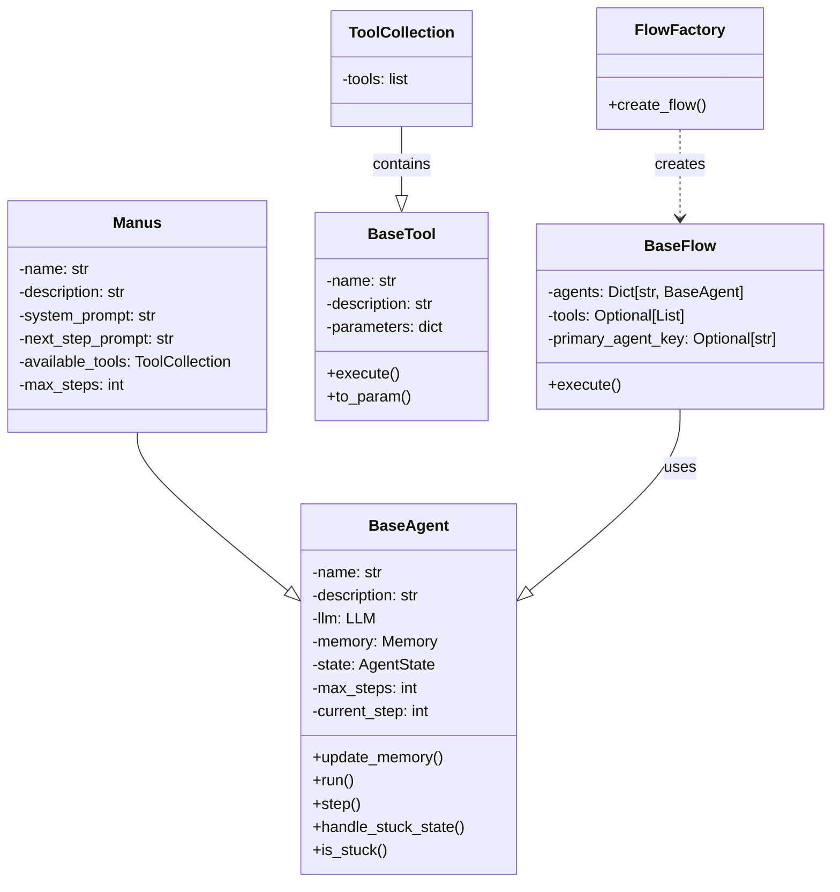

Since I don't have access to `ToolCallAgent.py`, I'll make some reasonable assumptions based on the code I *do* have.

**3. Data Flow**

*   **Main Data Flow:**
    1.  The user provides input to the `main.py` script.
    2.  The input is passed to the `Manus` agent's `run` method.
    3.  The `Manus` agent, inheriting from `ToolCallAgent`, likely uses the LLM to determine which tool to use based on the input.
    4.  The agent executes the selected tool with the appropriate parameters.
    5.  The tool performs its task and returns a result.
    6.  The agent stores the result in its memory.
    7.  The agent uses the LLM to determine the next step, potentially using another tool or generating a final response.
    8.  The process repeats until the agent reaches a final state or the maximum number of steps.
    9.  The agent returns a summary of the execution results to the user.
*   **Key Data Structures:**
    *   `Message`: Represents a message in the agent's memory. It includes the role of the sender (user, system, assistant, tool) and the content of the message.
    *   `ToolResult`: Represents the result of a tool execution. It includes the output of the tool, any errors that occurred, and any system messages.
*   **API Contracts:** The `BaseTool` class defines an API contract for tools. All tools must implement the `execute` method, which takes a set of parameters and returns a `ToolResult`.

Now, let's create a Mermaid sequence diagram showing the main data flow through the system.



**4. State Management**

*   **State Management:** The `BaseAgent` class uses an `AgentState` enum to manage the agent's state. The possible states are `IDLE`, `RUNNING`, `FINISHED`, and `ERROR`. The `state_context` method is used to safely transition between states.
*   **State Diagram:** The state machine is relatively simple, so a state diagram might not be necessary. However, here's a basic one:



*   **Global State Patterns:** The `Config` class in `app/config.py` uses the singleton pattern to ensure that only one instance of the configuration is created. This provides a global access point to the application's configuration settings.

**5. Error Handling & Resilience**

*   **Error Handling:** The `BaseAgent` class includes error handling logic in the `state_context` method. If an exception occurs during the execution of a step, the agent transitions to the `ERROR` state. The `ToolResult` class also includes an `error` field for reporting errors that occur during tool execution.
*   **Resilience Patterns:** The `BaseAgent` class includes a `handle_stuck_state` method to detect and handle situations where the agent is stuck in a loop. This method adds a prompt to the agent's memory to encourage it to change its strategy. The `tenacity` library is included as a dependency, suggesting that retry mechanisms might be used in some parts of the code, although I haven't found explicit usage.
*   **Exception Hierarchies:** I don't see any explicit exception hierarchies defined in the code.

**6. Security Model**

*   **Authentication and Authorization:** The application relies on API keys for authentication with the LLM. These API keys are stored in the `config.toml` file.
*   **Encryption and Data Protection:** I don't see any explicit encryption or data protection mechanisms in the code.
*   **Potential Security Concerns:** Storing API keys in a configuration file can be a security risk if the file is not properly protected. It is important to ensure that the configuration file is not accessible to unauthorized users. The application should also validate user input to prevent injection attacks.

**7. Performance Considerations**

*   **Caching Mechanisms:** I don't see any explicit caching mechanisms in the code.
*   **Concurrency/Parallelism Approaches:** The application uses `asyncio` for asynchronous programming, which allows it to handle multiple requests concurrently.
*   **Performance Optimizations:** I don't see any specific performance optimizations in the architecture.

**8. Testing Strategy**

*   **Testing Approach:** I don't have enough information to determine the testing approach.
*   **Test Coverage and Quality:** I don't have enough information to determine the test coverage and quality.
*   **Test Automation Patterns:** The presence of `.github/workflows/pre-commit.yaml` suggests that pre-commit hooks are used for test automation.

**9. Deployment Architecture**

*   **Deployment Model:** The application can be deployed as a Python application. The `uvicorn` library is used to run the application as a web server.
*   **Deployment Diagram:** I don't have enough information to create a detailed deployment diagram. However, here's a basic diagram:

```mermaid
deploymentDiagram
    node "Server" {
        component "OpenManus Application" {
            artifact "main.py"
            artifact "app/"
            artifact "config/"
        }
        interface "API" {
            methods
        }
    }
    node "User" {
        component "Client"
    }
    User -- API
    API -- "OpenAI API"
```

*   **CI/CD Patterns:** The presence of `.github/workflows/build-package.yaml` suggests that CI/CD is used for building and deploying the application.

**10. Technology Stack**

*   **Key Technologies:**
    *   Python 3.12
    *   pydantic
    *   openai
    *   tenacity
    *   loguru
    *   numpy
    *   datasets
    *   html2text
    *   gymnasium
    *   pillow
    *   browsergym
    *   uvicorn
    *   unidiff
    *   browser-use
    *   googlesearch-python
    *   aiofiles
    *   colorama
    *   playwright
*   **Version Constraints:** The `requirements.txt` file specifies version constraints for the dependencies.
*   **Deprecated or Outdated Dependencies:** I don't see any obviously deprecated or outdated dependencies.

## Architectural Overview Document

### Executive Summary

OpenManus is an open-source framework for building general AI agents. It employs an agent-based architecture, with the `Manus` agent serving as the central component. The agent leverages a collection of tools and configurable flows to process user input and generate intelligent responses. The system emphasizes modularity and configurability, allowing for easy extension and customization. Key technologies include Python, Pydantic, OpenAI, and a variety of libraries for tasks such as web browsing, file manipulation, and data analysis. The architecture incorporates asynchronous programming for concurrency and a singleton pattern for configuration management.

The `Manus` agent extends the `ToolCallAgent` and uses an LLM to decide which tool to use for a given task. The agent's memory stores the history of interactions, and a state machine manages the agent's lifecycle. Error handling is implemented through state transitions and the `ToolResult` class. While the codebase demonstrates a solid foundation, there are opportunities for improvement in areas such as security, caching, and testing.

This document provides a comprehensive architectural overview of the OpenManus codebase, covering key aspects such as high-level architecture, component structure, data flow, state management, error handling, security, performance, testing, deployment, and technology stack. It includes Mermaid diagrams to visualize the architecture and provides recommendations for improvements.

### 1. High-Level Architecture

*   **Architectural Pattern:** Agent-based architecture.
*   **Component Diagram:**



*   **Key Design Principles:** Modularity, configurability, and extensibility.

### 2. Component Structure

*   **Core Components:** `Manus` agent, `ToolCollection`, and `FlowFactory`.
*   **Class Diagram:**



*   **Dependencies:** `Manus` depends on `ToolCollection` and `FlowFactory`.
*   **Circular Dependencies:** None apparent.

### 3. Data Flow

*   **Main Data Flow:** User input -> `Manus` agent -> LLM -> Tool -> Memory -> LLM -> Next step -> ... -> Result summary.
*   **Sequence Diagram:**


*   **Key Data Structures:** `Message`, `ToolResult`.
*   **API Contracts:** `BaseTool.execute()`.

### 4. State Management

*   **State Management:** `AgentState` enum (`IDLE`, `RUNNING`, `FINISHED`, `ERROR`).
*   **State Diagram:**


*   **Global State Patterns:** Singleton pattern for `Config` class.

### 5. Error Handling & Resilience

*   **Error Handling:** `state_context`, `ToolResult.error`.
*   **Resilience Patterns:** `handle_stuck_state`.
*   **Exception Hierarchies:** None explicitly defined.

### 6. Security Model

*   **Authentication and Authorization:** API keys in `config.toml`.
*   **Encryption and Data Protection:** None apparent.
*   **Potential Security Concerns:** API key storage, input validation.

### 7. Performance Considerations

*   **Caching Mechanisms:** None apparent.
*   **Concurrency/Parallelism Approaches:** `asyncio`.
*   **Performance Optimizations:** None specifically identified.

### 8. Testing Strategy

*   Insufficient information to analyze.

### 9. Deployment Architecture

*   **Deployment Model:** Python application, `uvicorn`.
*   **Deployment Diagram:**

```mermaid
deploymentDiagram
    node "Server" {
        component "OpenManus Application" {
            artifact "main.py"
            artifact "app/"
            artifact "config/"
        }
        interface "API" {
            methods
        }
    }
    node "User" {
        component "Client"
    }
    User -- API
    API -- "OpenAI API"
```

*   **CI/CD Patterns:** `.github/workflows/build-package.yaml` suggests CI/CD usage.

### 10. Technology Stack

*   **Key Technologies:** Python 3.12, Pydantic, OpenAI, Tenacity, Loguru, Numpy, Datasets, Html2text, Gymnasium, Pillow, Browsergym, Uvicorn, Unidiff, Browser-use, Googlesearch-python, Aiofiles, Colorama, Playwright.
*   **Version Constraints:** Specified in `requirements.txt`.
*   **Deprecated or Outdated Dependencies:** None apparent.

### Key Architectural Decisions

*   **Agent-Based Architecture:** The choice of an agent-based architecture allows for a modular and extensible system.
*   **Tool-Based Approach:** The use of tools allows the agent to perform a wide range of tasks.
*   **Configuration via TOML:** The use of TOML for configuration allows for easy modification of the application's behavior.
*   **Asynchronous Programming:** The use of `asyncio` allows the application to handle multiple requests concurrently.
*   **Singleton Pattern for Configuration:** Ensures a single, globally accessible configuration instance.

### Recommendations

*   **Implement Caching:** Implement caching mechanisms to improve performance and reduce the load on the LLM.
*   **Enhance Security:** Implement encryption for sensitive data, such as API keys. Implement robust input validation to prevent injection attacks. Consider using a more secure method for storing API keys, such as environment variables or a secrets management system.
*   **Improve Testing:** Implement a comprehensive testing strategy, including unit tests, integration tests, and end-to-end tests.
*   **Standardize Error Handling:** Define a clear exception hierarchy and use consistent error handling practices throughout the codebase.
*   **Implement Monitoring:** Implement monitoring and logging to track the application's performance and identify potential issues.
*   **Consider a Message Queue:** For more complex workflows, consider using a message queue to decouple the agent from the tools and flows.
*   **Formalize API Contracts:** Document and formalize the API contracts between components to improve maintainability and reduce the risk of breaking changes.
*   **Address potential circular dependencies:** Review the codebase for potential circular dependencies and refactor the code to eliminate them.
